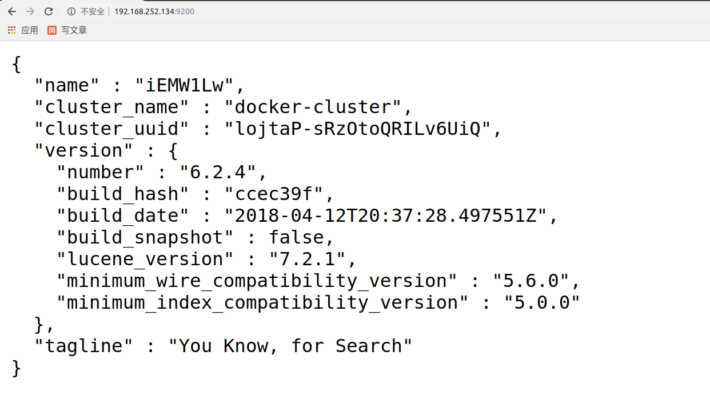

# Elasticsearch

开源的 [Elasticsearch ](https://www.elastic.co/)是目前全文搜索引擎的首选。

它可以快速地储存、搜索和分析海量数据。维基百科、Stack Overflow[爆栈]、Github 都采用它。

Elasticsearch 的底层是开源库 [Lucene](https://lucene.apache.org/)。但是，你没法直接用 Lucene，必须自己写代码去调用它的接口。Elastic 是 Lucene 的封装，提供了 REST API 的操作接口，开箱即用。

Elasticsearch 是用Java实现的。

搜索引擎在对数据构建索引时，需要进行分词处理。分词是指将一句话拆解成多个单字或词，这些字或词便是这句话的关键词。如

```python
我是中国人。
```

'我'、'是'、'中'、'国'、'人'、'中国'等都可以是这句话的关键词。

Elasticsearch 不支持对中文进行分词建立索引，需要配合扩展ik分词器[**elasticsearch-ik**]来实现中文分词处理。

扩展：https://www.cnblogs.com/leeSmall/p/9189078.html

## docker安装Elasticsearch和ik分词器

```
sudo docker pull bachue/elasticsearch-ik:2.2-1.8
```

注意： 容器较大，所以可以选择配置国内加速器

国内的镜像加速器选项较多，如：阿里云，DaoCloud 等。这里我们使用阿里云的[docker加速器](https://cr.console.aliyun.com/)。


点击“镜像加速器”


```bash
sudo mkdir -p /etc/docker
sudo tee /etc/docker/daemon.json <<-'EOF'
{
  "registry-mirrors": ["https://2xdmrl8d.mirror.aliyuncs.com"]
}
EOF
sudo systemctl daemon-reload
sudo systemctl restart docker
```

也可以使用笔记里面的素材目录下的镜像文件加载到docker中

```bash
sudo docker load -i '/home/moluo/Desktop/elasticsearch-ik.tar.gz'
sudo docker image ls
```


 拉取了镜像以后，直接创建容器

```bash
sudo docker run -itd --network=host -e ES_JAVA_OPTS="-Xms256m -Xmx256m" --name=esik bachue/elasticsearch-ik:2.2-1.8
```

上面容器在创建并运行9秒以后会自动关闭，可以通过以下命令查看容器运行的日志信息：

```bash
sudo docker logs --since 30m esik  # 查看最近30分钟的日志

sudo docker logs -t --since="2020-01-01T00:00:00" <容器名称/容器ID> # 查看某时间之后的日志

sudo docker logs -t --since="开始时间" --until "结束时间" <容器名称/容器ID> # 查看某时间段日志
```

经过查看可以发现报错信息如下：

```bash
ERROR: [1] bootstrap checks failed
[1]: max virtual memory areas vm.max_map_count [65530] is too low, increase to at least [262144]
```

`vm.max_map_count`参数，是允许一个进程在内容中拥有的最大数量（VMA：虚拟内存地址， 一个连续的虚拟地址空间），当进程占用内存超过max_map_count时， 直接GG。所以错误提示：elasticsearch用户拥有的内存权限太小，至少需要262144。

max_map_count配置文件写在系统中的`/proc/sys/vm`文件中，但是我们不需要进入docker容器中配置，因为docker使用宿主机的/proc/sys作为只读路径之一。因此我们在Ubuntu系统下设置一下命令即可：

```bash
sudo sysctl -w vm.max_map_count=262144 # 本次服务器，的mvm = 262144，如果服务器关闭了，需要重新设置
```

删除上面的容器，继续创建`elasticsearch`容器：

```bash
sudo docker rm esik
sudo docker run -itd --network=host -e ES_JAVA_OPTS="-Xms256m -Xmx256m" --name=esik bachue/elasticsearch-ik:2.2-1.8
```

完成上面操作以后，我们接下来，直接访问浏览器，输入`IP:9200`，出现以下内容则表示elasticsearch安装成功：



接下来，我们可以使用postman测试下使用能对文本进行正常分词。

```
GET    /_analyze?pretty

{
  "text": "老男孩python"
}
```

出现内容如下则表示分词器正常：

```json
{
    "tokens": [
        {
            "token": "老",
            "start_offset": 0,
            "end_offset": 1,
            "type": "<IDEOGRAPHIC>",
            "position": 0
        },
        {
            "token": "男",
            "start_offset": 1,
            "end_offset": 2,
            "type": "<IDEOGRAPHIC>",
            "position": 1
        },
        {
            "token": "孩",
            "start_offset": 2,
            "end_offset": 3,
            "type": "<IDEOGRAPHIC>",
            "position": 2
        },
        {
            "token": "python",
            "start_offset": 3,
            "end_offset": 9,
            "type": "<ALPHANUM>",
            "position": 3
        }
    ]
}
```

接下来，我们快速的学习下使用分词器。

## 分词器的基本使用

上面的分词器测试中，我们使用了postman发起了如下请求：

```bash
GET    /_analyze?pretty

{
  "text": "老男孩python"
}
```

这个请求得到的分词结果其实很傻瓜。因为这样会自动把每一个文字都进行了分割。

所以我们使用postman发起一个新的请求：

```
GET    /_analyze?pretty

{
  "analyzer": "ik_smart",
  "text": "老男孩python"
}
```

效果：

```json
{
    "tokens": [
        {
            "token": "老",
            "start_offset": 0,
            "end_offset": 1,
            "type": "CN_CHAR",
            "position": 0
        },
        {
            "token": "男孩",
            "start_offset": 1,
            "end_offset": 3,
            "type": "CN_WORD",
            "position": 1
        },
        {
            "token": "python",
            "start_offset": 3,
            "end_offset": 9,
            "type": "ENGLISH",
            "position": 2
        }
    ]
}
```

`analyzer`表示分词器 ，我们可以理解为分词的算法或者分析器。默认情况下，Elasticsearch内置了很多分词器。

以下两种举例，又兴趣可以访问[文章](https://blog.csdn.net/ZYC88888/article/details/83620572)来深入了解。

```
1. standard 标准分词器，单字切分。上面我们测试分词器时候没有声明analyzer参数，则默认调用标准分词器。
2. simple 简单分词器，按非字母字符来分割文本信息
```

综合上面的分词器，其实对于中文都不友好，所以我们前面安装的ik分词器就有了用武之地。

ik分词器在Elasticsearch内置分词器的基础上，新增了2种分词器。

```bash
ik_max_word：会将文本做最细粒度的拆分；尽可能多的拆分出词语

ik_smart：会做最粗粒度的拆分；已被分出的词语将不会再次被其它词语占有
```

我们使用下ik分词器，在postman中发起请求：

```bash
GET    /_analyze?pretty

{
  "analyzer": "ik_max_word",
  "text": "你好，老男孩python"
}
```

效果：

```json
{
    "tokens": [
        {
            "token": "你好",
            "start_offset": 0,
            "end_offset": 2,
            "type": "CN_WORD",
            "position": 0
        },
        {
            "token": "老",
            "start_offset": 3,
            "end_offset": 4,
            "type": "CN_CHAR",
            "position": 1
        },
        {
            "token": "男孩",
            "start_offset": 4,
            "end_offset": 6,
            "type": "CN_WORD",
            "position": 2
        },
        {
            "token": "python",
            "start_offset": 6,
            "end_offset": 12,
            "type": "ENGLISH",
            "position": 3
        }
    ]
}
```


### 使用haystack对接Elasticsearch

#### django-haystack 模块

专门给 django 提供搜索功能的。 django-haystack 提供了一个统一的API搜索接口，底层可以根据自己需求更换搜索引擎( Solr, Elasticsearch, Whoosh, Xapian 等等)，类似于 django 中的 ORM 插件，提供l了一个操作数据库接口，但是底层具体使用哪个数据库是可以在配置文件中进行设置的。

在django中可以通过使用haystack来调用Elasticsearch搜索引擎。而在drf框架中，也有一个对应的drf-haystack模块，是`django-haystack`进行封装处理的。

1）安装模块

```python
pip install drf-haystack           # django框架安装命令： pip install django-haystack
pip install elasticsearch==2.4.1
```


2）注册应用，settings/dev.py，代码：

```python
INSTALLED_APPS = [
    ...
    'haystack',
    ...
]
```


3）相关配置

在配置文件中配置haystack使用的搜索引擎后端，settings/dev.py，代码：

```python
# Haystack
HAYSTACK_CONNECTIONS = {
    'default': {
        'ENGINE': 'haystack.backends.elasticsearch_backend.ElasticsearchSearchEngine',
        # elasticsearch运行的服务器ip地址，端口号默认为9200
        'URL': 'http://192.168.252.168:9200/',
        # elasticsearch建立的索引库的名称，一般使用项目名作为索引库
        'INDEX_NAME': 'renran',
    },
}

# 设置在Django运行时，如果有数据产生变化(添加、修改、删除)，
# haystack会自动让Elasticsearch实时生成新数据的索引
HAYSTACK_SIGNAL_PROCESSOR = 'haystack.signals.RealtimeSignalProcessor'
```


4）创建索引类

通过创建索引类，来指明让搜索引擎对哪些字段建立索引，也就是可以通过哪些字段的关键字来检索数据。

在article子应用下创建索引类文件search_indexes.py，代码：

```python
from haystack import indexes
from .models import Article

class ArticleIndex(indexes.SearchIndex, indexes.Indexable):
    """
    文章索引数据模型类
    """
    text = indexes.CharField(document=True, use_template=True)
    id = indexes.IntegerField(model_attr='id')
    title = indexes.CharField(model_attr='title')
    content = indexes.CharField(model_attr='content')

    def get_model(self):
        """返回建立索引的模型类"""
        return Article

    def index_queryset(self, using=None):
        """返回要建立索引的数据查询集"""
        return self.get_model().objects.filter(is_public=True)
```


在SKUIndex建立的字段，都可以借助haystack由elasticsearch搜索引擎查询。

其中text字段我们声明为document=True，表名该字段是主要进行关键字查询的字段， 该字段的索引值可以由多个数据库模型类字段组成，具体由哪些模型类字段组成，我们用use_template=True表示后续通过模板来指明。其他字段都是通过model_attr选项指明引用数据库模型类的特定字段。

在REST framework中，索引类的字段会作为查询结果返回数据的来源。

6）在templates目录中创建text字段使用的模板文件

具体在templates/search/indexes/article/article_text.txt文件中定义

```python
{{ object.title }}
{{ object.content }}
{{ object.id }}
```

此模板指明当将关键词通过text参数名传递时，可以通过article的title、content、id来进行关键字索引查询。

7）手动生成初始索引

```python
python manage.py rebuid_index
```

8）创建序列化器

在article/serializers.py中创建haystack序列化器

```python
from drf_haystack.serializers import HaystackSerializer

class ArticleIndexSerializer(HaystackSerializer):
    """
    文章索引结果数据序列化器
    """
    class Meta:
        index_classes = [ArticleIndex]
        fields = ('text', 'id', 'title', 'content')
```

**注意fields属性的字段名与SKUIndex类的字段对应。**

9）创建视图

在article/views.py中创建视图

```python
from drf_haystack.viewsets import HaystackViewSet

class ArticleSearchViewSet(HaystackViewSet):
    """
    文章搜索
    """
    index_models = [Article]

    serializer_class = ArticleIndexSerializer
```

10）定义路由

通过REST framework的router来定义路由

```python
router = DefaultRouter()
router.register('article/search', views.SKUSearchViewSet, base_name='skus_search')
```

11）测试

我们可以访问如下链接进行测试

