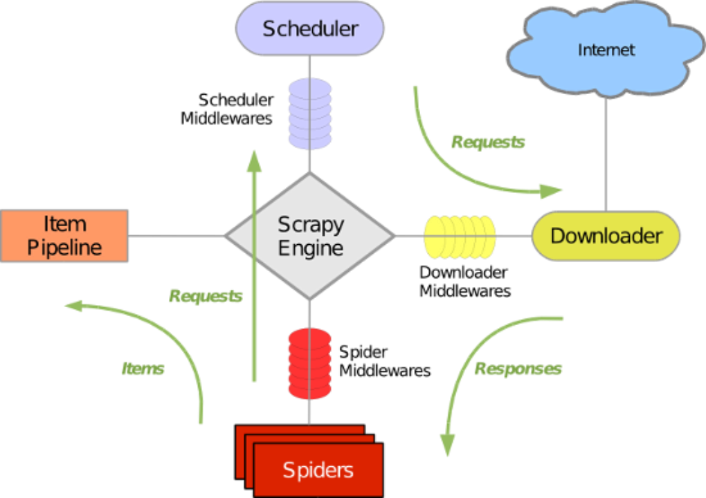

Scrapy框架课程介绍：

1.   框架的简介和基础使用

2.   持久化存储

3.   代理和cookie

4.   日志等级和请求传参

5.   CrawlSpider

6.   基于redis的分布式爬虫


持久化存储操作：

a. 磁盘文件

-   **基于终端指令**

i. 保证parse方法返回一个可迭代类型的对象（存储解析到的页面内容）

ii. 使用终端指令完成数据存储到制定磁盘文件中的操作

```
scrapy crawl 爬虫文件名称 –o 磁盘文件.后缀
```

-   **基于管道**

    items：存储解析到的页面数据

    pipelines：处理持久化存储的相关操作

 代码实现流程：

1.   将解析到的页面数据存储到items对象

2.   使用yield关键字将items提交给管道文件进行处理

3.   在管道文件中编写代码完成数据存储的操作

4.   在配置文件中开启管道操作

 

b. 数据库

​		mysql

​		redis

c) 编码流程：

1.   将解析到的页面数据存储到items对象

2.   使用yield关键字将items提交给管道文件进行处理

3.   在管道文件中编写代码完成数据存储的操作

4.   在配置文件中开启管道操作

 

需求：将爬取到的数据值分别存储到本地磁盘、redis数据库、mysql数据。

1.   需要在管道文件中编写对应平台的管道类

2.   在配置文件中对自定义的管道类进行生效操作

 

***问题：针对多个url进行数据的爬取

​	解决方案：请求的手动发送


Scrapy核心组件：

-   引擎(Scrapy)
    用来处理整个系统的数据流处理, 触发事务(框架核心)
-   调度器(Scheduler)
    用来接受引擎发过来的请求, 压入队列中, 并在引擎再次请求的时候返回. 可以想像成一个URL（抓取网页的网址或者说是链接）的优先队列, 由它来决定下一个要抓取的网址是什么, 同时去除重复的网址
-   下载器(Downloader)
    用于下载网页内容,并将网页内容返回给蜘蛛(Scrapy下载器是建立在twisted这个高效的异步模型上的)
-   爬虫(Spiders)
    爬虫是主要干活的, 用于从特定的网页中提取自己需要的信息, 即所谓的实体(Item)。用户也可以从中提取出链接,让Scrapy继续抓取下一个页面
-   项目管道(Pipeline)
    负责处理爬虫从网页中抽取的实体，主要的功能是持久化实体、验证实体的有效性、清除不需要的信息。当页面被爬虫解析后，将被发送到项目管道，并经过几个特定的次序处理数据。


 