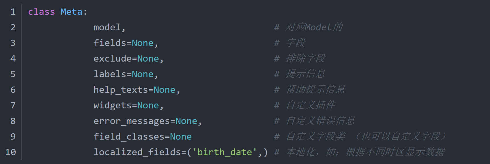

# modelForm组件

在写[表单](https://so.csdn.net/so/search?q=表单&spm=1001.2101.3001.7020)的时候，会发现表单中的Field和模型中的Field基本上是一模一样的。而且一般情况下表单中需要验证的数据就是我们模型中需要保存的数据。那么这个时候我们就可以将模型中的字段和表单中的字段进行绑定。

modelform是一个神奇的组件，通过名字我们可以看出来，这个组件的功能就是把model和form组合起来。

比如我们的数据库中有这样一张学生表，字段有姓名，年龄，爱好，邮箱，电话，住址，注册时间等等一大堆信息，现在让你写一个创建学生的页面，你的后台应该怎么写呢？

* 前端：首先会在前端一个一个罗列出这些字段，让用户去填写，然后后台一个一个接收用户的输入
* 后台：定义一个学生模型，用来保存学生信息
* 后台：定义一个学生表单，用来验证前端传递过来的数据
* 后台：在视图函数中使用get()方法来一个一个的获取已通过验证的数据，然后使用模型中的QuerySet方法将数据保存起来

在上面示例中：其实表单的定义和模型的定义其实是差不多的，但是如果按照上面这种方式来的话，一个差不多的东西我们就需要完整的定义两边，这样就显得混麻烦了。因此Django就提供了ModelForm组件：这个组件主要就是用来整合表单和模型，将它们两个连接起来使用。就不需要完整的定义两次了。


## **ModelForm所有属性**



```python
# models.py
class Student(models.Model):
    name = models.CharField(max_length=12)
    age = models.SmallIntegerField()
    email = models.EmailField()
    birthday = models.DateField()

# forms.py
class StudentModelForm(ModelForm):
    class Meta:
        model = Student  # 对应的Model中的类
        fields = "__all__"  # 字段，如果是__all__,就是表示列出所有的字段
        # exclude = None #排除的字段

        # error_messages用法：
        error_messages = {
            'name': {'required': "用户名不能为空"},
        }
        # widgets用法
        # 首先得导入模块
        from django.forms import widgets as wid  # 因为重名，所以起个别名
        widgets = {
            "birthday": wid.Input(attrs={"type": "date", 'class': 'form-control'}),  # 还可以自定义属性
        }
        # labels，自定义在前端显示的名字
        labels = {
                     "name": "用户名"
                 },
    # 局部校验
    def clean_name(self):
      pass
```

## 添加逻辑

```python
def addstus(request):
    if request.method == "GET":
        studentModelFormObj = StudentModelForm()
        return render(request, "addstu.html", {"studentModelFormObj": studentModelFormObj})
    else:
        # create a form instance and populate it with data from the request
        studentModelFormObj = StudentModelForm(data=request.POST)
        # check whether it's valid:
        if studentModelFormObj.is_valid():
            # 将form中的cleaned_data插入一条记录
            studentModelFormObj.save()
            return HttpResponse("添加成功！")
        else:
            return JsonResponse(studentModelFormObj.errors)

```

````html
<!DOCTYPE html>
<html lang="en">
<head>
    <meta charset="UTF-8">
    <title>Title</title>
    <!-- 最新版本的 Bootstrap 核心 CSS 文件 -->
    <link rel="stylesheet" href="https://stackpath.bootstrapcdn.com/bootstrap/3.4.1/css/bootstrap.min.css"
          integrity="sha384-HSMxcRTRxnN+Bdg0JdbxYKrThecOKuH5zCYotlSAcp1+c8xmyTe9GYg1l9a69psu" crossorigin="anonymous">

</head>
<body>


<hr>
<div class="row">
    <div class="col-md-8 col-md-offset-2">
        <form action="/addstus/" method="post">
            
            
                <div class="form-group">
                    <label for="">{{ studentModelFormField.label }}</label>
                    <div> {{ studentModelFormField }}</div>
                </div>
            
            <input type="submit" class="btn btn-success">
        </form>

    </div>
</div>

</body>
</html>
````

## 编辑逻辑

```python
def editstus(request,id):
    # 获取编辑对象
    instance = Student.objects.get(pk=1)
    if request.method == "GET":
        # 构建改编辑对象的ModelForm对象
        studentModelFormObj = StudentModelForm(instance=instance)
        # 通过该的ModelForm对象渲染出html元素
        return render(request, "editstu.html", {"studentModelFormObj": studentModelFormObj,"instance":instance})
    else:
        # 构建改编辑对象的ModelForm对象,并传入前端发送的数据
        studentModelFormObj = StudentModelForm(instance=instance,data=request.POST)
        # 对前端发送的数据做校验
        if studentModelFormObj.is_valid():
            # 将cleaned_data更新到model的instance中进行update
            studentModelFormObj.save()
            return HttpResponse("编辑成功！")
        else:
            return JsonResponse(studentModelFormObj.errors)
```

```html
<!DOCTYPE html>
<html lang="en">
<head>
    <meta charset="UTF-8">
    <title>Title</title>
    <!-- 最新版本的 Bootstrap 核心 CSS 文件 -->
    <link rel="stylesheet" href="https://stackpath.bootstrapcdn.com/bootstrap/3.4.1/css/bootstrap.min.css"
          integrity="sha384-HSMxcRTRxnN+Bdg0JdbxYKrThecOKuH5zCYotlSAcp1+c8xmyTe9GYg1l9a69psu" crossorigin="anonymous">

</head>
<body>


<hr>
<div class="row">
    <div class="col-md-8 col-md-offset-2">
        <form action="/editstus/{{ instance.id }}/" method="post">
            
            
                <div class="form-group">
                    <label for="">{{ studentModelFormField.label }}</label>
                    <div> {{ studentModelFormField }}</div>
                </div>
            
            <input type="submit" class="btn btn-success">
        </form>

    </div>
</div>

</body>
</html>
```

## `Form`组件和`ModelForm`的区别

1. `ModelForm`是`Django Model.py`和`Form`组件的结合体，可以简单、快速使用 Form验证和数据库操作功能，但不如Form组件灵活
2. 如果在使用`Django`做web开发过程中验证的数据和数据库字段相关(可以对表进行增、删、改操)，建议优先使用`ModelForm`，用起来更方便些。
3. `ModelForm`适合中小型应用程序。因为`ModelForm`是依赖于models的。而Form更适合大型应用程序。

`Django`中Model负责操作数据库，并且具有简单的数据库验证功能(基本不用)；Form用于用户请求的验证，具有强悍的数据库验证功能；`ModelForm`是将二者合二为一，即可用于数据库操作(部分)，也可用于用户请求的验证(部分)。但由于`ModelForm`的耦合性太强，其作用一般用作于结构简单的小站点

