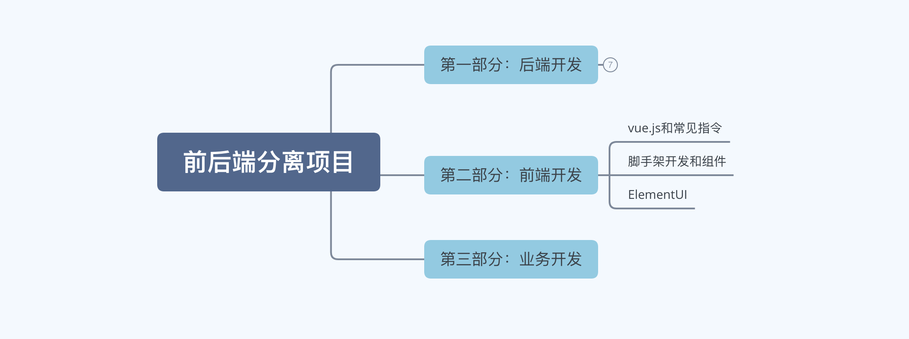
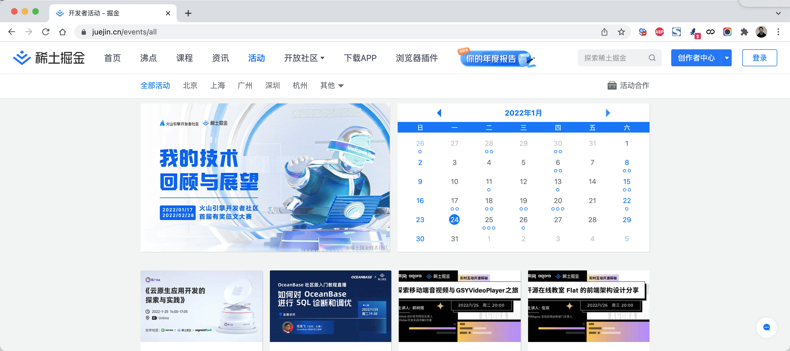
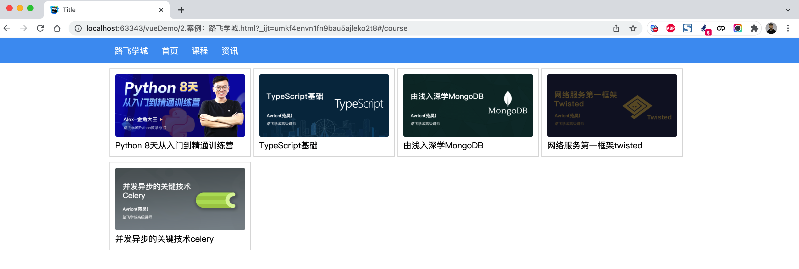
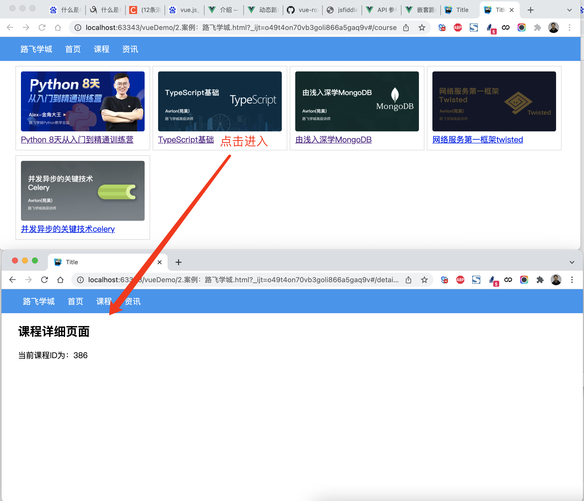
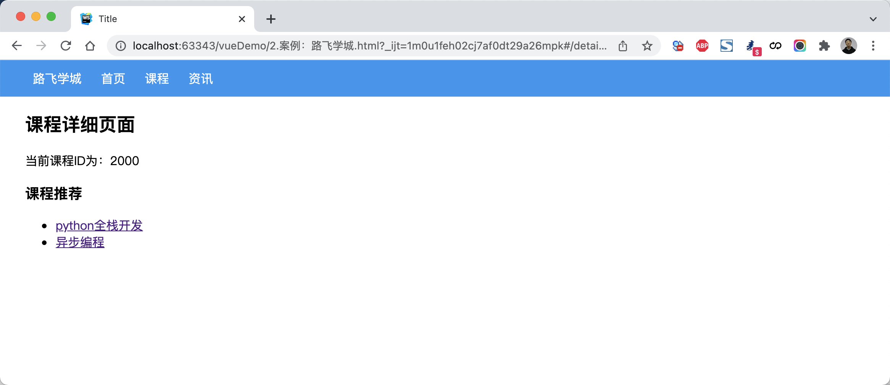
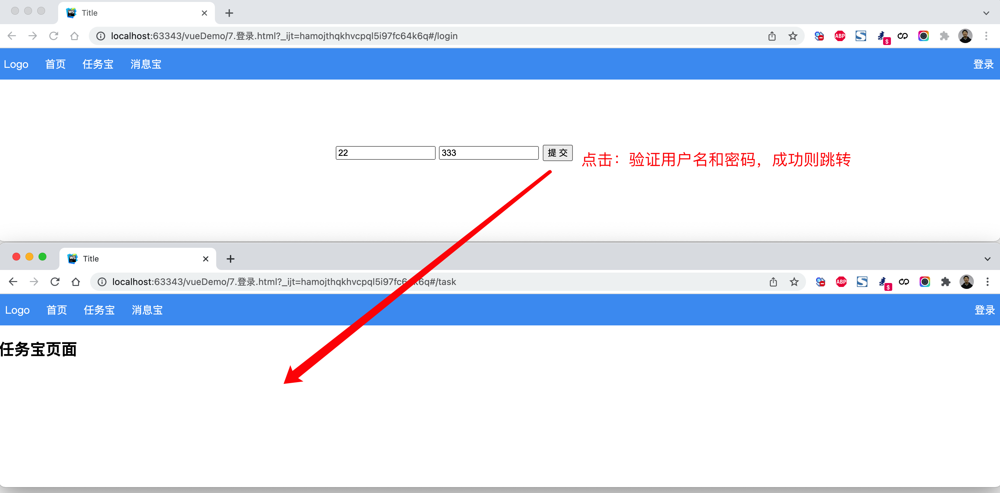
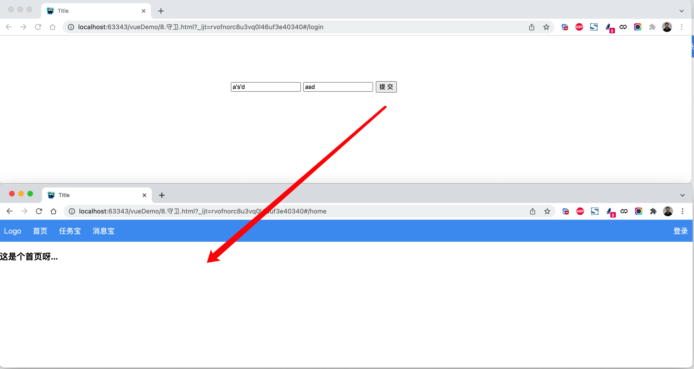
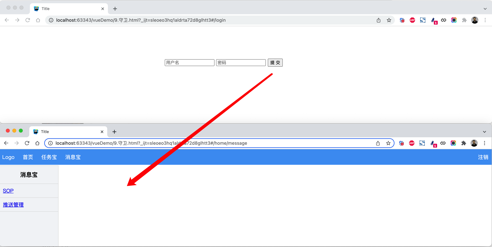

## 第二部分：前端开发



关于vue.js的版本

- **vue2**，经典版本，现在绝大部分的企业项目都是用vue2版本开发。
- vue3，新版本，未来的趋势。


## 1.vue.js 初体验

基于vue.js框架来编写项目需要以下几个步骤：

- 导入vue.js包（CDN）

  ```html
  <!-- 开发环境版本，包含了有帮助的命令行警告 -->
  <script src="https://cdn.jsdelivr.net/npm/vue@2/dist/vue.js"></script>
  
  <!-- 生产环境版本，优化了尺寸和速度 -->
  <script src="https://cdn.jsdelivr.net/npm/vue@2"></script>
  
  # 当然，也可以将文件下载下来再通过本地导入。
  ```

- 应用

  ```html
  <!DOCTYPE html>
  <html lang="en">
  <head>
      <meta charset="UTF-8">
      <title>Title</title>
      <!-- 1.引入vue.js文件 -->
      <script src="https://cdn.jsdelivr.net/npm/vue@2/dist/vue.js"></script>
  </head>
  <body>
  
  <!-- 2.指定区域，该区域的内容希望由vue.js来接管。 -->
  <div id="app">
      <h1>欢迎学习Vue.js</h1>
      <div>我叫{{name}}，微信{{wechat}}</div>
      
      <input type="button" value="点我" v-on:click="clickMe">
  </div>
  
  
  <script>
  	// 3.创建Vue对象，并关联指定HTML区域。
      var app = new Vue({
          el: '#app',
          data: {
              name: '武沛齐',
              wechat: 'wupeiqi888'
          },
          methods: {
              clickMe: function () {
                  // 获取值this.name
                  // 修改值this.name = "xx"
                  this.name = "alex";
                  this.wechat = "wupeiqi666";
              }
          }
      })
  </script>
  </body>
  </html>
  ```

  

后期编写前端代码使用IDE：WebStom （与Pycharm是一家子）【2020.1版本破解同Pycharm】


## 2.vue常见指令

想要使用vue.js来进行开发，就必须学会vue.js中提供的指令，明白每个指令是什么意思，才能更灵活的让他去显示我们想要的效果。

一大波vue指令来了。。。


### 2.1 插值表达式

一般在显示文本内容的标签中使用。

```html
<!DOCTYPE html>
<html lang="en">
<head>
    <meta charset="UTF-8">
    <title>Title</title>
    <script src="https://cdn.jsdelivr.net/npm/vue@2/dist/vue.js"></script>
</head>
<body>
<div id="app">
    <div>我叫{{name}}，我喜欢{{hobby}}，邮箱:{{dataInfo.email}}</div>
    <ul>
        <li>{{'李杰'}}</li>
        <li>{{'李杰' + "土鳖"}}</li>
        <li>{{ base + 1 + 1 }}</li>
        <li>{{ 1===1 ?"李杰":"alex"}}</li>
    </ul>
    <ul>
        <li>{{ condition?"李杰":"alex"}}</li>
    </ul>
    <input type="button" value="点我" v-on:click="clickMe">
</div>


<script>
    var app = new Vue({
        el: '#app',
        data: {
            name: '武沛齐',
            hobby: '篮球',
            dataInfo: {
                id: 1,
                email: "xxx.com"
            },
            condition: false,
            base: 1
        },
        methods: {
            clickMe: function () {
                this.name = "苑日天";
                this.condition = true;
                this.dataInfo.email = "wupeiqi@live.com";
                this.base += 100;
            }
        }
    })
</script>
</body>
</html>
```


### 2.2 v-bind指令

一般用于对标签中的属性进行操作。

```html
<!DOCTYPE html>
<html lang="en">
<head>
    <meta charset="UTF-8">
    <title>Title</title>
    <script src="https://cdn.jsdelivr.net/npm/vue@2/dist/vue.js"></script>
    <style>
        .ig {
            border: 2px solid red;
        }
    </style>
</head>
<body>
<div id="app">
    
    
    

</div>


<script>
    var app = new Vue({
        el: '#app',
        data: {
            imageUrl: 'https://hcdn2.luffycity.com/media/frontend/public_class/PY1@2x_1566529821.1110113.png',
            cls: "ig",
        }
    })
</script>
</body>
</html>


```

```html
<!DOCTYPE html>
<html lang="en">
<head>
    <meta charset="UTF-8">
    <title>Title</title>
    <script src="https://cdn.jsdelivr.net/npm/vue@2/dist/vue.js"></script>
    <style>
        .ig {
            border: 2px solid red;
        }

        .info {
            color: red;
        }

        .danger {
            font-size: 10px;
        }
    </style>
</head>
<body>
<div id="app">
    

    

    <h1 v-bind:class="{info:v1,danger:v2}">你好呀111</h1>
    <h1 v-bind:class="clsDict">你好呀</h1>

    <h2 v-bind:class="[a1,a2]"></h2>
    <h2 v-bind:class="[1===1?a1:'y',a2]">111</h2>

    <h3 v-bind:style="{ color:clr,fontSize:size+'px'}">222</h3>
    <h3 style="color: red;font-size: 19px">333</h3>

    <input type="button" value="点我" v-on:click="clickMe">
</div>


<script>
    var app = new Vue({
        el: '#app',
        data: {
            imageUrl: 'https://hcdn2.luffycity.com/media/frontend/public_class/PY1@2x_1566529821.1110113.png',
            cls: "ig",
            v1: true,
            v2: true,
            clsDict: {
                info: false,
                danger: false
            },
            a1: "info",
            a2: "danger",
            clr: "red",
            size: "19",
        },
        methods:{
            clickMe:function () {
                this.v1 = false;
            }
        }
    })
</script>
</body>
</html>
```


v-bind注意：

- 简写的格式:`:属性名=xxx`，例如：

  ```html
  <h1 v-bind:class="v1"></h1>
  <h1 :class="v1"></h1>
  
  ```

- v-bind属于单向绑定（ JS修改->HTML修改 )。


### 2.3 v-model指令

一般用于在交互的表中中使用，例如：input、select、textarea等。【双向绑定】

```html
<!DOCTYPE html>
<html lang="en">
<head>
    <meta charset="UTF-8">
    <title>Title</title>
    <script src="https://cdn.jsdelivr.net/npm/vue@2/dist/vue.js"></script>
</head>
<body>
<div id="app">
    <div>
        用户名：<input type="text" v-model="user">
    </div>
    <div>
        密码：<input type="password" v-model="pwd">
    </div>
    <input type="button" value="登录" v-on:click="clickMe"/>
    <input type="button" value="重置" v-on:click="resetForm"/>
</div>


<script>
    var app = new Vue({
        el: '#app',
        data: {
            user: "",
            pwd: "",
        },
        methods: {
            clickMe: function () {
                console.log(this.user, this.pwd)
            },
            resetForm: function () {
                this.user = "";
                this.pwd = "";
            }
        }
    })
</script>
</body>
</html>
```


更多相关标签示例：

```html
<!DOCTYPE html>
<html lang="en">
<head>
    <meta charset="UTF-8">
    <title>Title</title>
    <script src="https://cdn.jsdelivr.net/npm/vue@2/dist/vue.js"></script>
</head>
<body>
<div id="app">
    <div>
        用户名：<input type="text" v-model="user">
    </div>
    <div>
        密码：<input type="password" v-model="pwd">
    </div>
    <div>
        性别：
        <input type="radio" v-model="sex" value="1">男
        <input type="radio" v-model="sex" value="2">女
    </div>
    <div>
        爱好：
        <input type="checkbox" v-model="hobby" value="11">篮球
        <input type="checkbox" v-model="hobby" value="22">足球
        <input type="checkbox" v-model="hobby" value="33">评判求
    </div>
    <div>
        城市：
        <select v-model="city">
            <option value="sh">上海</option>
            <option value="bj">北京</option>
            <option value="sz">深圳</option>
        </select>
    </div>
    <div>
        擅长领域：
        <select v-model="company" multiple>
            <option value="11">技术</option>
            <option value="22">销售</option>
            <option value="33">运营</option>
        </select>
    </div>
    <div>
        其他：<textarea v-model="more"></textarea>
    </div>

    <input type="button" value="注 册" v-on:click="clickMe"/>
</div>


<script>
    var app = new Vue({
        el: '#app',
        data: {
            user: "",
            pwd: "",
            sex: "2",
            hobby: ["22"],
            city: "sz",
            company: ["22", "33"],
            more: '...'
        },
        methods: {
            clickMe: function () {
                console.log(this.user, this.pwd, this.sex, this.hobby, this.city, this.company, this.more);
            },
        }
    })
</script>
</body>
</html>


```


```html
<!DOCTYPE html>
<html lang="en">
<head>
    <meta charset="UTF-8">
    <title>Title</title>
    <script src="https://cdn.jsdelivr.net/npm/vue@2/dist/vue.js"></script>
</head>
<body>
<div id="app">
    <div>
        用户名：<input type="text" v-model="info.user">
    </div>
    <div>
        密码：<input type="password" v-model="info.pwd">
    </div>
    <div>
        性别：
        <input type="radio" v-model="info.sex" value="1">男
        <input type="radio" v-model="info.sex" value="2">女
    </div>
    <div>
        爱好：
        <input type="checkbox" v-model="info.hobby" value="11">篮球
        <input type="checkbox" v-model="info.hobby" value="22">足球
        <input type="checkbox" v-model="info.hobby" value="33">评判求
    </div>
    <div>
        城市：
        <select v-model="info.city">
            <option value="sh">上海</option>
            <option value="bj">北京</option>
            <option value="sz">深圳</option>
        </select>
    </div>
    <div>
        擅长领域：
        <select v-model="info.company" multiple>
            <option value="11">技术</option>
            <option value="22">销售</option>
            <option value="33">运营</option>
        </select>
    </div>
    <div>
        其他：<textarea v-model="info.more"></textarea>
    </div>

    <input type="button" value="注 册" v-on:click="clickMe"/>
</div>


<script>
    var app = new Vue({
        el: '#app',
        data: {
            info: {
                user: "",
                pwd: "",
                sex: "2",
                hobby: ["22"],
                city: "sz",
                company: ["22", "33"],
                more: '...'
            }
        },
        methods: {
            clickMe: function () {
                console.log(this.info);
            },
        }
    })
</script>
</body>
</html>
```


### 2.4 v-for指令

用户数据进行循环并展示。

示例1：

```html
<div id="app">
    <ul>
        <li v-for="item in dataList">{{ item }}</li>
    </ul>
</div>
<script>
    var app = new Vue({
        el: '#app',
        data: {
            dataList: ["郭德纲", "于谦", "三哥"],
        }
    })
</script>
```


示例2：

```html
<div id="app">
    <ul>
        <li v-for="(item,idx) in dataList">{{idx}} - {{ item }}</li>
    </ul>
</div>
<script>
    var app = new Vue({
        el: '#app',
        data: {
            dataList: ["郭德纲", "于谦", "三哥"],
        }
    })
</script>
```


示例3：

```html
<div id="app">
    <ul>
        <li v-for="(value,key) in dataDict">{{key}} - {{ value }}</li>
    </ul>
</div>
<script>
    var app = new Vue({
        el: '#app',
        data: {
            dataDict: {
                id: 1,
                age: 18,
                name: "xxx"
            }
        }
    })
</script>
```


示例4：

```html
<div id="app">
    <ul>
        <li v-for="(item,idx) in cityList">{{item.id}} - {{ item.text }}</li>
    </ul>
</div>
<script>
    var app = new Vue({
        el: '#app',
        data: {
            cityList: [
                {id: 11, text: "上海"},
                {id: 12, text: "北京"},
                {id: 13, text: "深圳"},
            ]
        }
    })
</script>
```


示例5：

```
<ul>
	<li> <span>id 11</span>  <span>text 上海</span> </li>
	。。
	。。
</ul>
```


```html
<div id="app">
    <ul>
        <li v-for="(item,idx) in cityList">
        	<span v-for="(v,k) in item">{{k}} {{v}}</span>
        </li>
    </ul>
</div>
<script>
    var app = new Vue({
        el: '#app',
        data: {
            cityList: [
                {id: 11, text: "上海"},
                {id: 12, text: "北京"},
                {id: 13, text: "深圳"},
            ]
        }
    })
</script>
```


### 2.5 v-on指令

事件相关的指令，例如：

```
v-on:click
v-on:dblclick
v-on:mouseover，
v-on:mouseout，
v-on:change
v-on:focus
...
```

```html
<!DOCTYPE html>
<html lang="en">
<head>
    <meta charset="UTF-8">
    <title>Title</title>
    <script src="https://cdn.jsdelivr.net/npm/vue@2/dist/vue.js"></script>
</head>
<body>
<div id="app">
    <ul>
        <li v-on:click="clickMe">点击</li>
        <li @click="clickMe">点击</li>
        <li v-on:dblclick="doSomething('双击')">双击</li>
        <li v-on:mouseover="doSomething('进入')" v-on:mouseout="doSomething('离开')">进入&离开</li>
    </ul>
</div>

<script>
    var app = new Vue({
        el: '#app',
        data: {},
        methods: {
            clickMe: function () {
                alert("点击了")
            },
            doSomething: function (msg) {
                console.log(msg);
            }
        }
    })
</script>
</body>
</html>
```


注意：事件可以简写为 `<div @click="xx">点击</div>`


#### 案例：数据管理

数据的管理包括对数据：展示、动态添加、删除、修改。

- 数据列表展示

  ```html
  <!DOCTYPE html>
  <html lang="en">
  <head>
      <meta charset="UTF-8">
      <title>Title</title>
      <script src="https://cdn.jsdelivr.net/npm/vue@2/dist/vue.js"></script>
      <style>
          .penal {
              border: 1px solid #dddddd;
              margin: 20px 0 0 0;
              padding: 10px;
              border-bottom: 0;
              background-color: #d9d9d9;
          }
  
          .table {
              width: 100%;
              border-collapse: collapse;
              border-spacing: 0;
          }
  
          .table > tbody > tr > td, .table > tbody > tr > th, .table > tfoot > tr > td, .table > tfoot > tr > th, .table > thead > tr > td, .table > thead > tr > th {
              padding: 8px;
              vertical-align: top;
              border: 1px solid #ddd;
              text-align: left;
          }
      </style>
  </head>
  <body>
  
  <div id="app">
      <h3 class="penal">数据列表</h3>
      <table class="table">
          <thead>
          <tr>
              <td>姓名</td>
              <td>年龄</td>
          </tr>
          </thead>
          <tbody>
          <tr v-for="item in dataList">
              <td>{{item.name}}</td>
              <td>{{item.age}}</td>
          </tr>
          </tbody>
      </table>
  </div>
  <script>
      var app = new Vue({
          el: '#app',
          data: {
              dataList: [
                  {"name": "武沛齐", "age": 19},
                  {"name": "alex", "age": 89},
              ]
          }
      })
  </script>
  </body>
  </html>
  ```

- 数据添加

  ```html
  <!DOCTYPE html>
  <html lang="en">
  <head>
      <meta charset="UTF-8">
      <title>Title</title>
      <script src="https://cdn.jsdelivr.net/npm/vue@2/dist/vue.js"></script>
      <style>
          .penal {
              border: 1px solid #dddddd;
              margin: 20px 0 0 0;
              padding: 10px;
              border-bottom: 0;
              background-color: #d9d9d9;
          }
  
          .table {
              width: 100%;
              border-collapse: collapse;
              border-spacing: 0;
          }
  
          .table > tbody > tr > td, .table > tbody > tr > th, .table > tfoot > tr > td, .table > tfoot > tr > th, .table > thead > tr > td, .table > thead > tr > th {
              padding: 8px;
              vertical-align: top;
              border: 1px solid #ddd;
              text-align: left;
          }
      </style>
  </head>
  <body>
  
  <div id="app">
      <h3 class="penal">表单区域</h3>
      <div>
          <div>
              <label>姓名</label>
              <input type="text" v-model="user">
          </div>
          <div>
              <label>年龄</label>
              <input type="text" v-model="age">
              <input type="button" value="新建" @click="addUser">
          </div>
      </div>
  
      <h3 class="penal">数据列表</h3>
      <table class="table">
          <thead>
          <tr>
              <td>姓名</td>
              <td>年龄</td>
          </tr>
          </thead>
          <tbody>
          <tr v-for="item in dataList">
              <td>{{item.name}}</td>
              <td>{{item.age}}</td>
          </tr>
          </tbody>
      </table>
  </div>
  <script>
      var app = new Vue({
          el: '#app',
          data: {
              user: "",
              age: "",
              dataList: [
                  {name: "武沛齐", age: 19},
                  {name: "alex", age: 89},
              ]
          },
          methods: {
              addUser: function () {
                  let row = {name: this.user, age: this.age};
                  this.dataList.push(row);
                  this.user = "";
                  this.age = "";
              }
          }
      })
  </script>
  </body>
  </html>
  ```

- 删除数据

  ```html
  <!DOCTYPE html>
  <html lang="en">
  <head>
      <meta charset="UTF-8">
      <title>Title</title>
      <script src="https://cdn.jsdelivr.net/npm/vue@2/dist/vue.js"></script>
      <style>
          .penal {
              border: 1px solid #dddddd;
              margin: 20px 0 0 0;
              padding: 10px;
              border-bottom: 0;
              background-color: #d9d9d9;
          }
  
          .table {
              width: 100%;
              border-collapse: collapse;
              border-spacing: 0;
          }
  
          .table > tbody > tr > td, .table > tbody > tr > th, .table > tfoot > tr > td, .table > tfoot > tr > th, .table > thead > tr > td, .table > thead > tr > th {
              padding: 8px;
              vertical-align: top;
              border: 1px solid #ddd;
              text-align: left;
          }
      </style>
  </head>
  <body>
  
  <div id="app">
      <h3 class="penal">表单区域</h3>
      <div>
          <div>
              <label>姓名</label>
              <input type="text" v-model="user">
          </div>
          <div>
              <label>年龄</label>
              <input type="text" v-model="age">
              <input type="button" value="新建" @click="addUser">
          </div>
      </div>
  
      <h3 class="penal">数据列表</h3>
      <table class="table">
          <thead>
          <tr>
              <td>姓名</td>
              <td>年龄</td>
              <td>操作</td>
          </tr>
          </thead>
          <tbody>
          <tr v-for="(item,idx) in dataList">
              <td>{{item.name}}</td>
              <td>{{item.age}}</td>
              <td>
                  <input type="button" value="删除" @click="deleteRow" :data-idx="idx"/>
              </td>
          </tr>
          </tbody>
      </table>
  </div>
  <script>
      var app = new Vue({
          el: '#app',
          data: {
              user: "",
              age: "",
              dataList: [
                  {name: "武沛齐", age: 19},
                  {name: "alex", age: 89},
              ]
          },
          methods: {
              addUser: function () {
                  let row = {name: this.user, age: this.age};
                  this.dataList.push(row);
                  this.user = "";
                  this.age = "";
              },
              deleteRow: function (event) {
                  // 根据索引删除dataList中的值
                  let idx = event.target.dataset.idx;
                  this.dataList.splice(idx, 1);
              }
          }
      })
  </script>
  </body>
  </html>
  
  ```

- 编辑修改数据

  ```html
  <!DOCTYPE html>
  <html lang="en">
  <head>
      <meta charset="UTF-8">
      <title>Title</title>
      <script src="https://cdn.jsdelivr.net/npm/vue@2/dist/vue.js"></script>
      <style>
          .penal {
              border: 1px solid #dddddd;
              margin: 20px 0 0 0;
              padding: 10px;
              border-bottom: 0;
              background-color: #d9d9d9;
          }
  
          .table {
              width: 100%;
              border-collapse: collapse;
              border-spacing: 0;
          }
  
          .table > tbody > tr > td, .table > tbody > tr > th, .table > tfoot > tr > td, .table > tfoot > tr > th, .table > thead > tr > td, .table > thead > tr > th {
              padding: 8px;
              vertical-align: top;
              border: 1px solid #ddd;
              text-align: left;
          }
      </style>
  </head>
  <body>
  
  <div id="app">
      <h3 class="penal">表单区域</h3>
      <div>
          <div>
              <label>姓名</label>
              <input type="text" v-model="user">
          </div>
          <div>
              <label>年龄</label>
              <input type="text" v-model="age">
              <input type="button" :value="title" @click="addUser">
          </div>
      </div>
  
      <h3 class="penal">数据列表</h3>
      <table class="table">
          <thead>
          <tr>
              <td>姓名</td>
              <td>年龄</td>
              <td>操作</td>
          </tr>
          </thead>
          <tbody>
          <tr v-for="(item,idx) in dataList">
              <td>{{item.name}}</td>
              <td>{{item.age}}</td>
              <td>
                  <input type="button" value="删除" @click="deleteRow" :data-idx="idx"/>
                  <input type="button" value="编辑" @click="editRow" :data-idx="idx"/>
              </td>
          </tr>
          </tbody>
      </table>
  </div>
  <script>
      var app = new Vue({
          el: '#app',
          data: {
              editIndex: undefined,
              title: "新建",
              user: "",
              age: "",
              dataList: [
                  {name: "武沛齐", age: 19},
                  {name: "alex", age: 89},
              ]
          },
          methods: {
              addUser: function () {
                  if (this.editIndex) {
                      // 修改
                      this.dataList[this.editIndex].name = this.user;
                      this.dataList[this.editIndex].age = this.age;
                  } else {
                      let row = {name: this.user, age: this.age};
                      this.dataList.push(row);
                  }
                  this.user = "";
                  this.age = "";
                  this.editIndex = undefined;
                  this.title = "新建";
              },
              deleteRow: function (event) {
                  // 根据索引删除dataList中的值
                  let idx = event.target.dataset.idx;
                  this.dataList.splice(idx, 1);
              },
              editRow: function (event) {
                  let idx = event.target.dataset.idx;
                  // let name = this.dataList[idx].name;
                  // let age = this.dataList[idx].age;
                  // let {id, name} = {id: 1, name: "武沛齐"};
                  // console.log(id, name);
                  let {name, age} = this.dataList[idx];
                  this.user = name;
                  this.age = age;
                  this.title = "编辑";
                  this.editIndex = idx;
              }
          }
      })
  </script>
  </body>
  </html>
  ```

  

### 2.6 v-if指令

条件判断。

```html
<!DOCTYPE html>
<html lang="en">
<head>
    <meta charset="UTF-8">
    <title>Title</title>
    <script src="https://cdn.jsdelivr.net/npm/vue@2/dist/vue.js"></script>
</head>
<body>
<div id="app">
    <a v-if="isLogin">{{user}}</a>
    <a v-else>登录</a>
</div>

<script>
    var app = new Vue({
        el: '#app',
        data: {
            isLogin: false,
            user: "武沛齐"
        }
    })
</script>
</body>
</html>
```


```html
<!DOCTYPE html>
<html lang="en">
<head>
    <meta charset="UTF-8">
    <title>Title</title>
    <script src="https://cdn.jsdelivr.net/npm/vue@2/dist/vue.js"></script>
</head>
<body>
<div id="app">
    <h1 v-if="v1">阿里无人区</h1>

    
    <h1 v-if="v2">去西藏</h1>
    <h1 v-else>去新疆</h1>

    
    <div v-if="v3 === '北京'">
        <h1>天安门</h1>
    </div>
    <div v-else-if="v3 === '新疆'">
        <h1>乌鲁木齐</h1>
    </div>
    <div v-else-if="v3 ==='西藏'">
        <h1>拉萨</h1>
    </div>
    <div v-else>
        <h1>大理</h1>
    </div>
</div>

<script>
    var app = new Vue({
        el: '#app',
        data: {
            v1: true,
            v2: true,
            v3: "新疆"
        }
    })
</script>
</body>
</html>
```


### 2.7 v-show指令

根据条件显示或隐藏（标签都会渲染到页面）。

```html
<!DOCTYPE html>
<html lang="en">
<head>
    <meta charset="UTF-8">
    <title>Title</title>
    <script src="https://cdn.jsdelivr.net/npm/vue@2/dist/vue.js"></script>
</head>
<body>
<div id="app">
    <h1 v-show="v1">可可西里</h1>
    <h1 v-show="!v1">罗布泊</h1>
</div>

<script>
    var app = new Vue({
        el: '#app',
        data: {
            v1: false,
        }
    })
</script>
</body>
</html>
```


```html
<!DOCTYPE html>
<html lang="en">
<head>
    <meta charset="UTF-8">
    <title>Title</title>
    <script src="https://cdn.jsdelivr.net/npm/vue@2/dist/vue.js"></script>
    <style>
        label {
            width: 60px;
            display: inline-block;
            text-align: right;
            margin-right: 8px;
        }
    </style>
</head>
<body>
<div id="app">
    <input type="button" value="密码登录" @click="isSms=false"/>
    <input type="button" value="短信登录" @click="isSms=true"/>
    
    <div v-show="isSms">
        <p>
            <label>手机号</label>
            <input type="text" placeholder="手机号">
        </p>
        <p>
            <label>验证码</label>
            <input type="text" placeholder="验证码">
        </p>
    </div>
    <div v-show="!isSms">
        <p>
            <label>用户名</label>
            <input type="text" placeholder="用户名">
        </p>
        <p>
            <label>密码</label>
            <input type="password" placeholder="密码">
        </p>
    </div>

</div>

<script>
    var app = new Vue({
        el: '#app',
        data: {
            isSms: false,
        }
    })
</script>
</body>
</html>
```


#### 案例：用户登录

在编写案例之前，现在来学下axios，他是一个HTTP 库，可以发送Http请求。

```html
<script src="https://unpkg.com/axios/dist/axios.min.js"></script>
<script>
    axios({
        method: "post",
        url: 'https://api.luf...ord/login/',
        params: {
			v1:123,
            v2:456
        },
        data: {
            name:"武沛齐",
            pwd:"123"
        },
        headers: {
            "Content-Type": "application/json"
        }
    }).then(function (res) {
        console.log(res.data);
    }).catch(function (error) {
		console.log(error);
    })
</script>
```

```html
<!DOCTYPE html>
<html lang="en">
<head>
    <meta charset="UTF-8">
    <title>Title</title>
    <script src="https://cdn.jsdelivr.net/npm/vue@2/dist/vue.js"></script>
    <script src="https://unpkg.com/axios/dist/axios.min.js"></script>
    <style>
        label {
            width: 60px;
            display: inline-block;
            text-align: right;
            margin-right: 8px;
        }
    </style>
</head>
<body>
<div id="app">
    <input type="button" value="密码登录" @click="isSms=false"/>
    <input type="button" value="短信登录" @click="isSms=true"/>

    <div v-show="isSms">
        <p>
            <label>手机号</label>
            <input type="text" placeholder="手机号" v-model="sms.mobile">
        </p>
        <p>
            <label>验证码</label>
            <input type="text" placeholder="验证码" v-model="sms.code">
        </p>
    </div>
    <div v-show="!isSms">
        <p>
            <label>用户名</label>
            <input type="text" placeholder="用户名" v-model="info.username">
        </p>
        <p>
            <label>密码</label>
            <input type="password" placeholder="密码" v-model="info.password">
        </p>
    </div>

    <input type="button" value="登 录" @click="loginForm"/>
</div>

<script>
    var app = new Vue({
        el: '#app',
        data: {
            isSms: false,
            info: {
                username: "",
                password: "",
            },
            sms: {
                mobile: "",
                code: ""
            }
        },
        methods: {
            loginForm: function () {
                // 1.获取用户输入的值
                let dataDict = this.isSms ? this.sms : this.info;

                let url;
                if (this.isSms) {
                    url = "https://api.luffycity.com/api/v1/auth/mobile/login/?loginWay=mobile";
                } else {
                    url = "https://api.luffycity.com/api/v1/auth/password/login/?loginWay=password";
                }

                // 2.想某个地址发送网络请求 axios
                // https://api.luffycity.com/api/v1/auth/password/login/?loginWay=password
                // {"username":"alex123","password":"999"}

                // https://api.luffycity.com/api/v1/auth/mobile/login/?loginWay=mobile
                // {"mobile":"18630087660","code":"123123"}
                axios({
                    method: "post",
                    url: url,
                    data: dataDict,
                    headers: {
                        "Content-Type": "application/json"
                    }
                }).then(function (res) {
                    if (res.data.code === -1) {
                        alert(res.data.msg);
                        return;
                    }
                    // 登录成功后跳转
                    window.location.href = "https://www.luffycity.com"
                }).catch(function (error) {
                    alert("请求异常，请重新操作。")
                })
            }
        }
    })
</script>
</body>
</html>
```


## 3.组件化开发

在开发过程中，我们可以将页面中 某一部分 的功能编写成一个组件，然后再在页面上进行引用。

- 有利于划分功能模块的开发（HTML、CSS、JavaScript等相关代码都集成到组件中）。
- 有利于重用


### 3.1 局部组件

```html
<!DOCTYPE html>
<html lang="en">
<head>
    <meta charset="UTF-8">
    <title>Title</title>
    <script src="https://cdn.jsdelivr.net/npm/vue@2/dist/vue.js"></script>
</head>
<body>
<div id="app">
    <h1>=======当前页面=======</h1>
    {{name}}

    <h1>=======引入子组件=======</h1>
    <Demo></Demo>
    <Demo></Demo>
    <Bb></Bb>
    <Bb></Bb>
    <hr/>
    <Bb></Bb>
</div>
<script>
    //创建子组件
    const Demo = {
        data:function() {
            return {
                msg: '哈哈哈哈哈'
            }
        },
        template: `
            <div>
                <h1>{{msg}}</h1>
                <input type="text" v-model="msg"/>
                <input type="button" @click="showMeg" value="点我呀">
            </div>
        `,
        methods: {
            showMeg: function () {
                alert(this.msg);
            }
        }
    }

    //创建子组件
    const Bili = {
        // 组件中的data是一个方法，并返回值（与Vue对象创建不同）
        data:function() {
            return {
                dataList: [
                    {"id": 1, "title": "路飞学城倒闭了"},
                    {"id": 2, "title": "老板和保洁阿姨跑了"},
                ]
            }
        },
        template: `
            <div>
                <h1>数据列表</h1>
                <table border="1">
                    <thead>
                    <tr>
                        <th>ID</th>
                        <th>标题</th>
                    </tr>
                    </thead>
                    <tbody>
                    <tr v-for="item in dataList">
                        <td>{{item.id}}</td>
                        <td>{{item.title}}</td>
                    </tr>
                    </tbody>
                </table>
            </div>
        `
    }

    var app = new Vue({
        el: '#app',
        data: {
            name: "武沛齐",
        },
        components: {
            Demo,
            Bb: Bili
        },
        methods: {}
    })
</script>
</body>
</html>

```


### 3.2 全局组件

```html
<!DOCTYPE html>
<html lang="en">
<head>
    <meta charset="UTF-8">
    <title>Title</title>
    <script src="https://cdn.jsdelivr.net/npm/vue@2/dist/vue.js"></script>
</head>
<body>
<div id="app">
    <h1>=======当前页面=======</h1>
    {{name}}

    <h1>=======引入子组件=======</h1>
    <Demo></Demo>
    <Demo></Demo>
    <Bili></Bili>
    <Bili></Bili>
</div>
<script>
    //创建子组件
    Vue.component('Demo', {
        data: function () {
            return {
                msg: '哈哈哈哈哈'
            }
        },
        template: `
            <div>
                <h1>{{msg}}</h1>
                <input type="text" v-model="msg"/>
                <input type="button" @click="showMeg" value="点我呀">
            </div>
        `,
        methods: {
            showMeg: function () {
                alert(this.msg);
            }
        }
    });

    //创建子组件
    Vue.component('Bili', {
        // 组件中的data是一个方法，并返回值（与Vue对象创建不同）
        data: function () {
            return {
                dataList: [
                    {"id": 1, "title": "路飞学城倒闭了"},
                    {"id": 2, "title": "老板和保洁阿姨跑了"},
                ]
            }
        },
        template: `
            <div>
                <h1>数据列表</h1>
                <table border="1">
                    <thead>
                    <tr>
                        <th>ID</th>
                        <th>标题</th>
                    </tr>
                    </thead>
                    <tbody>
                    <tr v-for="item in dataList">
                        <td>{{item.id}}</td>
                        <td>{{item.title}}</td>
                    </tr>
                    </tbody>
                </table>
            </div>
        `
    });

    var app = new Vue({
        el: '#app',
        data: {
            name: "武沛齐",
        },
        methods: {}
    })
</script>
</body>
</html>
```


## 4.vue-router组件

vue + **vue-router**组件 可以实现 SPA（single Page Application），即：**单页面应用**。

单页面应用，简而言之就是项目只有一个页面。


一个页面如何呈现多种界面的效果呢？

- 基于vue开发多个组件，例如：活动组件、课程组件、咨询组件
- 在页面上 vue-router 用来管理这些组件，用户点击某个按钮，就显示特定的组件（数据基于Ajax获取）。




### 4.1 下载和引用

官方地址：https://router.vuejs.org/zh/

下载地址：https://unpkg.com/vue-router@4

```html
<!DOCTYPE html>
<html lang="en">
<head>
    <meta charset="UTF-8">
    <title>Title</title>

    <!--  vue-router.js 依赖 vue.js -->
    <script src="vue.js"></script>
    <script src="vue-router.js"></script>
    
</head>
<body>
	...
</body>
</html>
```

注意：后期用脚手架开发时，可以直接使用npm下载和引用。


### 4.2 快速上手


```html
<!DOCTYPE html>
<html lang="en">
<head>
    <meta charset="UTF-8">
    <title>Title</title>
    <style>
        body {
            margin: 0;
        }

        .container {
            width: 980px;
            margin: 0 auto;
        }

        .menu {
            height: 48px;
            background-color: #499ef3;
            line-height: 48px;

        }

        .menu a {
            color: white;
            text-decoration: none;
            padding: 0 10px;
        }
    </style>

    <script src="vue.js"></script>
    <script src="vue-router.js"></script>
</head>
<body>
<div id="app">
    <div class="menu">
        <div class="container">
            <router-link to="/">Logo</router-link>
            <router-link to="/home">首页</router-link>
            <router-link to="/course">课程</router-link>
            <router-link to="/news">资讯</router-link>
        </div>
    </div>
    <div class="container">
        <router-view></router-view>
    </div>

</div>

<script>

    const Home = {template: '<div>首页内容...</div>'}
    const Course = {template: '<div>课程内容..</div>'}
    const News = {template: '<div>资讯内容..</div>'}

    const router = new VueRouter({
        routes: [
            { 
                path: '/', 
                component: Home
            },
            {
                path: '/home', 
                component: Home
            },
            {path: '/course', component: Course},
            {path: '/news', component: News}
        ],
    })

    var app = new Vue({
        el: '#app',
        data: {
            name: "武沛齐",
        },
        methods: {},
        router: router
    })
</script>
</body>
</html>
```


#### 案例：路飞学城（第1版）



```html
<!DOCTYPE html>
<html lang="en">
<head>
    <meta charset="UTF-8">
    <title>Title</title>
    <style>
        body {
            margin: 0;
        }

        .container {
            width: 1100px;
            margin: 0 auto;
        }

        .menu {
            height: 48px;
            background-color: #499ef3;
            line-height: 48px;

        }

        .menu a {
            color: white;
            text-decoration: none;
            padding: 0 10px;
        }

        .course-list {
            display: flex;
            flex-wrap: wrap;
            justify-content: flex-start;
        }

        .course-list .item {
            width: 248px;
            padding: 10px;
            border: 1px solid #dddddd;
            margin-right: 5px;
            margin-top: 10px;
        }

        .course-list .item img {
            width: 100%;
            height: 120px;
        }
    </style>

    <script src="vue.js"></script>
    <script src="vue-router.js"></script>
    <script src="axios.min.js"></script>
</head>
<body>
<div id="app">
    <div class="menu">
        <div class="container">
            <router-link to="/">路飞学城</router-link>
            <router-link to="/home">首页</router-link>
            <router-link to="/course">课程</router-link>
            <router-link to="/news">资讯</router-link>
        </div>
    </div>
    <div class="container">
        <router-view></router-view>
    </div>

</div>

<script>

    const Home = {
        data: function () {
            return {
                title: "欢迎使用路飞学城"
            }
        },
        template: `<h2>{{title}}</h2>`
    }
    const Course = {
        data: function () {
            return {
                courseList: []
            }
        },
        created: function () {
            /* 组件创建完成之后自动触发【此时组件的对象已创建，但还未将页面先关的DOM创建并显示在页面上】
                 - 可以去操作组件对象，例如：this.courseList = [11,22,33]
                 - 不可以去操作DOM，例如：document.getElementById （未创建）
             */
            axios({
                method: "get",
                url: 'https://api.luffycity.com/api/v1/course/actual/?limit=5&offset=0',
                headers: {
                    "Content-Type": "application/json"
                }
            }).then((res) => {
                this.courseList = res.data.data.result;
            })

        },
        mounted: function () {
            /* DOM对象已在页面上生成，此时就可以 */
        },
        template: `
            <div class="course-list">
                <div class="item" v-for="item in courseList">
                    
                    <a>{{item.name}}</a>
                </div>
            </div>`
    }
    const News = {
        data: function () {
            return {
                dataList: []
            }
        },
        created: function () {
            /* 组件创建完成之后自动触发【此时组件的对象已创建，但还未将页面先关的DOM创建并显示在页面上】
                 - 可以去操作组件对象，例如：this.courseList = [11,22,33]
                 - 不可以去操作DOM，例如：document.getElementById （未创建）
             */
            axios({
                method: "get",
                url: 'https://api.luffycity.com/api/v1/course/actual/?limit=5&offset=10',
                headers: {
                    "Content-Type": "application/json"
                }
            }).then((res) => {
                this.dataList = res.data.data.result;
            })

        },
        template: `<ul><li v-for="item in dataList">{{item.name}}</li></ul>`
    }

    const router = new VueRouter({
        routes: [
            {path: '/', component: Home},
            {path: '/home', component: Home},
            {path: '/course', component: Course},
            {path: '/news', component: News}
        ],
        //mode: 'history'
    })

    var app = new Vue({
        el: '#app',
        data: {},
        methods: {},
        router: router
    })
</script>
</body>
</html>
```


### 4.3 路由和传值

当某个组件可以根据某些参数值的不同，展示不同效果时，需要用到动态路由。

例如：访问网站看到课程列表，点击某个课程，就可以跳转到课程详细页面（根据课程ID不同展示不同数据）。


如何来设置动态路由呢？

- 定义路由

  ```javascript
  const router = new VueRouter({
      routes: [
          { path: '/', component: Home},
          { path: '/course', component: Course, name: "Course"}
          { path: '/detail/:id', component: Detail, name: "Detail"}
      ],
  })
  ```

- HTML展示

  ```html
  <div>
      <router-link to="/">首页</router-link>
      <router-link to="/course">课程</router-link>
      <router-link to="/detail/123">课程</router-link>
      
      <router-link :to="{path:'/course'}">课程</router-link>
      <router-link :to="{path:'/course?size=19&page=2'}">课程</router-link>
      <router-link :to="{path:'/course', query:{size:19,page:2}">课程</router-link>
      
      <router-link :to="{name:'Course'}">课程</router-link>
      <router-link :to="{name:'Course', query:{size:19,page:2} }">课程</router-link>
  
      <router-link :to="{path:'/detail/22',query:{size:123}}">Linux</router-link>
      <router-link :to="{name:'Detail',params:{id:3}, query:{size:29}}">网络安全</router-link>
  </div>
  
  <h1>内容区域</h1>
  <router-view></router-view>
  ```

- 组件获取URL传值和GET参数

  ```javascript
   const Detail = {
       data: function () {
           return {
               title: "详细页面",
               paramDict: null,
               queryDict: null,
  
           }
       },
       created: function () {
           this.paramDict = this.$route.params;
           this.queryDict = this.$route.query;
           // 发送axios请求
       },
       template: `<div><h2>{{title}}</h2><div>当前请求的数据 {{paramDict}}  {{queryDict}}</div></div>`
   }
  ```

  

#### 案例：路飞学城（第2版）

> 点击课程，查看课程详细页面。



```html
<!DOCTYPE html>
<html lang="en">
<head>
    <meta charset="UTF-8">
    <title>Title</title>
    <style>
        body {
            margin: 0;
        }

        .container {
            width: 1100px;
            margin: 0 auto;
        }

        .menu {
            height: 48px;
            background-color: #499ef3;
            line-height: 48px;

        }

        .menu a {
            color: white;
            text-decoration: none;
            padding: 0 10px;
        }

        .course-list {
            display: flex;
            flex-wrap: wrap;
            justify-content: flex-start;
        }

        .course-list .item {
            width: 248px;
            padding: 10px;
            border: 1px solid #dddddd;
            margin-right: 5px;
            margin-top: 10px;
        }

        .course-list .item img {
            width: 100%;
            height: 120px;
        }
    </style>

    <script src="vue.js"></script>
    <script src="vue-router.js"></script>
    <script src="axios.min.js"></script>
</head>
<body>
<div id="app">
    <div class="menu">
        <div class="container">
            <router-link to="/">路飞学城</router-link>
            <router-link to="/home">首页</router-link>
            <router-link to="/course">课程</router-link>
            <router-link to="/news">资讯</router-link>
        </div>
    </div>
    <div class="container">
        <router-view></router-view>
    </div>

</div>

<script>

    const Home = {
        data: function () {
            return {
                title: "欢迎使用路飞学城"
            }
        },
        template: `<h2>{{title}}</h2>`
    }
    const Course = {
        data: function () {
            return {
                courseList: []
            }
        },
        created: function () {
            /* 组件创建完成之后自动触发【此时组件的对象已创建，但还未将页面先关的DOM创建并显示在页面上】
                 - 可以去操作组件对象，例如：this.courseList = [11,22,33]
                 - 不可以去操作DOM，例如：document.getElementById （未创建）
             */
            axios({
                method: "get",
                url: 'https://api.luffycity.com/api/v1/course/actual/?limit=5&offset=0',
                headers: {
                    "Content-Type": "application/json"
                }
            }).then((res) => {
                this.courseList = res.data.data.result;
            })

        },
        mounted: function () {
            /* DOM对象已在页面上生成，此时就可以 */
        },
        template: `
            <div class="course-list">

                <div class="item" v-for="item in courseList">
                    <router-link :to="{name:'Detail',params:{id:item.id}}">
                        
                        <a>{{item.name}}</a>
                     </router-link>
                </div>

            </div>`
    }
    const News = {
        data: function () {
            return {
                dataList: []
            }
        },
        created: function () {
            /* 组件创建完成之后自动触发【此时组件的对象已创建，但还未将页面先关的DOM创建并显示在页面上】
                 - 可以去操作组件对象，例如：this.courseList = [11,22,33]
                 - 不可以去操作DOM，例如：document.getElementById （未创建）
             */
            axios({
                method: "get",
                url: 'https://api.luffycity.com/api/v1/course/actual/?limit=5&offset=10',
                headers: {
                    "Content-Type": "application/json"
                }
            }).then((res) => {
                this.dataList = res.data.data.result;
            })

        },
        template: `<ul><li v-for="item in dataList">{{item.name}}</li></ul>`
    }

    const Detail = {
        data: function () {
            return {
                title: "详细页面",
                courseId: null
            }
        },
        created: function () {
            this.courseId = this.$route.params.id;
            // 此处可以根据课程ID，发送ajax请求获取课程详细信息
        },
        template: `<div><h2>课程详细页面</h2><div>当前课程ID为：{{courseId}}</div></div>`
    }

    const router = new VueRouter({
        routes: [
            {path: '/', component: Home},
            {path: '/home', component: Home},
            {path: '/course', component: Course},
            {path: '/news', component: News},
            {path: '/detail/:id', component: Detail, name: 'Detail'}
        ],
        //mode: 'history'
    })

    var app = new Vue({
        el: '#app',
        data: {},
        methods: {},
        router: router
    })
</script>
</body>
</html>
```


### 4.5 无法刷新

上述编写案例是没有问题，但如果在开发中会涉及到 同一个路由的跳转（默认不会重新加载页面，数据无法获取）。

例如：在详细页面再出现一个课程推荐，即：在课程详细，点击推荐的课程后跳转到课程详细页面（课程ID不同），此时课程的ID还是原来加载的ID，无法获取推荐课程的ID。

**如何解决呢？**

在课程详细的组件中设置watch属性即可，watch会监测`$route` 值，一旦发生变化，就执行相应的函数。

```javascript
const Detail = {
    data: function () {
        return {
            title: "详细页面",
            courseId: null,

        }
    },
    created: function () {
        this.courseId = this.$route.params.id;
        this.getCourseDetail();
    },
    watch: {
        $route:function(to, from) {
            this.courseId = to.params.id;
            // this.getCourseDetail();
        }
    },
    methods: {
        getCourseDetail: function () {
            // 根据this.courseId获取课程详细信息
        }
    },
    template: `<div><h2>{{title}}</h2><div>当前请求的数据 {{paramDict}}  {{queryDict}}</div></div>`
}
```


#### 案例：路飞学城（第3版）

> 在详细页面实现推荐课程



```html
<!DOCTYPE html>
<html lang="en">
<head>
    <meta charset="UTF-8">
    <title>Title</title>
    <style>
        body {
            margin: 0;
        }

        .container {
            width: 1100px;
            margin: 0 auto;
        }

        .menu {
            height: 48px;
            background-color: #499ef3;
            line-height: 48px;

        }

        .menu a {
            color: white;
            text-decoration: none;
            padding: 0 10px;
        }

        .course-list {
            display: flex;
            flex-wrap: wrap;
            justify-content: flex-start;
        }

        .course-list .item {
            width: 248px;
            padding: 10px;
            border: 1px solid #dddddd;
            margin-right: 5px;
            margin-top: 10px;
        }

        .course-list .item img {
            width: 100%;
            height: 120px;
        }
    </style>

    <script src="vue.js"></script>
    <script src="vue-router.js"></script>
    <script src="axios.min.js"></script>
</head>
<body>
<div id="app">
    <div class="menu">
        <div class="container">
            <router-link to="/">路飞学城</router-link>
            <router-link to="/home">首页</router-link>
            <router-link to="/course">课程</router-link>
            <router-link to="/news">资讯</router-link>
        </div>
    </div>
    <div class="container">
        <router-view></router-view>
    </div>

</div>

<script>

    const Home = {
        data: function () {
            return {
                title: "欢迎使用路飞学城"
            }
        },
        template: `<h2>{{title}}</h2>`
    }
    const Course = {
        data: function () {
            return {
                courseList: []
            }
        },
        created: function () {
            /* 组件创建完成之后自动触发【此时组件的对象已创建，但还未将页面先关的DOM创建并显示在页面上】
                 - 可以去操作组件对象，例如：this.courseList = [11,22,33]
                 - 不可以去操作DOM，例如：document.getElementById （未创建）
             */
            axios({
                method: "get",
                url: 'https://api.luffycity.com/api/v1/course/actual/?limit=5&offset=0',
                headers: {
                    "Content-Type": "application/json"
                }
            }).then((res) => {
                this.courseList = res.data.data.result;
            })

        },
        mounted: function () {
            /* DOM对象已在页面上生成，此时就可以 */
        },
        template: `
            <div class="course-list">

                <div class="item" v-for="item in courseList">
                    <router-link :to="{name:'Detail',params:{id:item.id}}">
                        
                        <a>{{item.name}}</a>
                     </router-link>
                </div>

            </div>`
    }
    const News = {
        data: function () {
            return {
                dataList: []
            }
        },
        created: function () {
            /* 组件创建完成之后自动触发【此时组件的对象已创建，但还未将页面先关的DOM创建并显示在页面上】
                 - 可以去操作组件对象，例如：this.courseList = [11,22,33]
                 - 不可以去操作DOM，例如：document.getElementById （未创建）
             */
            axios({
                method: "get",
                url: 'https://api.luffycity.com/api/v1/course/actual/?limit=5&offset=10',
                headers: {
                    "Content-Type": "application/json"
                }
            }).then((res) => {
                this.dataList = res.data.data.result;
            })

        },
        template: `<ul><li v-for="item in dataList">{{item.name}}</li></ul>`
    }

    const Detail = {
        data: function () {
            return {
                title: "详细页面",
                courseId: null,
                hotCourseList: [
                    {id: 1000, title: "python全栈开发"},
                    {id: 2000, title: "异步编程"},
                ],
            }
        },
        created: function () {
            this.courseId = this.$route.params.id;
            // 此处可以根据课程ID，发送ajax请求获取课程详细信息
            this.getCourseDetail();
        },
        watch: {
            $route: function (to, from) {
                this.courseId = to.params.id;
                this.getCourseDetail();
            }
        },
        methods: {
            getCourseDetail: function () {
                // 根据this.courseId获取课程详细信息
            }
        },
        template: `
                <div>
                    <h2>课程详细页面</h2>
                    <div>当前课程ID为：{{courseId}}</div>
                    <h3>课程推荐</h3>
                    <ul>
                        <li v-for="item in hotCourseList">
                            <router-link :to="{name:'Detail', params:{id:item.id}}">{{item.title}}</router-link>
                        </li>
                    </ul>
                </div>`
    }

    const router = new VueRouter({
        routes: [
            {path: '/', component: Home},
            {path: '/home', component: Home},
            {path: '/course', component: Course},
            {path: '/news', component: News},
            {path: '/detail:id', component: Detail, name: 'Detail'}
        ],
        //mode: 'history'
    })

    var app = new Vue({
        el: '#app',
        data: {},
        methods: {},
        router: router
    })
</script>
</body>
</html>
```


### 4.6 路由嵌套


```javascript
const router = new VueRouter({
  routes: [
    {
      path: '/pins/',
      component: Pins,
      children: [
        {
          // 当 /pins/hot 匹配成功，
          // Hot组件 会被渲染在 Pins 的 <router-view> 中
          path: 'hot',
          component: Hot
        },
        {
          // 当 /pins/following 匹配成功，
          // Following组件 会被渲染在 Pins 的 <router-view> 中
          path: 'following',
          component: Following
        }
      ]
    }
  ]
})
```


#### 案例：路飞学城（第4版）

```html
<!DOCTYPE html>
<html lang="en">
<head>
    <meta charset="UTF-8">
    <title>Title</title>
    <style>
        body {
            margin: 0;
        }

        .container {
            width: 1100px;
            margin: 0 auto;
        }

        .menu {
            height: 48px;
            background-color: #499ef3;
            line-height: 48px;

        }

        .menu a {
            color: white;
            text-decoration: none;
            padding: 0 10px;
        }

        .course-list {
            display: flex;
            flex-wrap: wrap;
            justify-content: flex-start;
        }

        .course-list .item {
            width: 248px;
            padding: 10px;
            border: 1px solid #dddddd;
            margin-right: 5px;
            margin-top: 10px;
        }

        .course-list .item img {
            width: 100%;
            height: 120px;
        }
    </style>

    <script src="vue.js"></script>
    <script src="vue-router.js"></script>
    <script src="axios.min.js"></script>
</head>
<body>
<div id="app">
    <div class="menu">
        <div class="container">
            <router-link to="/">路飞学城</router-link>
            <router-link to="/pins">沸点</router-link>
            <router-link to="/home">首页</router-link>
            <router-link to="/course">课程</router-link>
            <router-link to="/news">资讯</router-link>
        </div>
    </div>
    <div class="container">
        <router-view></router-view>
    </div>

</div>

<script>

    const Home = {
        data: function () {
            return {
                title: "欢迎使用路飞学城"
            }
        },
        template: `<h2>{{title}}</h2>`
    }
    const Course = {
        data: function () {
            return {
                courseList: []
            }
        },
        created: function () {
            /* 组件创建完成之后自动触发【此时组件的对象已创建，但还未将页面先关的DOM创建并显示在页面上】
                 - 可以去操作组件对象，例如：this.courseList = [11,22,33]
                 - 不可以去操作DOM，例如：document.getElementById （未创建）
             */
            axios({
                method: "get",
                url: 'https://api.luffycity.com/api/v1/course/actual/?limit=5&offset=0',
                headers: {
                    "Content-Type": "application/json"
                }
            }).then((res) => {
                this.courseList = res.data.data.result;
            })

        },
        mounted: function () {
            /* DOM对象已在页面上生成，此时就可以 */
        },
        template: `
            <div class="course-list">

                <div class="item" v-for="item in courseList">
                    <router-link :to="{name:'Detail',params:{id:item.id}}">
                        
                        <a>{{item.name}}</a>
                     </router-link>
                </div>

            </div>`
    }
    const News = {
        data: function () {
            return {
                dataList: []
            }
        },
        created: function () {
            /* 组件创建完成之后自动触发【此时组件的对象已创建，但还未将页面先关的DOM创建并显示在页面上】
                 - 可以去操作组件对象，例如：this.courseList = [11,22,33]
                 - 不可以去操作DOM，例如：document.getElementById （未创建）
             */
            axios({
                method: "get",
                url: 'https://api.luffycity.com/api/v1/course/actual/?limit=5&offset=10',
                headers: {
                    "Content-Type": "application/json"
                }
            }).then((res) => {
                this.dataList = res.data.data.result;
            })

        },
        template: `<ul><li v-for="item in dataList">{{item.name}}</li></ul>`
    }
    const Detail = {
        data: function () {
            return {
                title: "详细页面",
                courseId: null,
                hotCourseList: [
                    {id: 1000, title: "python全栈开发"},
                    {id: 2000, title: "异步编程"},
                ],
            }
        },
        created: function () {
            this.courseId = this.$route.params.id;
            // 此处可以根据课程ID，发送ajax请求获取课程详细信息
            this.getCourseDetail();
        },
        watch: {
            $route: function (to, from) {
                this.courseId = to.params.id;
                this.getCourseDetail();
            }
        },
        methods: {
            getCourseDetail: function () {
                // 根据this.courseId获取课程详细信息
            }
        },
        template: `
                <div>
                    <h2>课程详细页面</h2>
                    <div>当前课程ID为：{{courseId}}</div>
                    <h3>课程推荐</h3>
                    <ul>
                        <li v-for="item in hotCourseList">
                            <router-link :to="{name:'Detail', params:{id:item.id}}">{{item.title}}</router-link>
                        </li>
                    </ul>
                </div>`
    }

    const Pins = {
        data: function () {
            return {}
        },
        template: `
            <div>
                <h2>沸点专区</h2>
                <router-link :to="{name:'Hot'}">热点</router-link>
                <router-link :to="{name:'Following'}">关注</router-link>
                <router-view></router-view>
            </div>
         `
    };

    const Hot = {template: `<div><h2>Hot页面</h2></div>`};
    const Following = {template: `<div><h2>Following页面</h2></div>`};

    const router = new VueRouter({
        routes: [
            {path: '/', component: Home},
            {path: '/home', component: Home},
            {path: '/course', component: Course},
            {path: '/news', component: News},
            {path: '/detail:id', component: Detail, name: 'Detail'},
            {
                path: '/pins',
                component: Pins,
                name: 'Pins',
                children: [
                    {
                        // 当 /pins/hot 匹配成功，
                        // Hot组件 会被渲染在 Pins 的 <router-view> 中
                        path: 'hot',
                        component: Hot,
                        name:'Hot'
                    },
                    {
                        // 当 /pins/following 匹配成功，
                        // Following组件 会被渲染在 Pins 的 <router-view> 中
                        path: 'following',
                        component: Following,
                        name:'Following'
                    }
                ]
            }
        ],
        //mode: 'history'
    })

    var app = new Vue({
        el: '#app',
        data: {},
        methods: {},
        router: router
    })
</script>
</body>
</html>
```


#### 案例：后台分类菜单


```html
<!DOCTYPE html>
<html lang="en">
<head>
    <meta charset="UTF-8">
    <title>Title</title>
    <style>
        body {
            margin: 0;
        }

        .header {
            height: 48px;
            background-color: #499ef3;
            line-height: 48px;

        }

        .header a {
            color: white;
            text-decoration: none;
            padding: 0 10px;
        }

        .body .left-menu {
            width: 180px;
            border: 1px solid #dddddd;
            border-bottom: 0;
            position: absolute;
            left: 1px;
            top: 50px;
            bottom: 0;
            overflow: auto;
            background-color: #f3f5f7;
        }

        .body .left-menu .head {
            border-bottom: 1px solid #dddddd;
            text-align: center;
            font-size: 18px;
            font-weight: bold;
            padding: 15px;
        }

        .body .left-menu a {
            display: block;
            padding: 10px;
            border-bottom: 1px solid #dddddd;
        }

        .body .right-body {
            position: absolute;
            left: 183px;
            top: 50px;
            right: 0;
            bottom: 0;
            overflow: auto;
            padding: 10px;

        }
    </style>

    <script src="vue.js"></script>
    <script src="vue-router.js"></script>
    <script src="axios.min.js"></script>
</head>
<body>
<div id="app">
    <div class="header">
        <router-link to="/">Logo</router-link>
        <router-link to="/home">首页</router-link>
        <router-link to="/task">任务宝</router-link>
        <router-link to="/message">消息宝</router-link>
    </div>
    <div class="body">
        <router-view></router-view>
    </div>

</div>

<script>

    const Home = {
        data: function () {
            return {
                title: "欢迎使用xx系统"
            }
        },
        template: `<h2>{{title}}</h2>`
    };

    const Task = {
        data: function () {
            return {}
        },
        template: `
            <div>
                <div class="left-menu">
                    <div class="head">任务宝</div>
                    <router-link :to="{name:'Fans'}">粉丝</router-link>
                    <router-link :to="{name:'Spread'}">推广码</router-link>
                    <router-link :to="{name:'Statistics'}">数据统计</router-link>
                </div>
                <div class="right-body">
                    <router-view></router-view>
                </div>

            </div>`
    };

    const Fans = {template: `<h3>粉丝页面</h3>`};
    const Spread = {template: `<h3>推广码页面</h3>`};
    const Statistics = {template: `<h3>数据统计页面</h3>`};

    const Message = {
        data: function () {
            return {}
        },
        template: `
            <div>
                <div class="left-menu">
                    <div class="head">消息宝</div>
                    <router-link :to="{name:'Sop'}">SOP</router-link>
                    <router-link :to="{name:'Send'}">推送管理</router-link>
                </div>
                <div class="right-body">
                    <router-view></router-view>
                </div>

            </div>`
    };

    const Sop = {template: `<h3>SOP页面</h3>`};
    const Send = {template: `<h3>推送管理页面</h3>`};

    const router = new VueRouter({
        routes: [
            {path: '/', component: Home},
            {path: '/home', component: Home},
            {
                path: '/task',
                component: Task,
                name: 'Task',
                children: [
                    {
                        path: '',
                        // component: Fans,
                        // redirect:'/task/fans'
                        redirect: {name: 'Fans'}
                    },
                    {
                        path: 'fans',
                        component: Fans,
                        name: 'Fans'
                    },
                    {
                        path: 'spread',
                        component: Spread,
                        name: 'Spread'
                    },
                    {
                        path: 'statistics',
                        component: Statistics,
                        name: 'Statistics'
                    }
                ]
            },
            {
                path: '/message',
                component: Message,
                name: 'Message',
                children: [
                    {
                        path: 'sop',
                        component: Sop,
                        name: 'Sop'
                    },
                    {
                        path: 'send',
                        component: Send,
                        name: 'Send'
                    }
                ]
            }
        ]
    })

    var app = new Vue({
        el: '#app',
        data: {},
        methods: {},
        router: router
    })
</script>
</body>
</html>
```


### 4.7 编程式导航

除了使用 `<router-link>` 创建 a 标签来定义导航链接，我们还可以借助 router 的实例方法，通过编写代码来实现。

想要导航到不同的 URL，则使用 `router.push` 方法。这个方法会向 history 栈添加一个新的记录，所以，当用户点击浏览器后退按钮时，则回到之前的 URL。

- router.push

  ```javascript
  // 字符串
  router.push('home')
  
  // 对象
  router.push({ path: 'home' })
  
  // 命名的路由
  router.push({ name: 'user', params: { userId: '123' }}) //
  
  // 带查询参数，变成 /register?plan=private
  router.push({ path: 'register', query: { plan: 'private' }})
  ```

- router.replace

  ```javascript
  // 字符串
  router.replace('home')
  
  // 对象
  router.replace({ path: 'home' })
  
  // 命名的路由
  router.replace({ name: 'user', params: { userId: '123' }})
  
  // 带查询参数，变成 /register?plan=private
  router.replace({ path: 'register', query: { plan: 'private' }})
  
  # 跟 router.push 很像，唯一的不同就是，它不会向 history 添加新记录，而是跟它的方法名一样 —— 替换掉当前的 history 记录。
  ```

- router.go  这个方法的参数是一个整数，意思是在 history 记录中向前或者后退多少步

  ```javascript
  // 在浏览器记录中前进一步，等同于 history.forward()
  router.go(1)
  
  // 后退一步记录，等同于 history.back()
  router.go(-1)
  
  // 前进 3 步记录
  router.go(3)
  
  // 如果 history 记录不够用，那就默默地失败呗
  router.go(-100)
  router.go(100)
  ```

  

#### 案例：登录跳转（含顶部）



```html
<!DOCTYPE html>
<html lang="en">
<head>
    <meta charset="UTF-8">
    <title>Title</title>
    <style>
        body {
            margin: 0;
        }

        .header {
            height: 48px;
            background-color: #499ef3;
            line-height: 48px;

        }

        .header a {
            color: white;
            text-decoration: none;
            padding: 0 10px;
        }


    </style>
    <script src="vue.js"></script>
    <script src="vue-router.js"></script>
</head>
<body>
<div id="app">
    <div class="header">
        <router-link to="/">Logo</router-link>
        <router-link to="/home">首页</router-link>
        <router-link to="/task">任务宝</router-link>
        <router-link to="/message">消息宝</router-link>

        <div style="float: right;">
            <router-link to="/login">登录</router-link>
        </div>
    </div>
    <div class="body">
        <router-view></router-view>
    </div>

</div>

<script>

    const Home = {
        data: function () {
            return {
                title: "欢迎使用xx系统"
            }
        },
        template: `<h2>{{title}}</h2>`
    };

    const Task = {
        data: function () {
            return {}
        },
        template: `
            <div>
                <h2>任务宝页面</h2>
            </div>`
    };

    const Message = {
        data: function () {
            return {}
        },
        template: `
            <div>
                <h2>消息宝页面</h2>
            </div>`
    };

    const Login = {
        data: function () {
            return {
                user: '',
                pwd: ''
            }
        },
        methods: {
            doLogin: function () {
                if (this.user.length > 0 && this.pwd.length > 0) {
                    this.$router.push({name: 'Task'});
                    // this.$router.replace({name: 'Task'});
                }
            }
        },
        template: `
            <div style="width: 500px;margin: 100px auto">
                <input type="text" placeholder="用户名" v-model="user"/>
                <input type="text" placeholder="密码" v-model="pwd" />
                <input type="button" value="提 交"  @click="doLogin" />
            </div>
         `
    };
    const router = new VueRouter({
        routes: [
            {path: '/', component: Home},
            {path: '/home', component: Home},
            {path: '/login', component: Login, name: 'Login'},
            {path: '/task', component: Task, name: 'Task'},
            {path: '/message', component: Message, name: 'Message'}
        ]
    })

    var app = new Vue({
        el: '#app',
        data: {},
        methods: {},
        router: router
    })
</script>
</body>
</html>
```

#### 

#### 案例：登录跳转（不含顶部）



```html
<!DOCTYPE html>
<html lang="en">
<head>
    <meta charset="UTF-8">
    <title>Title</title>
    <style>
        body {
            margin: 0;
        }

        .header {
            height: 48px;
            background-color: #499ef3;
            line-height: 48px;

        }

        .header a {
            color: white;
            text-decoration: none;
            padding: 0 10px;
        }

        .body .left-menu {
            width: 180px;
            border: 1px solid #dddddd;
            border-bottom: 0;
            position: absolute;
            left: 1px;
            top: 50px;
            bottom: 0;
            overflow: auto;
            background-color: #f3f5f7;
        }

        .body .left-menu .head {
            border-bottom: 1px solid #dddddd;
            text-align: center;
            font-size: 18px;
            font-weight: bold;
            padding: 15px;
        }

        .body .left-menu a {
            display: block;
            padding: 10px;
            border-bottom: 1px solid #dddddd;
        }

        .body .right-body {
            position: absolute;
            left: 183px;
            top: 50px;
            right: 0;
            bottom: 0;
            overflow: auto;
            padding: 10px;

        }
    </style>
    <script src="vue.js"></script>
    <script src="vue-router.js"></script>
</head>
<body>
<div id="app">
    <router-view></router-view>
</div>

<script>

    const Home = {
        data: function () {
            return {
                title: "欢迎使用xx系统"
            }
        },
        template: `
            <div>
                <div class="header">
                    <router-link to="/">Logo</router-link>
                    <router-link to="/home">首页</router-link>
                    <router-link :to="{name:'Task'}">任务宝</router-link>
                    <router-link :to="{name:'Message'}">消息宝</router-link>

                    <div style="float: right;">
                        <router-link to="/login">登录</router-link>
                    </div>
                </div>
                <div class="body">
                    <router-view></router-view>
                </div>

            </div>
        `
    };

    const Index = {template: '<h3>这是个首页呀...</h3>'}

    const Task = {
        data: function () {
            return {}
        },
        template: `
            <div>
                <div class="left-menu">
                    <div class="head">任务宝</div>
                    <router-link :to="{name:'Fans'}">粉丝</router-link>
                    <router-link :to="{name:'Spread'}">推广码</router-link>
                    <router-link :to="{name:'Statistics'}">数据统计</router-link>
                </div>
                <div class="right-body">
                    <router-view></router-view>
                </div>

            </div>`
    };

    const Fans = {template: `<h3>粉丝页面</h3>`};
    const Spread = {template: `<h3>推广码页面</h3>`};
    const Statistics = {template: `<h3>数据统计页面</h3>`};

    const Message = {
        data: function () {
            return {}
        },
        template: `
            <div>
                <div class="left-menu">
                    <div class="head">消息宝</div>
                    <router-link :to="{name:'Sop'}">SOP</router-link>
                    <router-link :to="{name:'Send'}">推送管理</router-link>
                </div>
                <div class="right-body">
                    <router-view></router-view>
                </div>

            </div>`
    };

    const Sop = {template: `<h3>SOP页面</h3>`};
    const Send = {template: `<h3>推送管理页面</h3>`};
    const Login = {
        data: function () {
            return {
                user: '',
                pwd: ''
            }
        },
        methods: {
            doLogin: function () {
                if (this.user.length > 0 && this.pwd.length > 0) {
                    this.$router.push({name: 'Index'});
                    // this.$router.replace({name: 'Task'});
                }
            }
        },
        template: `
            <div style="width: 500px;margin: 100px auto">
                <input type="text" placeholder="用户名" v-model="user"/>
                <input type="text" placeholder="密码" v-model="pwd" />
                <input type="button" value="提 交"  @click="doLogin" />
            </div>
         `
    };


    const router = new VueRouter({
        routes: [
            {
                path: '/',
                // component: Home,
                redirect: '/login'
            },
            {path: '/login', component: Login, name: 'Login'},
            {
                path: '/home',
                component: Home,
                children: [
                    {
                        path: '',
                        component: Index,
                        name: "Index"
                    },
                    {
                        path: 'task',
                        component: Task,
                        name: 'Task',
                        children: [
                            {
                                path: 'fans',
                                component: Fans,
                                name: 'Fans'
                            },
                            {
                                path: 'spread',
                                component: Spread,
                                name: 'Spread'
                            },
                            {
                                path: 'statistics',
                                component: Statistics,
                                name: 'Statistics'
                            }
                        ]
                    },
                    {
                        path: 'message',
                        component: Message,
                        name: 'Message',
                        children: [
                            {
                                path: 'sop',
                                component: Sop,
                                name: 'Sop'
                            },
                            {
                                path: 'send',
                                component: Send,
                                name: 'Send'
                            }
                        ]
                    }
                ],
            },

        ]
    })

    var app = new Vue({
        el: '#app',
        data: {},
        methods: {},
        router: router
    })
</script>
</body>
</html>
```

### 

### 4.8 导航守卫

在基于vue-router实现访问跳转时，都会执行一个钩子。

```javascript
const router = new VueRouter({ ... })

router.beforeEach((to, from, next) => {
	// to: Route: 即将要进入的目标 路由对象
	// from: Route: 当前导航正要离开的路由
    // next() 继续向后执行
    // next(false) 中断导航，保持当前所在的页面。
    // next('/')   next({path:'/'}) next({name:'Login'})  跳转到指定页面
})
```

注意：可以基于他实现未登录跳转登录页面。


#### 案例：登录拦截（全局）

> 未登录时，访问后台管理页面，自动跳转到登录页面。



```html
<!DOCTYPE html>
<html lang="en">
<head>
    <meta charset="UTF-8">
    <title>Title</title>
    <style>
        body {
            margin: 0;
        }

        .header {
            height: 48px;
            background-color: #499ef3;
            line-height: 48px;

        }

        .header a {
            color: white;
            text-decoration: none;
            padding: 0 10px;
        }

        .body .left-menu {
            width: 180px;
            border: 1px solid #dddddd;
            border-bottom: 0;
            position: absolute;
            left: 1px;
            top: 50px;
            bottom: 0;
            overflow: auto;
            background-color: #f3f5f7;
        }

        .body .left-menu .head {
            border-bottom: 1px solid #dddddd;
            text-align: center;
            font-size: 18px;
            font-weight: bold;
            padding: 15px;
        }

        .body .left-menu a {
            display: block;
            padding: 10px;
            border-bottom: 1px solid #dddddd;
        }

        .body .right-body {
            position: absolute;
            left: 183px;
            top: 50px;
            right: 0;
            bottom: 0;
            overflow: auto;
            padding: 10px;

        }
    </style>
    <script src="vue.js"></script>
    <script src="vue-router.js"></script>
</head>
<body>
<div id="app">
    <router-view></router-view>
</div>

<script>

    const Home = {
        data: function () {
            return {
                title: "欢迎使用xx系统"
            }
        },
        methods: {
            doLogout: function () {
                sessionStorage.clear();
                this.$router.push({name: "Login"});
            }
        },
        template: `
            <div>
                <div class="header">
                    <router-link to="/">Logo</router-link>
                    <router-link to="/home">首页</router-link>
                    <router-link :to="{name:'Task'}">任务宝</router-link>
                    <router-link :to="{name:'Message'}">消息宝</router-link>

                    <div style="float: right;">
                        <a @click="doLogout">注销</a>
                    </div>
                </div>
                <div class="body">
                    <router-view></router-view>
                </div>

            </div>
        `
    };

    const Index = {template: '<h3>这是个首页呀...</h3>'}

    const Task = {
        data: function () {
            return {}
        },
        template: `
            <div>
                <div class="left-menu">
                    <div class="head">任务宝</div>
                    <router-link :to="{name:'Fans'}">粉丝</router-link>
                    <router-link :to="{name:'Spread'}">推广码</router-link>
                    <router-link :to="{name:'Statistics'}">数据统计</router-link>
                </div>
                <div class="right-body">
                    <router-view></router-view>
                </div>

            </div>`
    };

    const Fans = {template: `<h3>粉丝页面</h3>`};
    const Spread = {template: `<h3>推广码页面</h3>`};
    const Statistics = {template: `<h3>数据统计页面</h3>`};

    const Message = {
        data: function () {
            return {}
        },
        template: `
            <div>
                <div class="left-menu">
                    <div class="head">消息宝</div>
                    <router-link :to="{name:'Sop'}">SOP</router-link>
                    <router-link :to="{name:'Send'}">推送管理</router-link>
                </div>
                <div class="right-body">
                    <router-view></router-view>
                </div>

            </div>`
    };

    const Sop = {template: `<h3>SOP页面</h3>`};
    const Send = {template: `<h3>推送管理页面</h3>`};
    const Login = {
        data: function () {
            return {
                user: '',
                pwd: ''
            }
        },
        methods: {
            doLogin: function () {
                if (this.user.length > 0 && this.pwd.length > 0) {
                    sessionStorage.setItem("isLogin", true);
                    this.$router.push({name: 'Index'});
                }
            }
        },
        template: `
            <div style="width: 500px;margin: 100px auto">
                <input type="text" placeholder="用户名" v-model="user"/>
                <input type="text" placeholder="密码" v-model="pwd" />
                <input type="button" value="提 交"  @click="doLogin" />
            </div>
         `
    };
    const router = new VueRouter({
        routes: [
            {
                path: '/',
                component: Home,
                redirect: '/home'
            },
            {
                path: '/home',
                component: Home,
                name: "Home",
                children: [
                    {
                        path: '',
                        component: Index,
                        name: "Index"
                    },
                    {
                        path: 'task',
                        component: Task,
                        name: 'Task',
                        children: [
                            {
                                path: 'fans',
                                component: Fans,
                                name: 'Fans'
                            },
                            {
                                path: 'spread',
                                component: Spread,
                                name: 'Spread'
                            },
                            {
                                path: 'statistics',
                                component: Statistics,
                                name: 'Statistics'
                            }
                        ]
                    },
                    {
                        path: 'message',
                        component: Message,
                        name: 'Message',
                        children: [
                            {
                                path: 'sop',
                                component: Sop,
                                name: 'Sop'
                            },
                            {
                                path: 'send',
                                component: Send,
                                name: 'Send'
                            }
                        ]
                    }
                ],
            },
            {path: '/login', component: Login, name: 'Login'},
        ]
    })

    router.beforeEach((to, from, next) => {
        // 如果已登录，则可以继续访问目标地址
        if (sessionStorage.getItem('isLogin')) {
            next();
            return;
        }
        // 未登录，访问登录页面
        if (to.name === "Login") {
            next();
            return;
        }
        // 未登录，跳转登录页面
        // next(false); 保持当前所在页面，不跳转
        next({name: 'Login'});
    })

    var app = new Vue({
        el: '#app',
        data: {},
        methods: {},
        router: router
    })
</script>
</body>
</html>
```


#### 案例：登录拦截（路由）

```html
<!DOCTYPE html>
<html lang="en">
<head>
    <meta charset="UTF-8">
    <title>Title</title>
    <style>
        body {
            margin: 0;
        }

        .header {
            height: 48px;
            background-color: #499ef3;
            line-height: 48px;

        }

        .header a {
            color: white;
            text-decoration: none;
            padding: 0 10px;
        }

        .body .left-menu {
            width: 180px;
            border: 1px solid #dddddd;
            border-bottom: 0;
            position: absolute;
            left: 1px;
            top: 50px;
            bottom: 0;
            overflow: auto;
            background-color: #f3f5f7;
        }

        .body .left-menu .head {
            border-bottom: 1px solid #dddddd;
            text-align: center;
            font-size: 18px;
            font-weight: bold;
            padding: 15px;
        }

        .body .left-menu a {
            display: block;
            padding: 10px;
            border-bottom: 1px solid #dddddd;
        }

        .body .right-body {
            position: absolute;
            left: 183px;
            top: 50px;
            right: 0;
            bottom: 0;
            overflow: auto;
            padding: 10px;

        }
    </style>
    <script src="vue.js"></script>
    <script src="vue-router.js"></script>
</head>
<body>
<div id="app">
    <router-view></router-view>
</div>

<script>

    const Home = {
        data: function () {
            return {
                title: "欢迎使用xx系统"
            }
        },
        methods: {
            doLogout: function () {
                sessionStorage.clear();
                this.$router.push({name: "Login"});
            }
        },
        template: `
            <div>
                <div class="header">
                    <router-link to="/">Logo</router-link>
                    <router-link to="/home">首页</router-link>
                    <router-link :to="{name:'Task'}">任务宝</router-link>
                    <router-link :to="{name:'Message'}">消息宝</router-link>

                    <div style="float: right;">
                        <a @click="doLogout">注销</a>
                    </div>
                </div>
                <div class="body">
                    <router-view></router-view>
                </div>

            </div>
        `
    };

    const Index = {template: '<h3>这是个首页呀...</h3>'}

    const Task = {
        data: function () {
            return {}
        },
        template: `
            <div>
                <div class="left-menu">
                    <div class="head">任务宝</div>
                    <router-link :to="{name:'Fans'}">粉丝</router-link>
                    <router-link :to="{name:'Spread'}">推广码</router-link>
                    <router-link :to="{name:'Statistics'}">数据统计</router-link>
                </div>
                <div class="right-body">
                    <router-view></router-view>
                </div>

            </div>`
    };

    const Fans = {template: `<h3>粉丝页面</h3>`};
    const Spread = {template: `<h3>推广码页面</h3>`};
    const Statistics = {template: `<h3>数据统计页面</h3>`};

    const Message = {
        data: function () {
            return {}
        },
        template: `
            <div>
                <div class="left-menu">
                    <div class="head">消息宝</div>
                    <router-link :to="{name:'Sop'}">SOP</router-link>
                    <router-link :to="{name:'Send'}">推送管理</router-link>
                </div>
                <div class="right-body">
                    <router-view></router-view>
                </div>

            </div>`
    };

    const Sop = {template: `<h3>SOP页面</h3>`};
    const Send = {template: `<h3>推送管理页面</h3>`};
    const Login = {
        data: function () {
            return {
                user: '',
                pwd: ''
            }
        },
        methods: {
            doLogin: function () {
                if (this.user.length > 0 && this.pwd.length > 0) {
                    sessionStorage.setItem("isLogin", true);
                    this.$router.push({name: 'Index'});
                }
            }
        },
        template: `
            <div style="width: 500px;margin: 100px auto">
                <input type="text" placeholder="用户名" v-model="user"/>
                <input type="text" placeholder="密码" v-model="pwd" />
                <input type="button" value="提 交"  @click="doLogin" />
            </div>
         `
    };
    const router = new VueRouter({
        routes: [
            {
                path: '/',
                component: Home,
                redirect: '/home'
            },
            {
                path: '/home',
                component: Home,
                name: "Home",
                children: [
                    {
                        path: '',
                        component: Index,
                        name: "Index"
                    },
                    {
                        path: 'task',
                        component: Task,
                        name: 'Task',
                        children: [
                            {
                                path: 'fans',
                                component: Fans,
                                name: 'Fans'
                            },
                            {
                                path: 'spread',
                                component: Spread,
                                name: 'Spread'
                            },
                            {
                                path: 'statistics',
                                component: Statistics,
                                name: 'Statistics'
                            }
                        ]
                    },
                    {
                        path: 'message',
                        component: Message,
                        name: 'Message',
                        children: [
                            {
                                path: 'sop',
                                component: Sop,
                                name: 'Sop'
                            },
                            {
                                path: 'send',
                                component: Send,
                                name: 'Send'
                            }
                        ]
                    }
                ],
                beforeEnter: (to, from, next) => {
                    if (sessionStorage.getItem('isLogin')) {
                        next();
                        return;
                    }
                    // 未登录，跳转登录页面
                    // next(false); 保持当前所在页面，不跳转
                    next({name: 'Login'});
                }
            },
            {path: '/login', component: Login, name: 'Login'},
        ]
    })

    var app = new Vue({
        el: '#app',
        data: {},
        methods: {},
        router: router
    })
</script>
</body>
</html>
```


**补充：**

- cookie

- localStorage

  ```
  setItem (key, value)
  getItem (key)
  removeItem (key)
  clear ()
  key (index)
  ```

- sessionStorage


