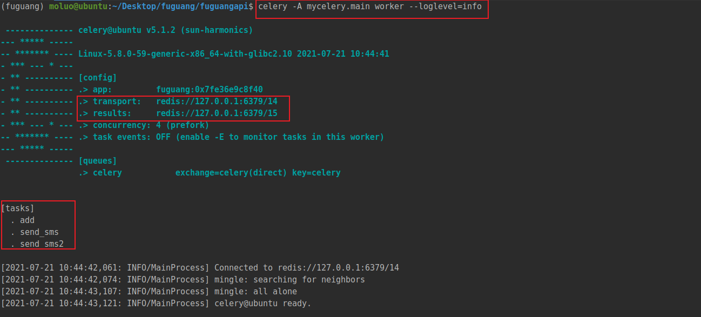
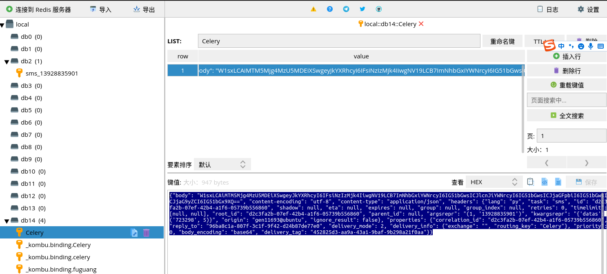

# Celery

Celery是一个python第三方模块，是一个功能完备即插即用的分布式异步任务队列框架。它适用于异步处理问题，当大批量发送邮件、或者大文件上传, 批图图像处理等等一些比较耗时的操作，我们可将其异步执行，这样的话原来的项目程序在执行过程中就不会因为耗时任务而形成阻塞，导致出现请求堆积过多的问题。celery通常用于实现异步任务或定时任务。

目前最新版本为: 5.2

项目：https://github.com/celery/celery/

文档：(3.1) http://docs.jinkan.org/docs/celery/getting-started/index.html

​          (最新) https://docs.celeryproject.org/en/latest/

Celery的特点是：

- 简单，易于使用和维护，有丰富的文档。
- 高效，支持多线程、多进程、协程模式运行，单个celery进程每分钟可以处理数百万个任务。
- 灵活，celery中几乎每个部分都可以自定义扩展。

celery的作用是：应用解耦，异步处理，流量削锋，消息通讯。

```python
celery通过消息(任务)进行通信，
celery通常使用一个叫Broker(中间人/消息中间件/消息队列/任务队列)来协助clients(任务的发出者/客户端)和worker(任务的处理者/工作进程)进行通信的.
clients发出消息到任务队列中，broker将任务队列中的信息派发给worker来处理。

client ---> 消息 --> Broker(消息队列) -----> 消息 ---> worker(celery运行起来的工作进程)

消息队列（Message Queue），也叫消息队列中间件，简称消息中间件，它是一个独立运行的程序，表示在消息的传输过程中临时保存消息的容器。
所谓的消息，是指代在两台计算机或2个应用程序之间传送的数据。消息可以非常简单，例如文本字符串或者数字，也可以是更复杂的json数据或hash数据等。
所谓的队列，是一种先进先出、后进呼后出的数据结构，python中的list数据类型就可以很方便地用来实现队列结构。
目前开发中，使用较多的消息队列有RabbitMQ，Kafka，RocketMQ，MetaMQ，ZeroMQ，ActiveMQ等，当然，像redis、mysql、MongoDB，也可以充当消息中间件，但是相对而言，没有上面那么专业和性能稳定。

并发任务10k以下的，直接使用redis
并发任务10k以上，1000k以下的，直接使用RabbitMQ
并发任务1000k以上的，直接使用RocketMQ
```


**Celery**的运行架构

Celery的运行架构由三部分组成，消息队列（message broker），任务执行单元（worker）和任务执行结果存储（task result store）组成。


```python
一个celery系统可以包含很多的worker和broker
Celery本身不提供消息队列功能，但是可以很方便地和第三方提供的消息中间件进行集成，包括Redis,RabbitMQ,RocketMQ等
```


## 安装

```python
pip install -U celery -i  https://pypi.tuna.tsinghua.edu.cn/simple
```

注意：

Celery不建议在windows系统下使用，Celery在4.0版本以后不再支持windows系统，所以如果要在windows下使用只能安装4.0以前的版本，而且即便是4.0之前的版本，在windows系统下也是不能单独使用的，需要安装gevent、geventlet或eventlet协程模块


## 基本使用

使用celery第一件要做的最为重要的事情是需要先创建一个Celery实例对象，我们一般叫做celery应用对象，或者更简单直接叫做一个app。app应用对象是我们使用celery所有功能的入口，比如启动celery、创建任务，管理任务，执行任务等.

celery框架有2种使用方式，一种是单独一个项目目录，另一种就是Celery集成到web项目框架中。

### celery作为一个单独项目运行

例如，mycelery代码目录直接放在项目根目录下即可，路径如下：

```python
服务端项目根目录/
└── mycelery/
    ├── settings.py   # 配置文件
    ├── __init__.py   
    ├── main.py       # 入口程序
    └── sms/          # 异步任务目录,这里拿发送短信来举例,一个类型的任务就一个目录
         └── tasks.py # 任务的文件，文件名必须是tasks.py!!!每一个任务就是一个被装饰的函数，写在任务文件中
```

main.py，代码：

```python
from celery import Celery

# 实例化celery应用，参数一般为项目应用名
app = Celery("luffycity")

# 通过app实例对象加载配置文件
app.config_from_object("mycelery.settings")

# 注册任务， 自动搜索并加载任务
# 参数必须必须是一个列表，里面的每一个任务都是任务的路径名称
# app.autodiscover_tasks(["任务1","任务2",....])
app.autodiscover_tasks(["mycelery.sms","mycelery.email"])

# 启动Celery的终端命令
# 强烈建议切换目录到项目的根目录下启动celery!!
# celery -A mycelery.main worker --loglevel=info
```

配置文件settings.py，代码：

```python
# 任务队列的链接地址
broker_url = 'redis://127.0.0.1:6379/14'
# 结果队列的链接地址
result_backend = 'redis://127.0.0.1:6379/15'
```

关于配置信息的官方文档：https://docs.celeryproject.org/en/master/userguide/configuration.html

创建任务文件sms/tasks.py，任务文件名必须固定为"tasks.py"，并创建任务，代码：

```python
from ..main import app

@app.task
def send_sms1():
    """没有任何参数的异步任务"""
    print('任务：send_sms1执行了...')

@app.task(name="send_sms2")
def send_sms2(mobile, code):
    """有参数的异步任务"""
    print(f'任务：send_sms2执行了...mobile={mobile}, code={code}')

@app.task
def send_sms3():
    """有结果的异步任务"""
    print('任务：send_sms3执行了...')
    return 100

@app.task(name="send_sms4")
def send_sms4(x,y):
    """有结果的异步任务"""
    print('任务：send_sms4执行了...')
    return x+y

```

接下来，我们运行celery。

```bash
cd ~/Desktop/luffycity/luffycityapi

# 普通的运行方式[默认多进程，卡终端，按CPU核数+1创建进程数]
# ps aux|grep celery
celery -A mycelery.main worker --loglevel=info

# 启动多工作进程，以守护进程的模式运行[一个工作进程就是4个子进程]
# 注意：pidfile和logfile必须以绝对路径来声明
celery multi start worker -A mycelery.main -E --pidfile="/home/moluo/Desktop/luffycity/luffycityapi/logs/worker1.pid" --logfile="/home/moluo/Desktop/luffycity/luffycityapi/logs/celery.log" -l info -n worker1
celery multi start worker -A mycelery.main -E --pidfile="/home/moluo/Desktop/luffycity/luffycityapi/logs/worker2.pid" --logfile="/home/moluo/Desktop/luffycity/luffycityapi/logs/celery.log" -l info -n worker2

# 关闭运行的工作进程
celery multi stop worker -A mycelery.main --pidfile="/home/moluo/Desktop/luffycity/luffycityapi/logs/worker1.pid" --logfile="/home/moluo/Desktop/luffycity/luffycityapi/logs/celery.log"
celery multi stop worker -A mycelery.main --pidfile="/home/moluo/Desktop/luffycity/luffycityapi/logs/worker2.pid" --logfile="/home/moluo/Desktop/luffycity/luffycityapi/logs/celery.log"
```

效果如下：



调用上面的异步任务，拿django的shell进行举例：

```python
# 因为celery模块安装在了虚拟环境中，所以要确保进入虚拟环境
conda activate luffycity
cd ~/Desktop/luffycity/luffycityapi

python manage.py shell

# 调用celery执行异步任务
from mycelery.sms.tasks import send_sms1,send_sms2,send_sms3,send_sms4
mobile = "13312345656"
code = "666666"

# delay 表示马上按顺序来执行异步任务，在celrey的worker工作进程有空闲的就立刻执行
# 可以通过delay异步调用任务，可以没有参数
ret1 = send_sms1.delay()
# 可以通过delay传递异步任务的参数，可以按位置传递参数，也可以使用命名参数
# ret2 = send_sms.delay(mobile=mobile,code=code)
ret2 = send_sms2.delay(mobile,code)

# apply_async 让任务在后面指定时间后执行，时间单位：秒/s
# 任务名.apply_async(args=(参数1,参数2), countdown=定时时间)
ret4 = send_sms4.apply_async(kwargs={"x":10,"y":20},countdown=30)

# 根据返回结果，不管delay，还是apply_async的返回结果都一样的。
ret4.id      # 返回一个UUID格式的任务唯一标志符，78fb827e-66f0-40fb-a81e-5faa4dbb3505
ret4.status  # 查看当前任务的状态 SUCCESS表示成功！ PENDING任务等待
ret4.get()   # 获取任务执行的结果[如果任务函数中没有return，则没有结果，如果结果没有出现则会导致阻塞]

if ret4.status == "SUCCESS":
    print(ret4.get())
```


接下来，我们让celery可以调度第三方框架的代码，这里拿django当成一个第三模块调用进行举例。

在main.py主程序中对django进行导包引入，并设置django的配置文件进行django的初始化。

```python
import os,django
from celery import Celery
# 初始化django
os.environ.setdefault('DJANGO_SETTINGS_MODULE', 'luffycityapi.settings.dev')
django.setup()

# 初始化celery对象
app = Celery("luffycity")

# 加载配置
app.config_from_object("mycelery.config")
# 自动注册任务
app.autodiscover_tasks(["mycelery.sms","mycelery.email"])
# 运行celery
# 终端下: celery -A mycelery.main worker -l info
```

在需要使用django配置的任务中，直接加载配置，所以我们把注册的短信发送功能，整合成一个任务函数，mycelery.sms.tasks，代码：

```python
from ..main import app
from ronglianyunapi import send_sms as send_sms_to_user

@app.task(name="send_sms1")
def send_sms1():
    """没有任何参数，没有返回结果的异步任务"""
    print('任务：send_sms1执行了...')

@app.task(name="send_sms2")
def send_sms2(mobile, code):
    """有参数，没有返回结果的异步任务"""
    print(f'任务：send_sms2执行了...mobile={mobile}, code={code}')


@app.task(name="send_sms3")
def send_sms3():
    """没有任何参数，有返回结果的异步任务"""
    print('任务：send_sms3执行了...')
    return 100

@app.task(name="send_sms4")
def send_sms4(x,y):
    """有结果的异步任务"""
    print('任务：send_sms4执行了...')
    return x+y

@app.task(name="send_sms")
def send_sms(tid, mobile, datas):
    """发送短信"""
    print("发送短信")
    return send_sms_to_user(tid, mobile, datas)
```

最终在django的视图里面，我们调用Celery来异步执行任务。

只需要完成2个步骤，分别是**导入异步任务**和**调用异步任务**。users/views.py，代码：

```python

import random
from django_redis import get_redis_connection
from django.conf import settings
# from ronglianyunapi import send_sms
from mycelery.sms.tasks import send_sms
"""
/users/sms/(?P<mobile>1[3-9]\d{9})
"""
class SMSAPIView(APIView):
    """
    SMS短信接口视图
    """
    def get(self, request, mobile):
        """发送短信验证码"""
        redis = get_redis_connection("sms_code")
        # 判断手机短信是否处于发送冷却中[60秒只能发送一条]
        interval = redis.ttl(f"interval_{mobile}")  # 通过ttl方法可以获取保存在redis中的变量的剩余有效期
        if interval != -2:
            return Response({"errmsg": f"短信发送过于频繁，请{interval}秒后再次点击获取!", "interval": interval},status=status.HTTP_400_BAD_REQUEST)

        # 基于随机数生成短信验证码
        # code = "%06d" % random.randint(0, 999999)
        code = f"{random.randint(0, 999999):06d}"
        # 获取短信有效期的时间
        time = settings.RONGLIANYUN.get("sms_expire")
        # 短信发送间隔时间
        sms_interval = settings.RONGLIANYUN["sms_interval"]
        # 调用第三方sdk发送短信
        # send_sms(settings.RONGLIANYUN.get("reg_tid"), mobile, datas=(code, time // 60))
        # 异步发送短信
        send_sms.delay(settings.RONGLIANYUN.get("reg_tid"), mobile, datas=(code, time // 60))

        # 记录code到redis中，并以time作为有效期
        # 使用redis提供的管道对象pipeline来优化redis的写入操作[添加/修改/删除]
        pipe = redis.pipeline()
        pipe.multi()  # 开启事务
        pipe.setex(f"sms_{mobile}", time, code)
        pipe.setex(f"interval_{mobile}", sms_interval, "_")
        pipe.execute()  # 提交事务，同时把暂存在pipeline的数据一次性提交给redis

        return Response({"errmsg": "OK"}, status=status.HTTP_200_OK)
```

上面就是使用celery并执行异步任务的第一种方式，适合在一些无法直接集成celery到项目中的场景。

```bash
cd /home/moluo/Desktop/luffycity
git add .
git commit -m "feature: celery作为一个单独项目运行，执行异步任务"
git push
```


### Celery作为第三方模块集成到项目中

这里还是拿django来举例，目录结构调整如下：

```bash
luffycityapi/           # 服务端项目根目录
└── luffycityapi/       # 主应用目录
    ├── apps/           # 子应用存储目录  
    ├   └── users/            # django的子应用
    ├       └── tasks.py      # [新增]分散在各个子应用下的异步任务模块
    ├── settings/     # [修改]django的配置文件存储目录[celery的配置信息填写在django配置中即可]
    ├── __init__.py   # [修改]设置当前包目录下允许外界调用celery应用实例对象
    └── celery.py     # [新增]celery入口程序，相当于上一种用法的main.py
```

luffycityapi/celery.py，主应用目录下创建cerley入口程序，创建celery对象并加载配置和异步任务，代码：

```python
import os
from celery import Celery

# 必须在实例化celery应用对象之前执行
os.environ.setdefault('DJANGO_SETTINGS_MODULE', 'luffycityapi.settings.dev')

# 实例化celery应用对象
app = Celery('luffycityapi')
# 指定任务的队列名称
app.conf.task_default_queue = 'Celery'
# 也可以把配置写在django的项目配置中
app.config_from_object('django.conf:settings', namespace='CELERY') # 设置django中配置信息以 "CELERY_"开头为celery的配置信息
# 自动根据配置查找django的所有子应用下的tasks任务文件
app.autodiscover_tasks()
```

settings/dev.py，django配置中新增celery相关配置信息，代码：

```python

# Celery异步任务队列框架的配置项[注意：django的配置项必须大写，所以这里的所有配置项必须全部大写]
# 任务队列
CELERY_BROKER_URL = 'redis://:123456@127.0.0.1:6379/14'
# 结果队列
CELERY_RESULT_BACKEND = 'redis://:123456@127.0.0.1:6379/15'
# 时区，与django的时区同步
CELERY_TIMEZONE = TIME_ZONE
# 防止死锁
CELERY_FORCE_EXECV = True
# 设置并发的worker数量
CELERYD_CONCURRENCY = 200
# 设置失败允许重试[这个慎用，如果失败任务无法再次执行成功，会产生指数级别的失败记录]
CELERY_ACKS_LATE = True
# 每个worker工作进程最多执行500个任务被销毁，可以防止内存泄漏，500是举例，根据自己的服务器的性能可以调整数值
CELERYD_MAX_TASKS_PER_CHILD = 500
# 单个任务的最大运行时间，超时会被杀死[慎用，有大文件操作、长时间上传、下载任务时，需要关闭这个选项，或者设置更长时间]
CELERYD_TIME_LIMIT = 10 * 60
# 任务发出后，经过一段时间还未收到acknowledge, 就将任务重新交给其他worker执行
CELERY_DISABLE_RATE_LIMITS = True
# celery的任务结果内容格式
CELERY_ACCEPT_CONTENT = ['json', 'pickle']

# 之前定时任务（定时一次调用），使用了apply_async({}, countdown=30);
# 设置定时任务（定时多次调用）的调用列表，需要单独运行SCHEDULE命令才能让celery执行定时任务：celery -A mycelery.main beat，当然worker还是要启动的
# https://docs.celeryproject.org/en/stable/userguide/periodic-tasks.html
from celery.schedules import crontab
CELERY_BEAT_SCHEDULE = {
    "user-add": {  # 定时任务的注册标记符[必须唯一的]
        "task": "add",   # 定时任务的任务名称
        "schedule": 10,  # 定时任务的调用时间，10表示每隔10秒调用一次add任务
        # "schedule": crontab(hour=7, minute=30, day_of_week=1),,  # 定时任务的调用时间，每周一早上7点30分调用一次add任务
    }
}
```

`luffycityapi/__init__.py`，主应用下初始化，代码：

```python
import pymysql
from .celery import app as celery_app

pymysql.install_as_MySQLdb()

__all__ = ['celery_app']
```

users/tasks.py，代码：

```python
from celery import shared_task
from ronglianyunapi import send_sms as sms
# 记录日志：
import logging
logger = logging.getLogger("django")

@shared_task(name="send_sms")
def send_sms(tid, mobile, datas):
    """异步发送短信"""
    try:
        return sms(tid, mobile, datas)
    except Exception as e:
        logger.error(f"手机号：{mobile}，发送短信失败错误: {e}")


@shared_task(name="send_sms1")
def send_sms1():
    print("send_sms1执行了！！！")
```

django中的用户发送短信，就可以改成异步发送短信了。

users/views，视图中调用异步发送短信的任务，代码：

```python
from .tasks import send_sms
send_sms.delay(settings.RONGLIANYUN.get("reg_tid"),mobile, datas=(code, time // 60))
```

users/views.py，异步发送信息的完整视图，代码：

```python
import random
from django_redis import get_redis_connection
from django.conf import settings
# from ronglianyunapi import send_sms
# from mycelery.sms.tasks import send_sms
from .tasks import send_sms

"""
/users/sms/(?P<mobile>1[3-9]\d{9})
"""
class SMSAPIView(APIView):
    """
    SMS短信接口视图
    """
    def get(self, request, mobile):
        """发送短信验证码"""
        redis = get_redis_connection("sms_code")
        # 判断手机短信是否处于发送冷却中[60秒只能发送一条]
        interval = redis.ttl(f"interval_{mobile}")  # 通过ttl方法可以获取保存在redis中的变量的剩余有效期
        if interval != -2:
            return Response({"errmsg": f"短信发送过于频繁，请{interval}秒后再次点击获取!", "interval": interval},status=status.HTTP_400_BAD_REQUEST)

        # 基于随机数生成短信验证码
        # code = "%06d" % random.randint(0, 999999)
        code = f"{random.randint(0, 999999):06d}"
        # 获取短信有效期的时间
        time = settings.RONGLIANYUN.get("sms_expire")
        # 短信发送间隔时间
        sms_interval = settings.RONGLIANYUN["sms_interval"]
        # 调用第三方sdk发送短信
        # send_sms(settings.RONGLIANYUN.get("reg_tid"), mobile, datas=(code, time // 60))
        # 异步发送短信
        send_sms.delay(settings.RONGLIANYUN.get("reg_tid"), mobile, datas=(code, time // 60))

        # 记录code到redis中，并以time作为有效期
        # 使用redis提供的管道对象pipeline来优化redis的写入操作[添加/修改/删除]
        pipe = redis.pipeline()
        pipe.multi()  # 开启事务
        pipe.setex(f"sms_{mobile}", time, code)
        pipe.setex(f"interval_{mobile}", sms_interval, "_")
        pipe.execute()  # 提交事务，同时把暂存在pipeline的数据一次性提交给redis

        return Response({"errmsg": "OK"}, status=status.HTTP_200_OK)
```


终端下先启动celery，在django项目根目录下启动。

```bash
cd ~/Desktop/luffycity/luffycityapi
# 1. 普通运行模式，关闭终端以后，celery就会停止运行
celery -A luffycityapi worker  -l INFO

# 2. 启动多worker进程模式，以守护进程的方式运行，不需要在意终端。但是这种运行模型，一旦停止，需要手动启动。
celery multi start worker -A luffycityapi -E --pidfile="/home/moluo/Desktop/luffycity/luffycityapi/logs/worker1.pid" --logfile="/home/moluo/Desktop/luffycity/luffycityapi/logs/celery.log" -l info -n worker1

# 3. 启动多worker进程模式
celery multi stop worker -A luffycityapi --pidfile="/home/moluo/Desktop/luffycity/luffycityapi/logs/worker1.pid"
```

还是可以在django终端下调用celery的

```bash
$ python manage.py shell
>>> from users.tasks import send_sms1
>>> res = send_sms1.delay()
>>> res = send_sms1.apply_async(countdown=15)
>>> res.id
'893c31ab-e32f-44ee-a321-8b07e9483063'
>>> res.state
'SUCCESS'
>>> res.result
```

关于celery中异步任务发布的2个方法的参数如下：

```python
异步任务名.delay(*arg, **kwargs)
异步任务名.apply_async((arg,), {'kwarg': value}, countdown=60, expires=120)
```

定时任务的调用器启动，可以在运行了worker以后，使用以下命令：

```bash
cd ~/Desktop/luffycity/luffycityapi
celery -A luffycityapi beat
```

beat调度器关闭了，则定时任务无法执行，如果worker工作进程关闭了，则celery关闭，保存在消息队列中的任务就会囤积在那里。



celery还有一些高阶用法， 我们后面用到再提。

celery后面还可以使用supervisor进行后台托管运行。还可以针对任务执行的情况和结果，使用flower来进行监控。celery失败任务的重新尝试执行。

supervisor会在celery以外关闭了以后，自动重启celery。


