# [课程介绍 ](https://www.cnblogs.com/GGGG-XXXX/articles/10239061.html)

https://www.cnblogs.com/GGGG-XXXX/p/9564651.html

### 知识体系回顾

我们之前学过了很多内容：

　　-- Python基础

　　-- 网络编程并发编程

　　-- 数据库

　　-- 前端

　　-- Django基础

　　-- Django项目 （crm）

　　-- Vue

大家想一个问题~我们之前的前面的页面是通过什么方式得到的~

通过后端render模板渲染出来的~~

我们已经学了Vue已经知道了前后端分离的一些概念~~

那么接下来我们总结一下为什么要做前后端分离的项目~~

### 为什么要做前后端分离的项目

#### 　　1，满足多端适配

　　  随着移动端的兴起，现在公司产品不只限于pc端的，包括Android，IOS。

　　　　按照以前的方式，我们后端其实就要有多套，pc一套，APP端两套。

　　   开发成本以及开发效率会很低，如果前后端分离，我们后端只需要有一套就可以了~

　　   后端只提供接口，前端不管是pc还是APP都可以去调用数据。

#### 　　2，前后端职责不清晰

　　　　我们的模板语言到底是前端写还是后端写

#### 　　3，开发效率 前后端互相等待

#### 　　4，前端配合后端，只写模板语言，能力受限

#### 　　5，后端开发语言与模板语言耦合度较高，依赖开发语言，更换后端语言的成本加大。

### 课程安排

　　DRF框架

　　　　-- 介绍DRF十大组件以及源码实现流程

　　路飞项目

　　　　-- 课程模块

　　　　-- 登录注册模块

　　　　-- 购物模块

　　　　-- 三方依赖

　　　　-- redis应用

　　　　-- Django的ContentType组件应用

　　　　-- 跨域的问题

学习中的一些小建议

　　用思维导图去记录自己知识点，能够很好的梳理自己知识体系知识架构。

　　代码量必须上去，码代码可以先用伪代码整理自己思路，然后再去实现。

　　


# [RESTful ](https://www.cnblogs.com/GGGG-XXXX/articles/9258310.html)

### web服务交互

　　我们在浏览器中能看到的每个网站，都是一个web服务。那么我们在提供每个web服务的时候，

　　都需要前后端交互，前后端交互就一定有一些实现方案，我们通常叫web服务交互方案。

　　目前主流的三种web服务交互方案：

　　　　-- REST （ Representational State Transfer）表述性状态转移

　　　　-- SOAP （Simple Object Access Protocol） 简单的对象访问协议

　　　　-- XML-RPC （XML Remote Procedure Call）基于XML的远程过程调用

　　XML-RPC是通过XML将调用函数封装，并使用HTTP协议作为传送机制。

　　后来在新的功能不断被引入下，这个标准慢慢演变成为今日的SOAP协定。

　　SOAP服务则是以本身所定义的操作集，来访问网络上的资源。

　　SOAP也是基于XML的，但是它不只限于HTTP协议的传输，包括TCP协议，UDP协议都可以传输。

　　REST是Roy Thomas Fielding博士于2000年在他的博士论文里提出来的。

　　REST相比SOAP更加简洁，性能和开发效率也有突出的优势。

　　我们今天主要说一下这个REST，现在越来越多的web服务开始采用REST风格设计和实现。

　　例如，amazon.com提供接近REST风格的Web服务进行图书查找；雅虎提供的Web服务也是REST风格的。

　　我们接下来要学的框架也是遵循REST风格的，那么我们来看下它到底是个什么样的风格，

　　了解了它是什么后，我们看下它的优点是什么，我们为什么用它。

### 理解REST

　　如果我们想要理解restful，就要理解Representational State Transfer这个词组的意思，表征性状态转移。

　　这里所说的表征性，其实指的就是资源。通常我们称为资源状态转移。

#### 什么是资源

　　任何事物，只要有被引用到的必要，它就是一个资源。

　　我们在浏览器中看到的文本，视频，图片等等都是资源。这些都是实实在在存在的实体。

　　资源可以是一个实体，也可以是抽象概念。

　　比如说吧：

　　　　-- Alex的个人信息

　　　　-- 沛齐的手机号

　　　　-- Alex跟沛齐的潜在关系

　　这些都是资源，可以是实体比如个人信息，手机号。也可以是抽象的概念，比如两个人的关系......

　　那么在我们的网络中，我们要引用资源，资源一定要有一个标识，在web中的唯一标识就是URI，

　　URI我们不常听说，我们经常用URL，那么两者区别是什么呢~

#### 什么是URI，URL

　　URI 统一资源标志符。

　　URL 统一资源定位符。

　　URI是给我们的资源进行标识的，URL是描述我们资源地址的。

　　比如说我们每个人都有名字和身份证，名字可能重名，但是身份证是唯一的，

　　那么身份证号就可以是我们的URI，标识我们每个人，也可以说标识我们每个资源。

　　我们可以通过身份证号找到Alex，也可以通过下面这种方式找到他.....

　　Alex的住址协议://地球/中国/屌丝省/屌丝市/寡妇村/250号街道/250号/Alex

　　这个就是我们的URL，我们通过这两种方式都可以找到我们的资源，

　　其实我们的URL可以说是URI的子集，通过定位的方式实现的URI。

　　这是我们资源的定位 -- 有了资源的地址后，我们要去访问资源，那么我们要通过什么方式去访问呢~~

#### 统一资源接口

　　现在我们可以通过URL去访问到资源，那么我们对资源会有很多不同的操作，增删改查，

　　以前我们可能会为了这个增加新设计一个URL，然后这个URL就是对数据进行增加的，

　　还会为了更新和删除分别设计一个URL，现在我们不用了，我们只有一个URL，

　　然后根据HTTP请求方式的不同，对资源进行不同的操作，这个就是是统一资源接口。

　　我们一定要遵循HTTP请求方法的语义，也就是说POST请求就在新增数据等....

#### 资源的表述

　　资源的表述其实就是资源的展现形式，我们客户端和服务端传输的都是资源的表述，而不是资源本身。

　　例如文本资源可以采用html、xml、json等格式，图片可以使用PNG或JPG展现出来。

　　那么客户端如何知道服务端提供哪种表述形式呢?

　　可以通过HTTP内容协商，客户端可以通过Accept头请求一种特定格式的表述，服务端则通过Content-Type告诉客户端资源的表述形式。

　　这些资源的表述呈现在页面上，就是我们说的资源状态。

#### 状态转移

　　我们在看页面的时候，从当前资源的表述(也可以说状态或者表现层)会跳转到其他的资源状态。

　　服务端通过超媒体告诉客户端当前状态有哪些后续状态可以进入。

　　这些类似"下一页"之类的链接起的就是这种推进状态的作用——指引你如何从当前状态进入下一个可能的状态。

#### 总结　

　　可以得知REST风格的特点如下：

　　（1）在web中，只要有被引用的必要都叫资源。

　　（2）每个URI代表一个资源，独一无二的。

　　（3）客户端通过HTTP的方法，对服务器端资源进行操作；

　　（4）客户端和服务器之间，传递这种资源的某种表现层；

　　（5）通过超链接的指引，实现"表现层状态转移"。

### RESTful 

　　如果一个架构符合REST的约束条件和原则，我们就称它为RESTful架构。

　　一种软件的架构风格，设计风格, 为客户端和服务端的交互提供一组设计原则和约束条件。

### restful规范

#### 一 面向资源编程

　　每个URL代表一种资源，URL中尽量不要用动词，要用名词。

#### 二 根据method不同，进行不同的操作

　　GET/POST/PUT/DELETE/PATCH

#### 三 在URL中体现版本

　　https://www.bootcss.com/v1/mycss

　　https://v1.bootcss.com/mycss

#### 四 在URL中体现是否是API

　　https://www.bootcss.com/api/mycss

　　https://api.bootcss.com/mycss

#### 五 在URL中的过滤条件

　　https://www.bootcss.com/v1/mycss？page=3

#### 六 尽量使用HTTPS

　　https://www.bootcss.com/v1/mycss

#### 七 响应时设置状态码

　　1**  信息，服务器收到请求，需要请求者继续执行操作

　　2** 成功，操作被成功接收并处理

　　3** 重定向，需要进一步的操作以完成请求

　　4** 客户端错误，请求包含语法错误或无法完成请求

　　5** 服务器错误，服务器在处理请求的过程中发生了错误

#### 八 返回值

　　GET请求 返回查到所有或单条数据

　　POST请求 返回新增的数据

　　PUT请求 返回更新数据

　　PATCH请求 局部更新 返回更新整条数据

　　DELETE请求 返回值为空

#### 九 返回错误信息

　　返回值携带错误信息

#### 十  Hypermedia API

　　如果遇到需要跳转的情况 携带调转接口的URL

```
ret = {
       code: 1000,
       data:{
             id:1,
             name:'小强',
             depart_id:http://www.luffycity.com/api/v1/depart/8/
             }
     }
```


 [学习DRF之前~~~](https://www.cnblogs.com/GGGG-XXXX/articles/9712194.html)

# 在学习DRF之前~我们要先复习一些知识点~~

### FBV和CBV

学习Django的时候~我们已经学习过了CBV以及FBV~~我们来复习一下~~

什么是FBV和CBV呢~~

　　FBV 基于函数的视图

　　CBV 基于类的视图

也就是说我们是用函数编写视图~还是类编写视图~~我们来看下两个的简单实现~~

```
urlpatterns = [
    path('admin/', admin.site.urls),
    path('test_fbv', test_fbv),
    path('test_cbv', TestCBV.as_view())
]
```


```
def test_fbv(request):
    return HttpResponse("ok")


class TestCBV(View):
    def get(self, request):
        return HttpResponse("ok")
```


我们可以看到，我们的CBV首先执行了as_view()方法，那我们看下我们这个方法里做了什么~

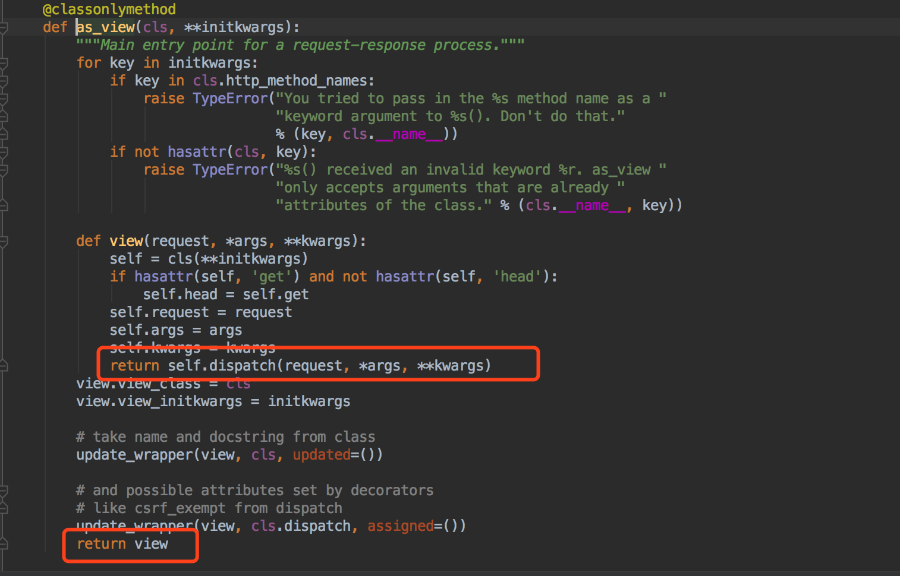

 

我们可以看出~CBV在内部做了一个分发~本质和FBV是一样的~~

以后做接口开发的时候，我们就要用CBV，我们之前学了restful规范，现在就很容易理解我们为什么用CBV了。

面向资源编程，并且用HTTP的请求方式来对资源进行操作，还要遵循这些方法的语义，所以我们选择CBV编写我们接下来的视图函数。

 

# [Serializers 序列化组件](https://www.cnblogs.com/GGGG-XXXX/articles/9568816.html)

## 为什么要用序列化组件

当我们做前后端分离的项目~~我们前后端交互一般都选择JSON数据格式，JSON是一个轻量级的数据交互格式。

那么我们给前端数据的时候都要转成json格式，那就需要对我们从数据库拿到的数据进行序列化。

接下来我们看下django序列化和rest_framework序列化的对比~~

## Django的序列化方法

.values 序列化结果

```
class BooksView(View):
    def get(self, request):
        book_list = Book.objects.values("id", "title", "chapter", "pub_time", "publisher")
        book_list = list(book_list)
        # 如果我们需要取外键关联的字段信息 需要循环获取外键 再去数据库查然后拼接成我们想要的
        ret = []
        for book in book_list:
            pub_dict = {}
            pub_obj = Publish.objects.filter(pk=book["publisher"]).first()
            pub_dict["id"] = pub_obj.pk
            pub_dict["title"] = pub_obj.title
            book["publisher"] = pub_dict
            ret.append(book)
        ret = json.dumps(book_list, ensure_ascii=False, cls=MyJson)
        return HttpResponse(ret)


# json.JSONEncoder.default()
# 解决json不能序列化时间字段的问题
class MyJson(json.JSONEncoder):
    def default(self, field):
        if isinstance(field, datetime.datetime):
            return field.strftime('%Y-%m-%d %H:%M:%S')
        elif isinstance(field, datetime.date):
            return field.strftime('%Y-%m-%d')
        else:
            return json.JSONEncoder.default(self, field)
```

django serializers

```
from django.core import serializers


# 能够得到我们要的效果 结构有点复杂
class BooksView(View):
    def get(self, request):
        book_list = Book.objects.all()
        ret = serializers.serialize("json", book_list)
        return HttpResponse(ret)
```


##  DRF序列化的方法

首先，我们要用DRF的序列化，就要遵循人家框架的一些标准，

　　-- Django我们CBV继承类是View，现在DRF我们要用APIView

　　-- Django中返回的时候我们用HTTPResponse，JsonResponse，render ，DRF我们用Response

为什么这么用~我们之后会详细讲~~我们继续来看序列化~~

### 序列化

第一步 声明序列化类

```
class BookSerializer(serializers.Serializer):
    id = serializers.IntegerField()
    title = serializers.CharField(max_length=32)
    CHOICES = ((1, "Linux"), (2, "Django"), (3, "Python"))
    chapter = serializers.ChoiceField(choices=CHOICES, source="get_chapter_display")
    pub_time = serializers.DateField()
```

第二步 序列化对象

```
from rest_framework.views import APIView
from rest_framework.response import Response

class BookView(APIView):
    def get(self, request):
        book_list = Book.objects.all()
        ret = BookSerializer(book_list, many=True)
        return Response(ret.data)
```


### 外键关系的序列化

外键关系的序列化

```
# by gaoxin
from rest_framework import serializers
from .models import Book


class PublisherSerializer(serializers.Serializer):
    id = serializers.IntegerField(read_only=True)
    title = serializers.CharField(max_length=32)


class UserSerializer(serializers.Serializer):
    id = serializers.IntegerField(read_only=True)
    name = serializers.CharField(max_length=32)
    age = serializers.IntegerField()


class BookSerializer(serializers.Serializer):
    id = serializers.IntegerField(read_only=True)
    title = serializers.CharField(max_length=32)
    CHOICES = ((1, "Linux"), (2, "Django"), (3, "Python"))
    chapter = serializers.ChoiceField(choices=CHOICES, source="get_chapter_display", read_only=True)
    pub_time = serializers.DateField()

    publisher = PublisherSerializer(read_only=True)
    user = UserSerializer(many=True, read_only=True)
```


### 反序列化

当前端给我们发post的请求的时候~前端给我们传过来的数据~我们要进行一些校验然后保存到数据库~

这些校验以及保存工作，DRF的Serializer也给我们提供了一些方法了~~

首先~我们要写反序列化用的一些字段~有些字段要跟序列化区分开~~

Serializer提供了.is_valid() 和.save()方法~~

反序列化serializer.py

```
# serializers.py 文件
class BookSerializer(serializers.Serializer):
    id = serializers.IntegerField(read_only=True)
    title = serializers.CharField(max_length=32)
    CHOICES = ((1, "Linux"), (2, "Django"), (3, "Python"))
    chapter = serializers.ChoiceField(choices=CHOICES, source="get_chapter_display", read_only=True)
    w_chapter = serializers.IntegerField(write_only=True)
    pub_time = serializers.DateField()

    publisher = PublisherSerializer(read_only=True)
    user = UserSerializer(many=True, read_only=True)

    users = serializers.ListField(write_only=True)
    publisher_id = serializers.IntegerField(write_only=True)

    def create(self, validated_data):
        book = Book.objects.create(title=validated_data["title"], chapter=validated_data["w_chapter"], pub_time=validated_data["pub_time"],                                  publisher_id=validated_data["publisher_id"])
        book.user.add(*validated_data["users"])
        return book
```

反序列化views.py

```
class BookView(APIView):
    def get(self, request):
        book_list = Book.objects.all()
        ret = BookSerializer(book_list, many=True)
        return Response(ret.data)

    def post(self, request):
        # book_obj = request.data
        print(request.data)
        serializer = BookSerializer(data=request.data)
        if serializer.is_valid():
            print(12341253)
            serializer.save()
            return Response(serializer.validated_data)
        else:
            return Response(serializer.errors)
```


当前端给我们发送patch请求的时候，前端传给我们用户要更新的数据，我们要对数据进行部分验证~~

PATCH请求serializers.py

```
class BookSerializer(serializers.Serializer):
    id = serializers.IntegerField(read_only=True)
    title = serializers.CharField(max_length=32)
    CHOICES = ((1, "Linux"), (2, "Django"), (3, "Python"))
    chapter = serializers.ChoiceField(choices=CHOICES, source="get_chapter_display", read_only=True)
    w_chapter = serializers.IntegerField(write_only=True)
    pub_time = serializers.DateField()

    publisher = PublisherSerializer(read_only=True)
    user = UserSerializer(many=True, read_only=True)

    users = serializers.ListField(write_only=True)
    publisher_id = serializers.IntegerField(write_only=True)

    def create(self, validated_data):
        book = Book.objects.create(title=validated_data["title"], chapter=validated_data["w_chapter"], pub_time=validated_data["pub_time"],
                                   publisher_id=validated_data["publisher_id"])
        book.user.add(*validated_data["users"])
        return book

    def update(self, instance, validated_data):
        instance.title = validated_data.get("title", instance.title)
        instance.chapter = validated_data.get("w_chapter", instance.chapter)
        instance.pub_time = validated_data.get("pub_time", instance.pub_time)
        instance.publisher_id = validated_data.get("publisher_id", instance.publisher_id)
        if validated_data.get("users"):
            instance.user.set(validated_data.get("users"))
        instance.save()
        return instance
```

PATCH请求views.py

```
class BookView(APIView):
     def patch(self, request):
        print(request.data)
        book_id = request.data["id"]
        book_info = request.data["book_info"]
        book_obj = Book.objects.filter(pk=book_id).first()
        serializer = BookSerializer(book_obj, data=book_info, partial=True)
        if serializer.is_valid():
            serializer.save()
            return Response(serializer.data)
        else:
            return Response(serializer.errors)
```

###  验证

如果我们需要对一些字段进行自定义的验证~DRF也给我们提供了钩子方法~~

单个字段的验证

```
class BookSerializer(serializers.Serializer):
    id = serializers.IntegerField(read_only=True)
    title = serializers.CharField(max_length=32)
    # 省略了一些字段 跟上面代码里一样的
    # 。。。。。
     def validate_title(self, value):
        if "python" not in value.lower():
            raise serializers.ValidationError("标题必须含有Python")
        return value
```

多个字段的验证

```
class BookSerializer(serializers.Serializer):
    id = serializers.IntegerField(read_only=True)
    title = serializers.CharField(max_length=32)
    CHOICES = ((1, "Linux"), (2, "Django"), (3, "Python"))
    chapter = serializers.ChoiceField(choices=CHOICES, source="get_chapter_display", read_only=True)
    w_chapter = serializers.IntegerField(write_only=True)
    pub_time = serializers.DateField()
    date_added = serializers.DateField(write_only=True)
    # 新增了一个上架时间字段  
    # 省略一些字段。。都是在原基础代码上增加的
    # 。。。。。。

    # 对多个字段进行验证 要求上架日期不能早于出版日期 上架日期要大
    def validate(self, attrs):
        if attrs["pub_time"] > attrs["date_added"]:
            raise serializers.ValidationError("上架日期不能早于出版日期")
        return attrs
```

验证器 validators

```
def my_validate(value):
    if "敏感词汇" in value.lower:
        raise serializers.ValidationError("包含敏感词汇，请重新提交")
    return value


class BookSerializer(serializers.Serializer):
    id = serializers.IntegerField(read_only=True)
    title = serializers.CharField(max_length=32, validators=[my_validate])
    # 。。。。。。
    
```


##  ModelSerializer

现在我们已经清楚了Serializer的用法，会发现我们所有的序列化跟我们的模型都紧密相关~

那么，DRF也给我们提供了跟模型紧密相关的序列化器~~ModelSerializer~~

　　-- 它会根据模型自动生成一组字段

　　-- 它简单的默认实现了.update()以及.create()方法

### 定义一个ModelSerializer序列化器

定义ModelSerializer

```
class BookSerializer(serializers.ModelSerializer):
    class Meta:
        model = Book
        fields = "__all__"
        # fields = ["id", "title", "pub_time"]
        # exclude = ["user"]
        # 分别是所有字段 包含某些字段 排除某些字段
```


### 外键关系的序列化

注意：当序列化类MATE中定义了depth时，这个序列化类中引用字段（外键）则自动变为只读

外键关系序列化

```
class BookSerializer(serializers.ModelSerializer):
    class Meta:
        model = Book
        fields = "__all__"
        # fields = ["id", "title", "pub_time"]
        # exclude = ["user"]
        # 分别是所有字段 包含某些字段 排除某些字段
        depth = 1
# depth 代表找嵌套关系的第几层
```


### 自定义字段

我们可以声明一些字段来覆盖默认字段，来进行自定制~

比如我们的选择字段，默认显示的是选择的key，我们要给用户展示的是value。

自定义字段

```
class BookSerializer(serializers.ModelSerializer):
    chapter = serializers.CharField(source="get_chapter_display", read_only=True)
    
    class Meta:
        model = Book
        fields = "__all__"
        # fields = ["id", "title", "pub_time"]
        # exclude = ["user"]
        # 分别是所有字段 包含某些字段 排除某些字段
        depth = 1
```


### Meta中其它关键字参数

Meta中参数

```
class BookSerializer(serializers.ModelSerializer):
    chapter = serializers.CharField(source="get_chapter_display", read_only=True)

    class Meta:
        model = Book
        fields = "__all__"
        # fields = ["id", "title", "pub_time"]
        # exclude = ["user"]
        # 分别是所有字段 包含某些字段 排除某些字段
        depth = 1
        read_only_fields = ["id"]
        extra_kwargs = {"title": {"validators": [my_validate,]}}
```


### post以及patch请求

由于depth会让我们外键变成只读，所以我们再定义一个序列化的类，其实只要去掉depth就可以了~~

post/patch请求序列化类

```
class BookSerializer(serializers.ModelSerializer):
    chapter = serializers.CharField(source="get_chapter_display", read_only=True)

    class Meta:
        model = Book
        fields = "__all__"
        # fields = ["id", "title", "pub_time"]
        # exclude = ["user"]
        # 分别是所有字段 包含某些字段 排除某些字段
        read_only_fields = ["id"]
        extra_kwargs = {"title": {"validators": [my_validate,]}}
```


### SerializerMethodField

外键关联的对象有很多字段我们是用不到的~都传给前端会有数据冗余~就需要我们自己去定制序列化外键对象的哪些字段~~

SerializerMethodField

```
class BookSerializer(serializers.ModelSerializer):
    chapter = serializers.CharField(source="get_chapter_display", read_only=True)
    user = serializers.SerializerMethodField()
    publisher = serializers.SerializerMethodField()

    def get_user(self, obj):
        # obj是当前序列化的book对象
        users_query_set = obj.user.all()
        return [{"id": user_obj.pk, "name": user_obj.name} for user_obj in users_query_set]

    def get_publisher(self, obj):
        publisher_obj = obj.publisher
        return {"id": publisher_obj.pk, "title": publisher_obj.title}

    class Meta:
        model = Book
        fields = "__all__"
        # fields = ["id", "title", "pub_time"]
        # exclude = ["user"]
        # 分别是所有字段 包含某些字段 排除某些字段
        read_only_fields = ["id"]
        extra_kwargs = {"title": {"validators": [my_validate,]}}
```


### 用ModelSerializer改进上面Serializer的完整版

ModelSerializer

```
class BookSerializer(serializers.ModelSerializer):
    dis_chapter = serializers.SerializerMethodField(read_only=True)
    users = serializers.SerializerMethodField(read_only=True)
    publishers = serializers.SerializerMethodField(read_only=True)

    def get_users(self, obj):
        # obj是当前序列化的book对象
        users_query_set = obj.user.all()
        return [{"id": user_obj.pk, "name": user_obj.name} for user_obj in users_query_set]

    def get_publishers(self, obj):
        publisher_obj = obj.publisher
        return {"id": publisher_obj.pk, "title": publisher_obj.title}

    def get_dis_chapter(self, obj):
        return obj.get_chapter_display()

    class Meta:
        model = Book
        # fields = "__all__"
        # 字段是有序的
        fields = ["id", "title","dis_chapter", "pub_time", "publishers", "users","chapter", "user", "publisher"]
        # exclude = ["user"]
        # 分别是所有字段 包含某些字段 排除某些字段
        read_only_fields = ["id", "dis_chapter", "users", "publishers"]
        extra_kwargs = {"title": {"validators": [my_validate,]}, "user": {"write_only": True}, "publisher": {"write_only": True},
                        "chapter": {"write_only": True}}
```


# [Django Rest Framework 视图和路由](https://www.cnblogs.com/GGGG-XXXX/articles/9675911.html)

## DRF的视图

### APIView

我们django中写CBV的时候继承的是View，rest_framework继承的是APIView，那么他们两个有什么不同呢

```
urlpatterns = [
    url(r'^book$', BookView.as_view()),
    url(r'^book/(?P<id>\d+)$', BookEditView.as_view()),
]
```

我们可以看到，不管是View还是APIView最开始调用的都是as_view()方法~~那我们走进源码看看~~

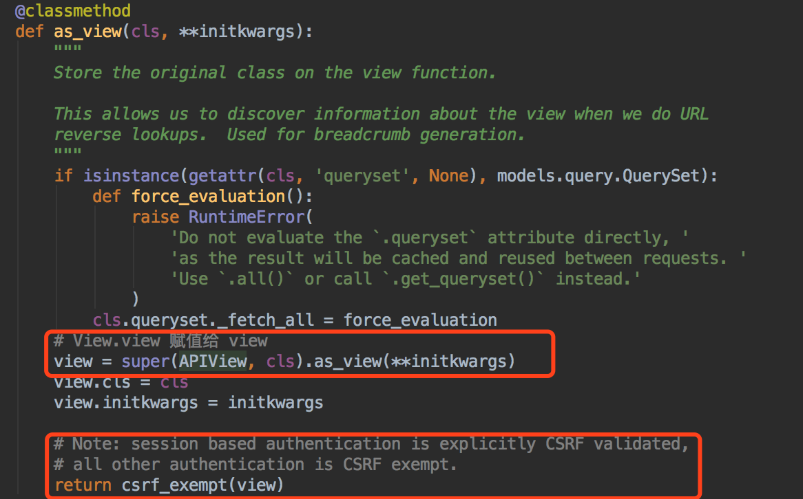

我们能看到，APIView继承了View, 并且执行了View中的as_view()方法，最后把view返回了，用csrf_exempt()方法包裹后去掉了csrf的认证。

那我们看看View中的as_view()方法做了什么~

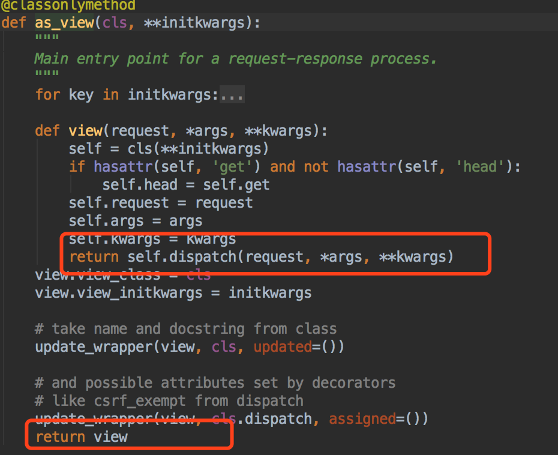

我们看到了~在View中的as_view方法返回了view函数，而view函数执行了self.dispatch()方法 但是这里的dispatch方法应该是我们APIView中的

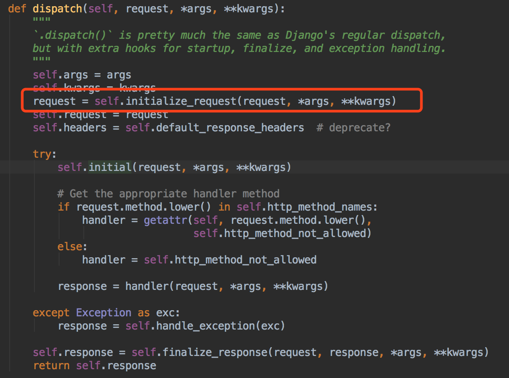

我们去initialize_request中看下把什么赋值给了request，并且赋值给了self.request, 也就是我们在视图中用的request.xxx到底是什么~~


我们看到，这个方法返回的是Request这个类的实例对象~~我们注意我们看下这个Request类中的第一个参数request，是我们走我们django的时候的原来的request~

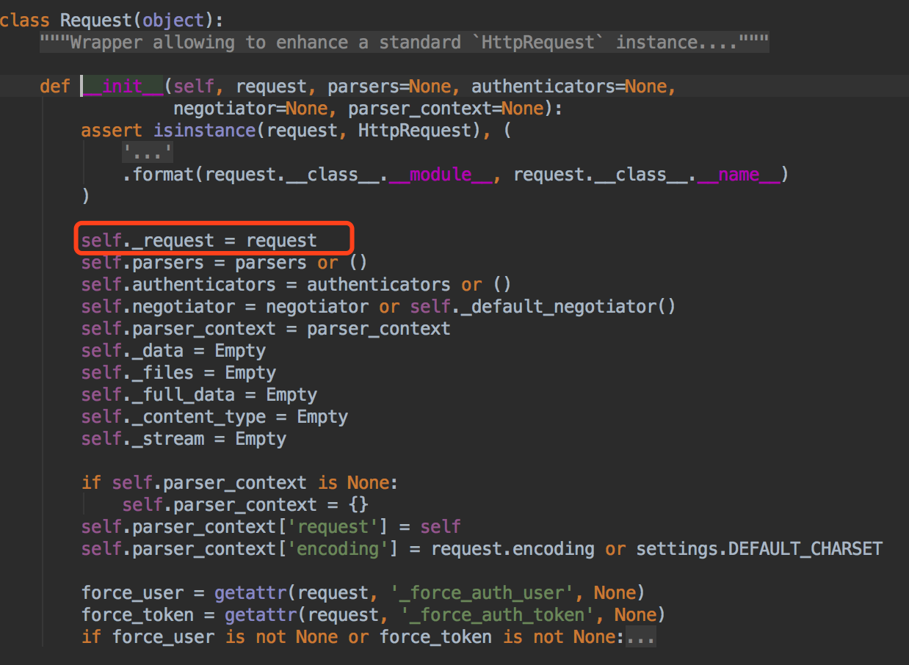

我们看到了，这个Request类把原来的request赋值给了self._request, 也就是说以后_request是我们老的request，新的request是我们这个Request类~~

那我们继承APIView之后请求来的数据都在哪呢~~


我们用了rest_framework框架以后，我们的request是重新封装的Request类~

request.query_params 存放的是我们get请求的参数

request.data 存放的是我们所有的数据，包括post请求的以及put，patch请求~~~

相比原来的django的request，我们现在的request更加精简，清晰了~~~

现在我们知道了APIView和View的一些区别~~当然还有~~后面我们还会说~~

我们写的视图可能对多个表进行增删改查，就导致我们的视图特别多重复的代码~~

那么我们尝试着来进行封装一下~~

### 第一次封装

APIView视图

```
class BookView(APIView):

    def get(self, request):
        query_set = Book.objects.all()
        book_ser = BookSerializer(query_set, many=True)
        return Response(book_ser.data)

    def post(self, request):
        query_set = request.data
        book_ser = BookSerializer(data=query_set)
        if book_ser.is_valid():
            book_ser.save()
            return Response(book_ser.validated_data)
        else:
            return Response(book_ser.errors)


class BookEditView(APIView):

    def get(self, request, id):
        query_set = Book.objects.filter(id=id).first()
        book_ser = BookSerializer(query_set)
        return Response(book_ser.data)

    def patch(self, request, id):
        query_set = Book.objects.filter(id=id).first()
        book_ser = BookSerializer(query_set, data=request.data, partial=True)
        if book_ser.is_valid():
            book_ser.save()
            return Response(book_ser.validated_data)
        else:
            return Response(book_ser.errors)

    def delete(self, request, id):
        query_set = Book.objects.filter(id=id).first()
        if query_set:
            query_set.delete()
            return Response("")
        else:
            return Response("删除的书籍不存在")
```

第一次封装

```
class GenericAPIView(APIView):
    queryset = None
    serializer_class = None

    def get_queryset(self):
        return self.queryset.all()

    def get_serializer(self, *args, **kwargs):
        return self.serializer_class(*args, **kwargs)


class ListModelMixin(object):
    def list(self, request, *args, **kwargs):
        queryset = self.get_queryset()
        serializer = self.get_serializer(queryset, many=True)
        return Response(serializer.data)


class CreateModelMixin(object):
    def create(self, request, *args, **kwargs):
        serializer = self.get_serializer(data=request.data)
        if serializer.is_valid():
            serializer.save()
            return Response(serializer.validated_data)
        else:
            return Response(serializer.errors)


class RetrieveModelMixin(object):
    def retrieve(self, request, id, *args, **kwargs):
        book_obj = self.get_queryset().filter(pk=id).first()
        book_ser = self.get_serializer(book_obj)
        return Response(book_ser.data)


class UpdateModelMixin(object):
    def update(self, request, id, *args, **kwargs):
        book_obj = self.get_queryset().filter(pk=id).first()
        book_ser = self.get_serializer(book_obj, data=request.data, partial=True)
        if book_ser.is_valid():
            book_ser.save()
            return Response(book_ser.validated_data)
        else:
            return Response(book_ser.errors)


class DestroyModelMixin(object):
    def destroy(self, request, id, *args, **kwargs):
        queryset = self.get_queryset()
        try:
            queryset.get(pk=id).delete()
            return Response("")
        except Exception as e:
            return Response("信息有误")
# 我们把公共的部分抽出来 这样不管写多少表的增删改查都变的很简单
# 这样封装后我们的视图会变成这样

class BookView(GenericAPIView, ListModelMixin, CreateModelMixin):
    queryset = Book.objects.all()
    serializer_class = BookSerializer

    def get(self, request, *args, **kwargs):
        return self.list(request, *args, **kwargs)

    def post(self, request, *args, **kwargs):
        return self.create(request, *args, **kwargs)


class BookEditView(GenericAPIView, RetrieveModelMixin, UpdateModelMixin, DestroyModelMixin):
    queryset = Book.objects.all()
    serializer_class = BookSerializer

    def get(self, request, id, *args, **kwargs):
        return self.retrieve(request, id, *args, **kwargs)

    def patch(self, request, id, *args, **kwargs):
        return self.update(request, id, *args, **kwargs)

    def destroy(self, request, id, *args, **kwargs):
        return self.delete(request, id, *args, **kwargs)
```


我们封装的GenericAPIView，包括封装每个方法的类，其实框架都帮我们封装好了~~

我们可以直接继承这些类~~来实现上面的视图~~可是还有没有更简单的方法呢~我们再次封装一下~~

### 第二次封装

```
# 上面我们写的继承类太长了~~我们再改改

class ListCreateAPIView(GenericAPIView, ListModelMixin, CreateModelMixin):
    pass


class RetrieveUpdateDestroyAPIView(GenericAPIView, RetrieveModelMixin, UpdateModelMixin, DestroyModelMixin):
    pass


class BookView(ListCreateAPIView):
    queryset = Book.objects.all()
    serializer_class = BookSerializer

    def get(self, request, *args, **kwargs):
        return self.list(request, *args, **kwargs)

    def post(self, request, *args, **kwargs):
        return self.create(request, *args, **kwargs)


class BookEditView(RetrieveUpdateDestroyAPIView):
    queryset = Book.objects.all()
    serializer_class = BookSerializer

    def get(self, request, id, *args, **kwargs):
        return self.retrieve(request, id, *args, **kwargs)

    def patch(self, request, id, *args, **kwargs):
        return self.update(request, id, *args, **kwargs)

    def delete(self, request, id, *args, **kwargs):
        return self.delete(request, id, *args, **kwargs)
```


这次我们只是让继承变的简单了一点而已，好像并没有什么大的进步~~

我们可不可以把这两个视图合并成一个视图呢~~~框架给我们提供了一个路由传参的方法~~

我们看下ViewSetMixin

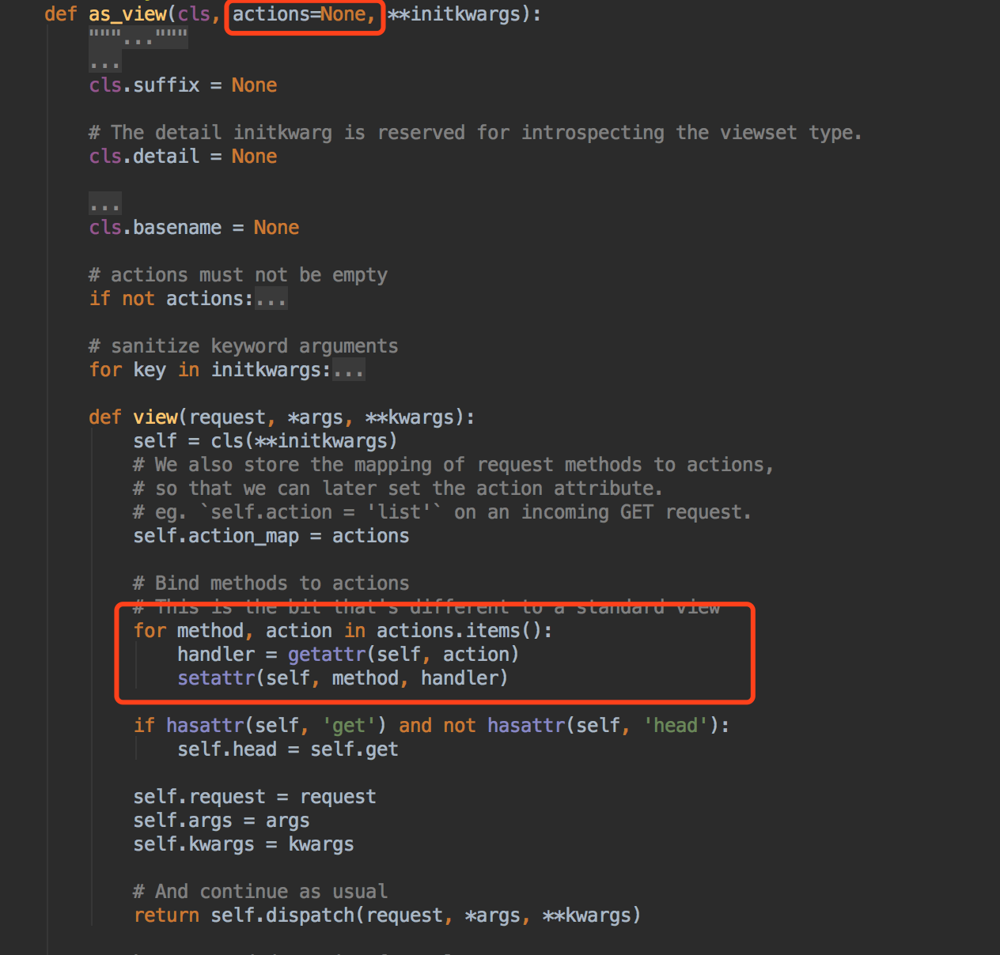

actions这个默认参数其实就是我们路由可以进行传参了~~~

下面这个循环~可以看出~我们要传的参数是一个字段~key应该是我们的请求方式，value应该对应我们处理的方法~

这样我们每个视图就不用在写函数了~因为已经和内部实现的函数相对应了~

### 第三次封装

路由urls.py

```
urlpatterns = [
    # url(r'^book$', BookView.as_view()),
    # url(r'^book/(?P<id>\d+)$', BookEditView.as_view()),
    url(r'^book$', BookView.as_view({"get": "list", "post": "create"})),
    url(r'^book/(?P<pk>\d+)$', BookView.as_view({"get": "retrieve", "patch": "update", "delete": "destroy"})),
]
```

第三次封装

```
from rest_framework.viewsets import ViewSetMixin


# class BookView(ViewSetMixin, ListCreateAPIView, RetrieveUpdateDestroyAPIView):
#     queryset = Book.objects.all()
#     serializer_class = BookSerializer
    
    
# 如果我们再定义一个类
class ModelViewSet(ViewSetMixin, ListCreateAPIView, RetrieveUpdateDestroyAPIView):
    pass


class BookView(ModelViewSet):
    queryset = Book.objects.all()
    serializer_class = BookSerializer
```


 我们现在的视图就只要写两行就可以了~~~

其实我们写的所有的视图~框架都帮我们封装好了~

注意一点~~用框架封装的视图~我们url上的那个关键字参数要用pk~~系统默认的~~

奉献一张图来看下我们的继承顺序~~~


## DRF的路由

我们上面的路由传参写的特别多~~框架也帮我们封装好了~

路由

```
from .views import BookView
from rest_framework.routers import DefaultRouter

router = DefaultRouter()
router.register(r"book", BookView)

urlpatterns = [
    # url(r'^book$', BookView.as_view()),
    # url(r'^book/(?P<id>\d+)$', BookEditView.as_view()),
    # url(r'^book$', BookView.as_view({"get": "list", "post": "create"})),
    # url(r'^book/(?P<pk>\d+)$', BookView.as_view({"get": "retrieve", "patch": "update", "delete": "destroy"})),

]
urlpatterns += router.urls
```


我们可以看到通过框架我们可以把路由视图都变的非常简单~~

但是需要自定制的时候还是需要我们自己用APIView写当不需要那么多路由的时候~也不要用这种路由注册~~

总之~~一切按照业务需要去用


# [DRF 版本 认证](https://www.cnblogs.com/GGGG-XXXX/articles/9681444.html)

## DRF的版本

### 版本控制是做什么用的, 我们为什么要用

首先我们要知道我们的版本是干嘛用的呢~~大家都知道我们开发项目是有多个版本的~~

随着我们项目的更新~版本就越来越多~~我们不可能新的版本出了~以前旧的版本就不进行维护了~~~

那我们就需要对版本进行控制~~这个DRF也给我们提供了一些封装好的版本控制方法~~

### 版本控制怎么用

之前我们学视图的时候知道APIView，也知道APIView返回View中的view函数，然后调用的dispatch方法~

那我们现在看下dispatch方法~~看下它都做了什么~~

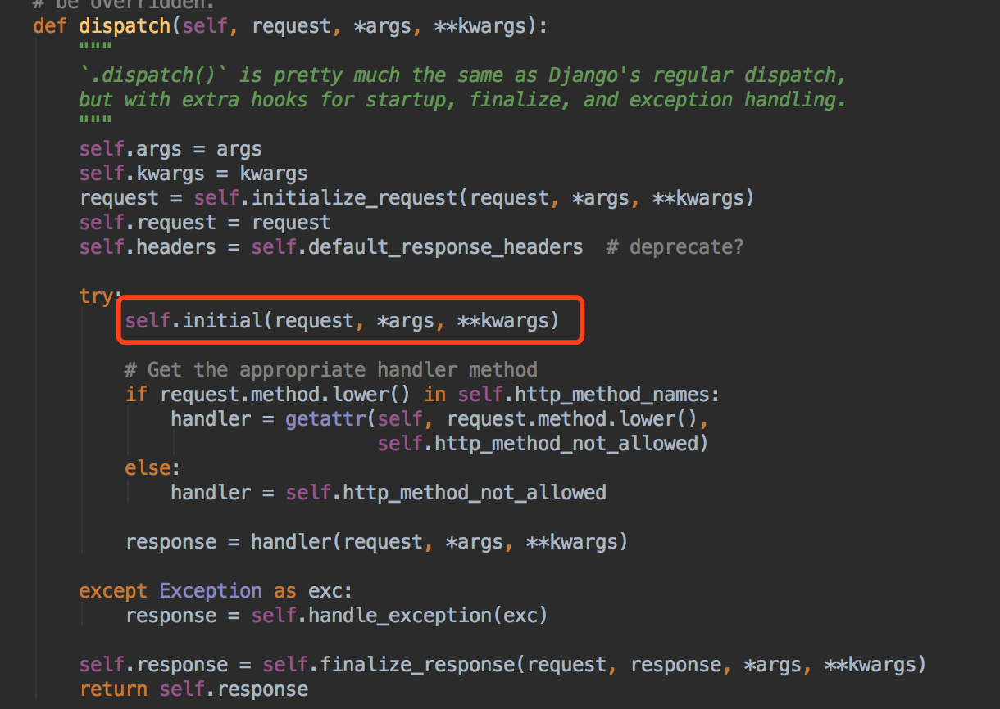

执行self.initial方法之前是各种赋值，包括request的重新封装赋值，下面是路由的分发，那我们看下这个方法都做了什么~~

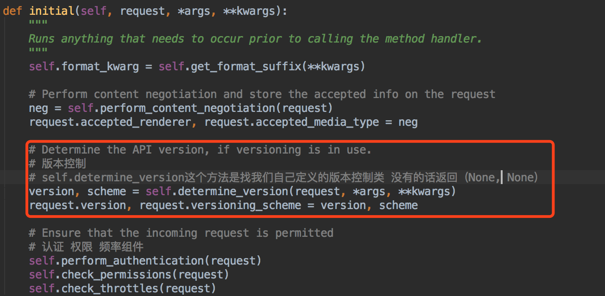

我们可以看到，我们的version版本信息赋值给了 request.version 版本控制方案赋值给了 request.versioning_scheme~~

其实这个版本控制方案~就是我们配置的版本控制的类~~

也就是说，APIView通过这个方法初始化自己提供的组件~~

我们接下来看看框架提供了哪些版本的控制方法~~在rest_framework.versioning里~~


框架一共给我们提供了这几个版本控制的方法~~我们在这里只演示一个~~因为基本配置都是一样的~~

### 详细用法

我们看下放在URL上携带版本信息怎么配置~~

第一步 setting.py

```
REST_FRAMEWORK = {
    # 默认使用的版本控制类
    'DEFAULT_VERSIONING_CLASS': 'rest_framework.versioning.URLPathVersioning',
    # 允许的版本
    'ALLOWED_VERSIONS': ['v1', 'v2'],
    # 版本使用的参数名称
    'VERSION_PARAM': 'version',
    # 默认使用的版本
    'DEFAULT_VERSION': 'v1',
}
```

第二步 urls.py

```
urlpatterns = [
    url(r"^versions", MyView.as_view()),
    url(r"^(?P<version>[v1|v2]+)/test01", TestView.as_view()),
]
```

测试试图

```
class TestView(APIView):
    def get(self, request, *args, **kwargs):
        print(request.versioning_scheme)
        ret = request.version
        if ret == "v1":
            return Response("版本v1的信息")
        elif ret == "v2":
            return Response("版本v2的信息")
        else:
            return Response("根本就匹配不到这个路由")
```


其他的版本控制的类，配置方法都差不多~~这里就不一一例举了~~

## DRF的认证

### 认证是干嘛的呢~

我们都知道~我们可以在网站上登录~然后可以有个人中心，对自己信息就行修改~~~

但是我们每次给服务器发请求，由于Http的无状态，导致我们每次都是新的请求~~

那么服务端需要对每次来的请求进行认证，看用户是否登录，以及登录用户是谁~~

那么我们服务器对每个请求进行认证的时候，不可能在每个视图函数中都写认证~~~

一定是把认证逻辑抽离出来~~以前我们可能会加装饰器~或者中间件~~那我们看看DRF框架给我们提供了什么~~~

### 认证怎么用

上面讲版本的时候我们知道~在dispatch方法里~执行了initial方法~~那里初始化了我们的版本~~

如果我们细心我们能看到~版本的下面其实就是我们的认证，权限，频率组件了~~

我们先看看我们的认证组件~~


我们进去我们的认证看下~~


我们这个权限组件返回的是request.user，那我们这里的request是新的还是旧的呢~~

我们的initial是在我们request重新赋值之后的~所以这里的request是新的~也就是Request类实例对象~~

那这个user一定是一个静态方法~我们进去看看~~


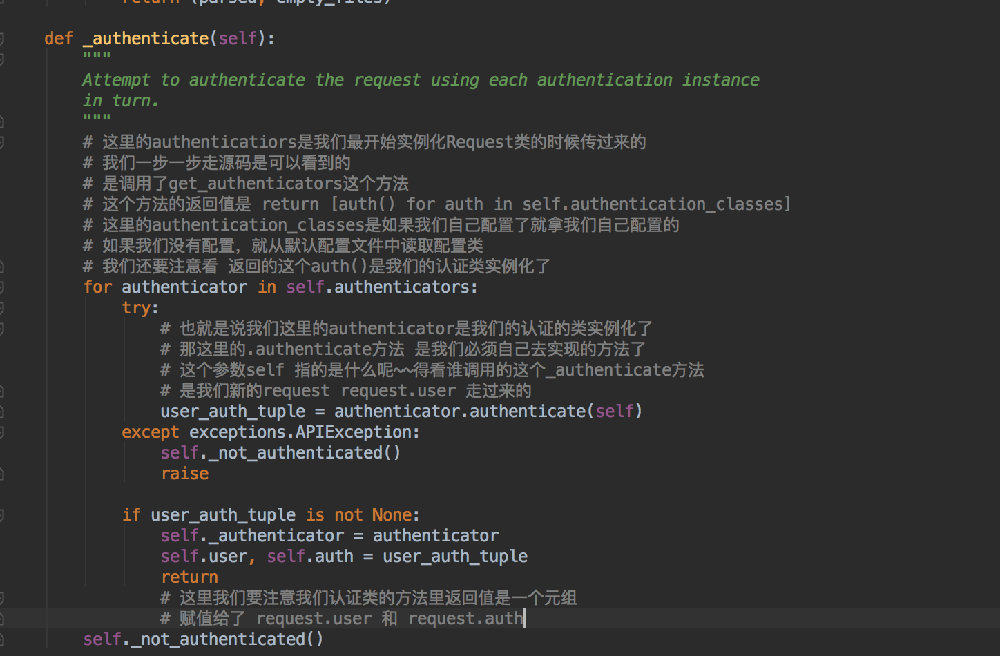

我没在这里反复的截图跳转页面~~大家可以尝试着自己去找~~要耐心~~细心~~

我们通过上面基本可以知道我们的认证类一定要实现的方法~~以及返回值类型~~以及配置的参数authentication_classes~

下面我们来看看具体用法~~~

### 认证的详细用法

我们先写个认证的小demo~~我们先建一个用户表~字段为用户名以及对应的token值~~

models.py

```
# 先在model中注册模型类
# 并且进行数据迁移
# 测试我就简写了~

class UserInfo(models.Model):
    username = models.CharField(max_length=32)
    token = models.UUIDField()
```

views.py

```
# 写视图类并且用post请求注册一个用户

class UserView(APIView):
    def post(self, request, *args, **kwargs):
        username = request.data["username"]
        UserInfo.objects.create(username=username, token=uuid.uuid4())
        return Response("注册成功")
```


准备工作完成~我们来开始我们的认证~~


写一个认证的类

```
# 注意我们这个认证的类必须实现的方法以及返回值
class MyAuth(BaseAuthentication):

    def authenticate(self, request):
        request_token = request.query_params.get("token", None)
        if not request_token:
            raise AuthenticationFailed({"code": 1001, "error": "缺少token"})
        token_obj = UserInfo.objects.filter(token=request_token).first()
        if not token_obj:
            raise AuthenticationFailed({"code": 1001, "error": "无效的token"})
        return token_obj.username, token_obj
```


视图级别认证

```
class TestAuthView(APIView):
    authentication_classes = [MyAuth, ]

    def get(self, request, *args, **kwargs):
        return Response("测试认证")
```


全局配置认证

```
REST_FRAMEWORK = {
    # 默认使用的版本控制类
    'DEFAULT_VERSIONING_CLASS': 'rest_framework.versioning.URLPathVersioning',
    # 允许的版本
    'ALLOWED_VERSIONS': ['v1', 'v2'],
    # 版本使用的参数名称
    'VERSION_PARAM': 'version',
    # 默认使用的版本
    'DEFAULT_VERSION': 'v1',
    # 配置全局认证
    'DEFAULT_AUTHENTICATION_CLASSES': ["BRQP.utils.MyAuth", ]
}
```


 

 [DRF 权限 频率](https://www.cnblogs.com/GGGG-XXXX/articles/9682663.html)

## DRF的权限 

### 权限是什么

大家之前都应该听过权限~那么我们权限到底是做什么用的呢~~

大家都有博客~或者去一些论坛~一定知道管理员这个角色~

比如我们申请博客的时候~一定要向管理员申请~也就是说管理员会有一些特殊的权利~是我们没有的~~

这些对某件事情决策的范围和程度~我们叫做权限~~权限是我们在项目开发中非常常用到的~~

那我们看DRF框架给我们提供的权限组件都有哪些方法~~

### 权限组件源码

我们之前说过了DRF的版本和认证~也知道了权限和频率跟版本认证都是在initial方法里初始化的~~

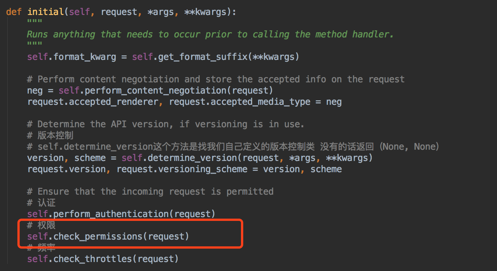

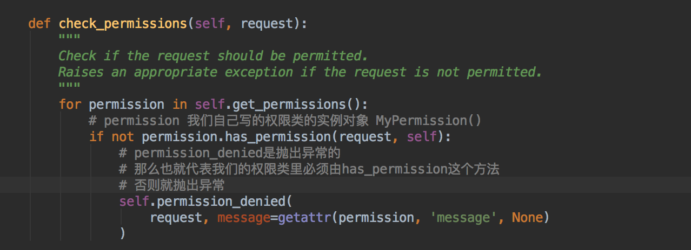

其实我们版本，认证，权限，频率控制走的源码流程大致相同~~大家也可以在源码里看到~~

我们的权限类一定要有has_permission方法~否则就会抛出异常~~这也是框架给我提供的钩子~~

我们先看到在rest_framework.permissions这个文件中~存放了框架给我们提供的所有权限的方法~~


我这里就不带着大家详细去看每一个了~大家可以去浏览一下每个权限类~看看每个都是干嘛的~~

这里主要说下BasePermission 这个是我们写权限类继承的一个基础权限类~~~ 

### 权限的详细用法

在这里我们一定要清楚一点~我们的Python代码是一行一行执行的~那么执行initial方法初始化这些组件的时候~~

也是有顺序的~~我们的版本在前面~然后是认证，然后是权限~ 最后是频率~~所以大家要清楚~~

我们的权限执行的时候~我们的认证已经执行结束了~~~

前提在model中的UserInfo表中加了一个字段~用户类型的字段~~做好数据迁移~~

 第一步 写权限类

```
class MyPermission(BasePermission):
    message = "VIP用户才能访问"

    def has_permission(self, request, view):
        """
        自定义权限只有vip用户能访问，
        注意我们初始化时候的顺序是认证在权限前面的，所以只要认证通过~
        我们这里就可以通过request.user,拿到我们用户信息
        request.auth就能拿到用户对象
        """
        if request.user and request.auth.type == 2:
            return True
        else:
            return False

```


局部视图注册

```
class TestAuthView(APIView):
    authentication_classes = [MyAuth, ]
    permission_classes = [MyPermission, ]

    def get(self, request, *args, **kwargs):
        print(request.user)
        print(request.auth)
        username = request.user
        return Response(username)

```


 全局注册 settings.py

```
REST_FRAMEWORK = {
    # 默认使用的版本控制类
    'DEFAULT_VERSIONING_CLASS': 'rest_framework.versioning.URLPathVersioning',
    # 允许的版本
    'ALLOWED_VERSIONS': ['v1', 'v2'],
    # 版本使用的参数名称
    'VERSION_PARAM': 'version',
    # 默认使用的版本
    'DEFAULT_VERSION': 'v1',
    # 配置全局认证
    # 'DEFAULT_AUTHENTICATION_CLASSES': ["BRQP.utils.MyAuth", ]
    # 配置全局权限
    "DEFAULT_PERMISSION_CLASSES": ["BROP.utils.MyPermission"]
}

```


## DRF的频率

### 频率限制是做什么的

开放平台的API接口调用需要限制其频率，以节约服务器资源和避免恶意的频繁调用。

我们的DRF提供了一些频率限制的方法，我们看一下。

### 频率组件源码

版本，认证，权限，频率这几个组件的源码是一个流程，这里就不再带大家走源码了~

相信大家可以自己看懂了~~下面我们谈谈频率组件实现的原理~~

### 频率组件原理

DRF中的频率控制基本原理是基于访问次数和时间的，当然我们可以通过自己定义的方法来实现。

当我们请求进来，走到我们频率组件的时候，DRF内部会有一个字典来记录访问者的IP，

以这个访问者的IP为key，value为一个列表，存放访问者每次访问的时间，

{ IP1: [第三次访问时间，第二次访问时间，第一次访问时间]，}

把每次访问最新时间放入列表的最前面，记录这样一个数据结构后，通过什么方式限流呢~~

如果我们设置的是10秒内只能访问5次，

　　-- 1，判断访问者的IP是否在这个请求IP的字典里

　　-- 2，保证这个列表里都是最近10秒内的访问的时间

　　　　　　判断当前请求时间和列表里最早的(也就是最后的)请求时间的查

　　　　　　如果差大于10秒，说明请求以及不是最近10秒内的，删除掉，

　　　　　　继续判断倒数第二个，直到差值小于10秒

　　-- 3，判断列表的长度(即访问次数)，是否大于我们设置的5次，

　　　　　　如果大于就限流，否则放行，并把时间放入列表的最前面。

### 频率组件的详细用法

频率组件的配置方式其实跟上面的组件都一样，我们看下频率组件的使用。


自定义的频率限制类

```
# by gaoxin
from rest_framework.throttling import BaseThrottle
import time

VISIT_RECORD = {}


class MyThrottle(BaseThrottle):

    def __init__(self):
        self.history = None

    def allow_request(self, request, view):
        # 实现限流的逻辑
        # 以IP限流
        # 访问列表 {IP: [time1, time2, time3]}
        # 1, 获取请求的IP地址
        ip = request.META.get("REMOTE_ADDR")
        # 2，判断IP地址是否在访问列表
        now = time.time()
        if ip not in VISIT_RECORD:
            # --1， 不在 需要给访问列表添加key，value
            VISIT_RECORD[ip] = [now,]
            return True
            # --2 在 需要把这个IP的访问记录 把当前时间加入到列表
        history = VISIT_RECORD[ip]
        history.insert(0, now)
        # 3， 确保列表里最新访问时间以及最老的访问时间差 是1分钟
        while history and history[0] - history[-1] > 60:
            history.pop()
        self.history = history
        # 4，得到列表长度，判断是否是允许的次数
        if len(history) > 3:
            return False
        else:
            return True

    def wait(self):
        # 返回需要再等多久才能访问
        time = 60 - (self.history[0] - self.history[-1])
        return time
```


配置自定义频率限制

```
REST_FRAMEWORK = {
    # ......
    # 频率限制的配置
    "DEFAULT_THROTTLE_CLASSES": ["Throttle.throttle.MyThrottle"],
    }
}
```


配置自定义频率限制

```
from rest_framework.throttling import SimpleRateThrottle


class MyVisitThrottle(SimpleRateThrottle):
    scope = "WD"

    def get_cache_key(self, request, view):
        return self.get_ident(request)
```


配置频率限制

```
REST_FRAMEWORK = {
    # 频率限制的配置
    # "DEFAULT_THROTTLE_CLASSES": ["Throttle.throttle.MyVisitThrottle"],
    "DEFAULT_THROTTLE_CLASSES": ["Throttle.throttle.MyThrottle"],
    "DEFAULT_THROTTLE_RATES":{
        'WD':'5/m',         #速率配置每分钟不能超过5次访问，WD是scope定义的值，

    }
}
```


 我们可以在postman  或者DRF自带的页面进行测试都可以~~*


# [DRF的分页](https://www.cnblogs.com/GGGG-XXXX/articles/9867882.html)

## DRF的分页

### 为什么要使用分页

其实这个不说大家都知道，大家写项目的时候也是一定会用的，

我们数据库有几千万条数据，这些数据需要展示，我们不可能直接从数据库把数据全部读取出来，

这样会给内存造成特别大的压力，有可能还会内存溢出，所以我们希望一点一点的取，

那展示的时候也是一样的，总是要进行分页显示，我们之前自己都写过分页。

DRF给我们提供了三种分页方式，我们看下他们都是什么样的~~

分页组件的使用

DRF提供的三种分页

```
from rest_framework.pagination import PageNumberPagination, LimitOffsetPagination, CursorPagination

```


全局配置

```
REST_FRAMEWORK = {
    'PAGE_SIZE': 2
}
```

 

#### 第一种 PageNumberPagination 看第n页，每页显示n条数据

http://127.0.0.1:8000/book?page=2&size=1

自定义分页类

```
class MyPageNumber(PageNumberPagination):
    page_size = 2  # 每页显示多少条
    page_size_query_param = 'size'  # URL中每页显示条数的参数
    page_query_param = 'page'  # URL中页码的参数
    max_page_size = None  # 最大页码数限制
```


视图

```
class BookView(APIView):
    def get(self, request):
        book_list = Book.objects.all()
        # 分页
        page_obj = MyPageNumber()
        page_article = page_obj.paginate_queryset(queryset=book_list, request=request, view=self)
        
        ret = BookSerializer(page_article, many=True)
        return Response(ret.data)
```


返回带页码链接的响应

```
class BookView(APIView):
    def get(self, request):
        book_list = Book.objects.all()
        # 分页
        page_obj = MyPageNumber()
        page_article = page_obj.paginate_queryset(queryset=book_list, request=request, view=self)

        ret = BookSerializer(page_article, many=True)
        # return Response(ret.data)
        # 返回带超链接 需返回的时候用内置的响应方法
        return page_obj.get_paginated_response(ret.data)
```


#### 第二种 LimitOffsetPagination 在第n个位置 向后查看n条数据

http://127.0.0.1:8000/book?offset=2&limit=1


自定义的分页类

```
class MyLimitOffset(LimitOffsetPagination):
    default_limit = 1
    limit_query_param = 'limit'
    offset_query_param = 'offset'
    max_limit = 999
```


视图

```
# 视图和上面的大体一致
# 只有用的分页类不同，其他都相同
class BookView(APIView):
    def get(self, request):
        book_list = Book.objects.all()
        # 分页
        page_obj = MyLimitOffset()
        page_article = page_obj.paginate_queryset(queryset=book_list, request=request, view=self)

        ret = BookSerializer(page_article, many=True)
        # return Response(ret.data)
        # 返回带超链接 需返回的时候用内置的响应方法
        return page_obj.get_paginated_response(ret.data)
```


#### 第三种 CursorPagination 加密游标的分页 把上一页和下一页的id记住

自定义分页类

```
class MyCursorPagination(CursorPagination):
    cursor_query_param = 'cursor'
    page_size = 1
    ordering = '-id'
```


视图

```
class BookView(APIView):
    def get(self, request):
        book_list = Book.objects.all()
        # 分页
        page_obj = MyCursorPagination()
        page_article = page_obj.paginate_queryset(queryset=book_list, request=request, view=self)

        ret = BookSerializer(page_article, many=True)
        # return Response(ret.data)
        # 返回带超链接 需返回的时候用内置的响应方法
        return page_obj.get_paginated_response(ret.data)
```


# [DRF的解析器和渲染器](https://www.cnblogs.com/GGGG-XXXX/articles/9893090.html)

## 解析器

解析器的作用就是服务端接收客户端传过来的数据，把数据解析成自己想要的数据类型的过程。

本质就是对请求体中的数据进行解析。

在了解解析器之前~大家要先知道Accept以及ContentType请求头。

Accept是告诉对方我能解析什么样的数据，通常也可以表示我想要什么样的数据。

ContentType是告诉对方我给你的是什么样的数据类型。

那大家想一下，解析器工作原理的本质应该是什么~~~~~

就是拿到请求的ContentType来判断前端给我的数据类型是什么，然后我们去拿相应的解析器去解析数据。

### Django的解析器

我们请求进来请求体中的数据在request.body中，那也就证明，解析器会把解析好的数据放入request.body

我们在视图中可以打印request的类型，能够知道request是WSGIRequest这个类。

我们可以看下这个类的源码~~~我们是怎么拿到request.POST数据的~~

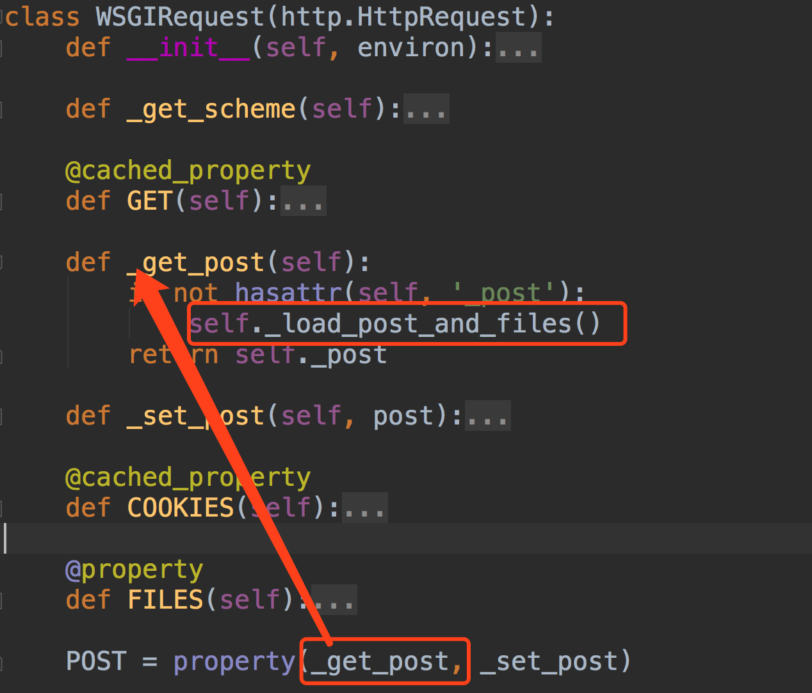

 

application/x-www-form-urlencoded不是不能上传文件，是只能上传文本格式的文件，

multipart/form-data是将文件以二进制的形式上传，这样可以实现多种类型的文件上传

一个解析到request.POST,  request.FILES中。

也就是说我们之前能在request中能到的各种数据是因为用了不同格式的数据解析器~

那么我们的DRF能够解析什么样的数据类型呢~~~

### DRF的解析器

我们想一个问题~什么时候我们的解析器会被调用呢~~ 是不是在request.data拿数据的时候~

我们说请求数据都在request.data中，那我们看下这个Request类里的data~~


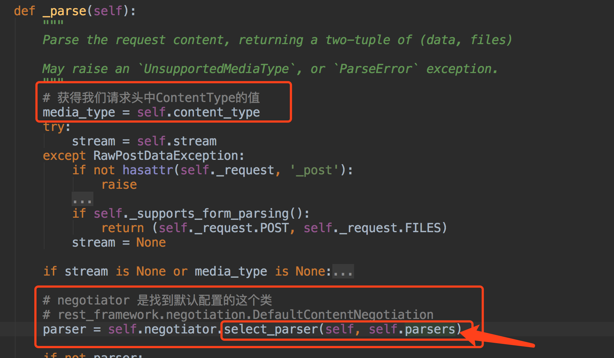

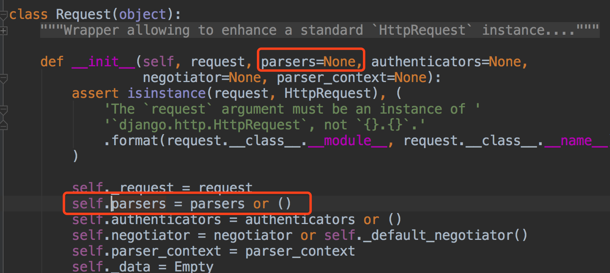

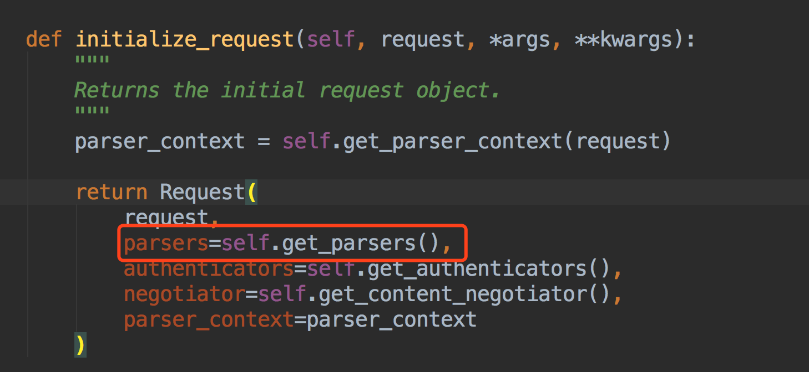


得到解析器后，调用解析器里的parse方法~~

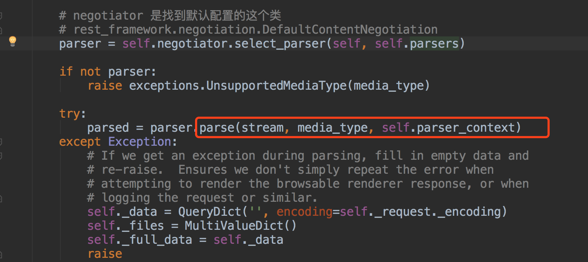

 那说到这里~我们看下DRF配置的默认的解析器的类都有哪些~~


也就是说我们的DRF支持Json，Form表单的请求，包括多种文件类型的数据~~~~


可以在我们的视图中配置视图级别的解析器~~~

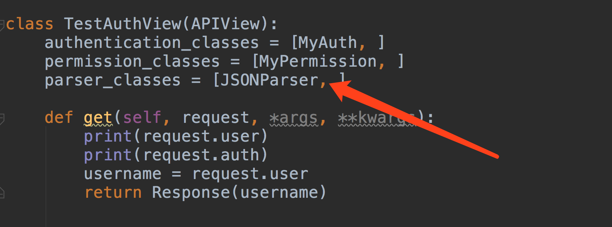

这就是我们DRF的解析器~~~

## DRF的渲染器

渲染器就是友好的展示数据~~

DRF给我们提供的渲染器有~~


我们在浏览器中展示的DRF测试的那个页面~就是通过浏览器的渲染器来做到的~~

当然我们可以展示Json数据类型~~~~渲染器比较简单~~~~ 
