# 移动端开发相关概念


## APP类型


### Native APP

Native APP又称原生APP，就是我们平时说的手机/桌面应用软件。

原生APP 是针对IOS、Android、Windows、鸿蒙等不同的手机操作系统要采用不同的语言和框架进行开发出来的，通常是由“服务器数据+APP应用客户端”两部份构成。

实现技术：

```
iOS: swift（雨燕）/ Object-C
Android: java / kotlin
HarmonyOS: JS, Java和C++
```


#### 优缺点

```txt
优点：
		体验好，用户无法上网也可访问APP应用中以前下载的数据
		性能稳定，可调用手机的硬件设备（语音、摄像头、短信、GPS、重力感应等）和本地资源（通讯录，相册等）
		操作速度快，能够实现出色的动效，转场动画完美

缺点：
		开发周期长，开发人员工资起点高。
		用户要使用原生APP，必须通过安装到手机里面才行，而且APP软件体积大，占用较多手机内存容量
		更新缓慢，根据不同平台，提交–审核–上线流程较复杂。
		要获取最新功能，需要升级应用，所以会容易出现有些用户不升级，导致多个不同功能版本出现，维护成本大
		跨平台差，每种平台都需要独立的开发语言。Java(安卓),swift(iOS), HarmonyOS(java、C++、js)等等
```


### Web APP

Web APP本质上是为移动浏览器设计的网站，可以在各种智能设备的浏览器上运行。

实现技术：

```
HTML5+Javascript+CSS3
react.js
vue.js
```


#### 优缺点

```txt
优点：
		一套代码到处运行，可以同时在 PC、Android、iPhone、鸿蒙系统上的浏览器上访问
		开发者不需要发布到应用市场审核，用户不需要下载、安装和更新
		开发周期短，维护成本低
		用户不需用户手动更新，可以自动更新，直接使用最新版本

缺点：
		转场表现略差，要求联网
		用户体验没那么炫。图片和动画支持性不高
		没法在应用市场中下载、无法通过应用下载获得盈利机会
		对手机功能应用缺乏，有限制（蓝牙、网络、本地文件等）
```


### Hybrid APP

Hybrid App就是混合APP，就是Native结合Web的混合开发，就是内部本质是Web网页，使用外壳打包软件给它套一层原生APP的外壳。

实现技术：

```
APICloud -> apicloud template ---> APICloud编辑器 ---> 混合APP
DCloud的uni-app ->Hbuilder编辑器 -> 混合APP

WeX5
phoneGap(cordova(浏览器内核)+android（引擎）)
Ionic4
React Native (react.js+APP外壳程序)
....
```


#### 优缺点

```txt
优点：
		集众家之长，既可以调用丰富的手机设备API，也能拥有Web APP的跨平台能力
		可以在应用商店发布，实现收费下载
		内部是网页结构，可以自主更新，做到开发一次，所有平台生效
		降低开发成本和技术成本，降低维护和开发周期
缺点：
		本质上就是一个Web APP使用了原生APP的壳，所以体验比不上原生APP，但是比webAPP强
		开发难度比Web APP高，有一定的学习成本，开发周期比Web APP长，但是比原生APP肯定要短。
		混合APP发布有可能无法通过审核，需要多次调整，才能发布
		依赖开发框架本身提供的手机设备API，少部分设备功能还是只能借助原生语言进行调用才可以
		对团队技术栈要求相对高，既要懂web开发的，也要懂原生APP开发的
```


## 移动端适配方案

目前常用的布局适配方案就3种，分别是`vw`、`像素百分比+flex弹性布局`和`rem+viewport`，`vw`最流行最容易。

当然，`rem+viewport`这种方案的实现方式也有很多，其中最著名的就是淘宝的**[flexible方案](https://github.com/amfe/article/issues/17)**。


# 开发准备

我们接下来开发的项目是嘤鸣APP，主要通过Flask+json-rpc+APICloud+vue.js完成的。


## 注册APICloud帐号

APICloud官网：https://www.apicloud.com 

开发文档：https://docs.apicloud.com


## 下载APP开发编辑器

注册成功，登录进入开发控制台，找到页面右下角点击<mark>开发工具</mark>跳转到工具下载页面。

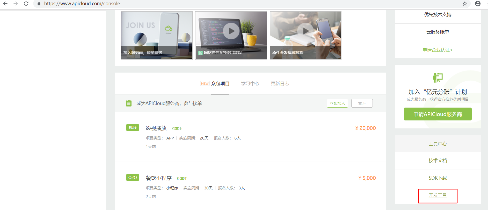


网站地址：https://www.apicloud.com/studio3


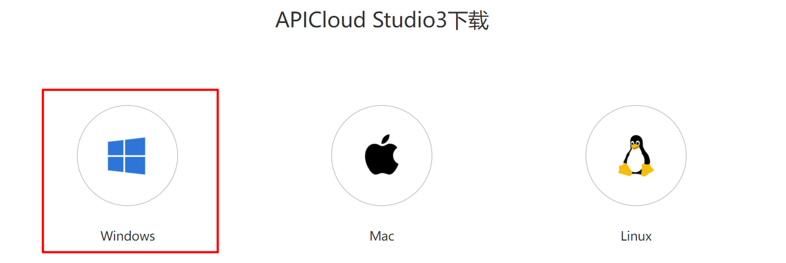

安装目录不能有中文！！！打开效果如下：

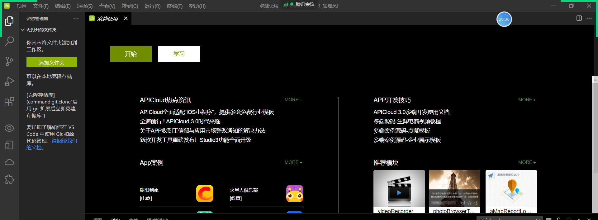

使用APICloud上注册的账户登录。


接下来开发APP的时候,肯定是要查看代码运行后的效果,所以我们需要安装安卓模拟器，当然也可以使用真机调试。

推荐: 市面上大部分的模拟器都差不多，使用人数最多,一般都是: 海马玩模拟器, 夜神模拟器, 雷电模拟器.

我们这里安装和使用雷电模拟器。


官网: https://www.ldmnq.com/

> 注意哦：
>
> 如果使用mac os 开发的同学,安装夜神模拟器.
>
> 夜神的官网: https://www.yeshen.com/

安装完成以后：


上面这个版面效果是平板的,所以我们调整下版面设置为移动端手机的。

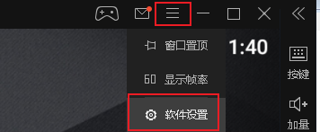

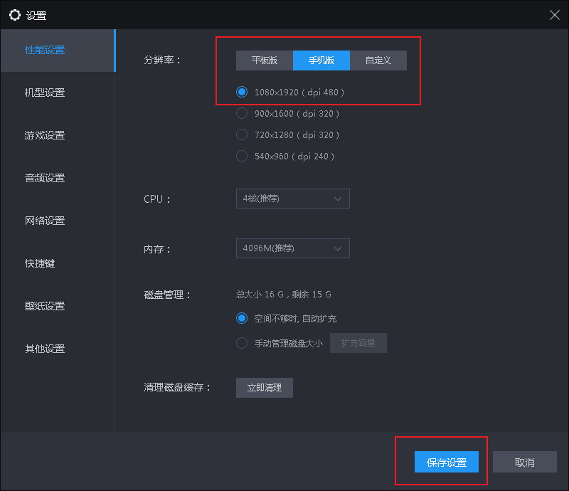

最终效果:

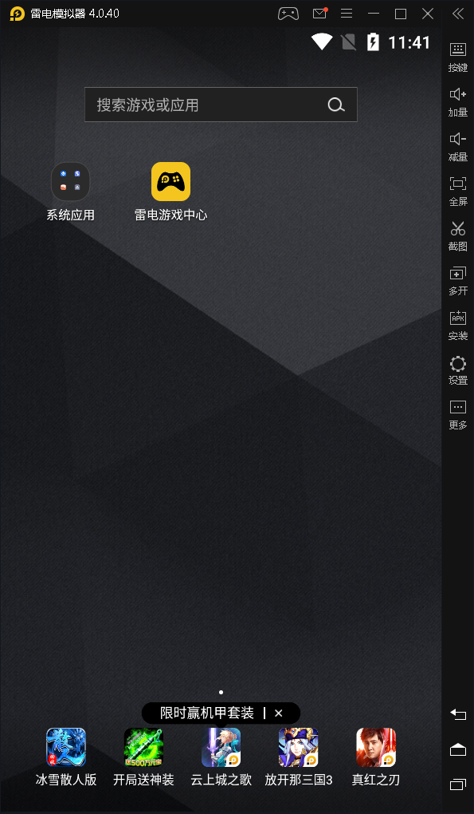


## 下载APP开发调试工具

下载地址：https://docs.apicloud.com/Download/download

点击<mark>AppLoader</mark>下载APP加载器工具，如扫码无法下载，则手动下载压缩包，通过USB连接电脑拖动到手机中进行安装。

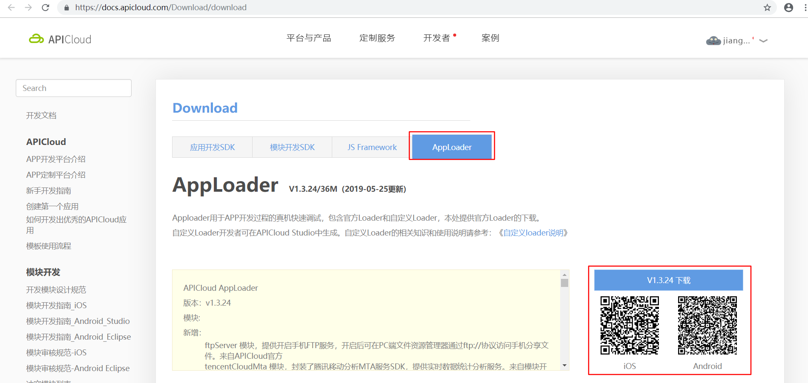


可以在真实手机中安装, 完成效果：

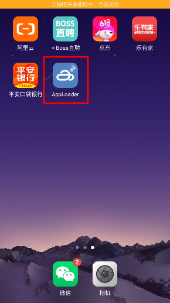


也可以在模拟器中安装, 完成效果:

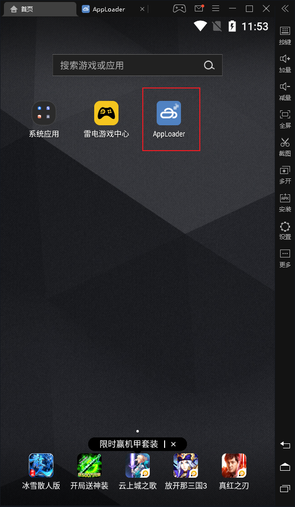

# 移动端项目搭建

注意：在本地编辑器中创建项目，必须保证联网，并当前开发机子已经安装了SVN。

点击APICloud Studio3编辑器，选择左上角，创建项目。


创建原生应用，空白项目。

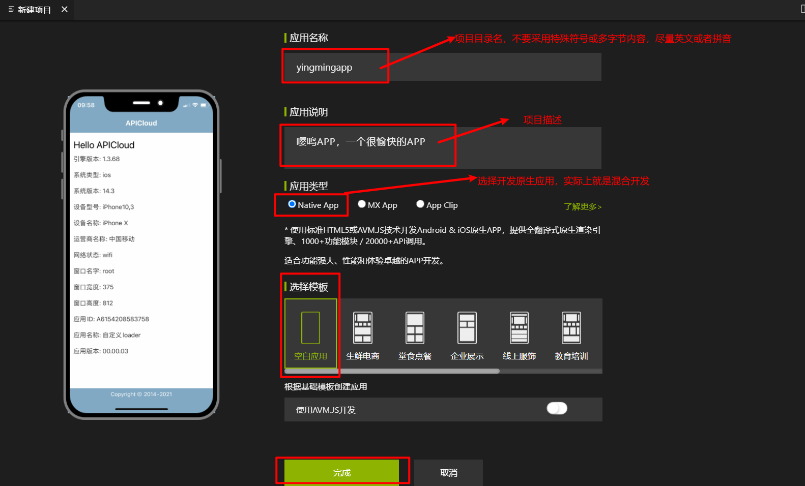


## 模拟器运行项目


## 手机真机运行项目

运行项目的前提是：必须通过USB或者测试的手机和当前开发的电脑处于同一个wifi网络中。

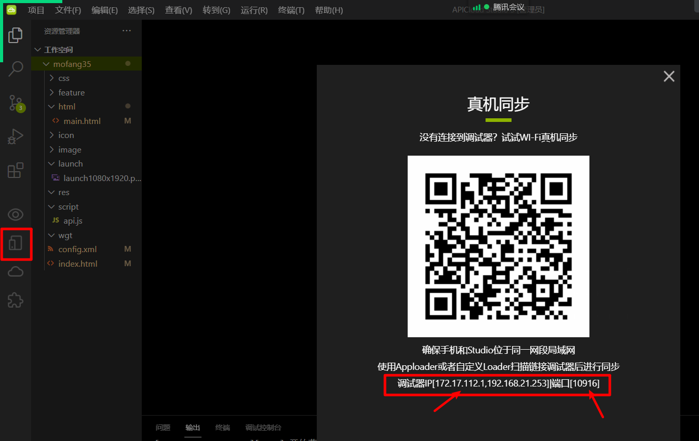

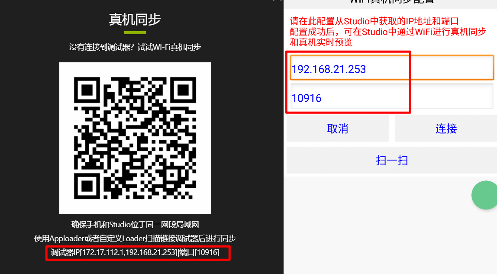


# APICloud前端框架

APICloud内置了2个前端框架给我们操作APP页面和展示数据，这2个前端框架都提供了ajax跨域请求数据功能。

这2个框架分别：**APICloud前端框架**和**AVM.js前端框架**。

+   APICloud前端框架

    本质上就是一个仿照jQuery编写的一个小工具库，所以并不好用。

    地址：https://docs.apicloud.com/Front-end-Framework/framework-dev-guide

+   AVM前端框架

    本质上就是一个仿照vue.js编写的组件化开发工具库，语法与vue高度相似。

    地址：https://docs.apicloud.com/apicloud3/                   

## APICloud前端框架

### 目录结构

```
APP/
  |- index.html   # 默认app配置的入口页面
  |- config.xml   # APP系统配置文件
  |- html/        # APP页面存储目录
  |- css/         # 样式目录
  |- script/      # js脚本目录
  |- image/       # 图片目录
```


### 调用框架

```html
<link rel="stylesheet" type="text/css" href="./css/api.css" />
<script src="./script/api.js"></script>
```

APICloud 前端框架引入到HTML文件以后，会在当前页面提供一个全局对象`$api`，`$api`在源码中提供的40多个操作HTML元素的方法，主要分6类用途：

```
数据操作：
	trim()       trimAll()    isArray()     jsonToStr()  strToJson()  get()
	post()

事件操作：
	one()   addEvt()     rmEvt()

元素查找：
	dom()        domAll()       byId()      first()      last()     eq()     not()        prev()       next()         contains()  closest()

DOM操作：
	remove()     attr()       removeAttr()   hasCls()    addCls()     removeCls()         toggleCls()  val()        prepend()      append()    before()     after()   
	html()       text()       offset()       css()       cssVal()

本地存储：
	setStorage() getStorage() rmStorage()    clearStorage()

系统兼容：
	fixIos7Bar() fixStatusBar()
```

APICloud中，所有的代码都必须在其提供的apiready入口函数中执行，才能调用APP系统设备的数据。


### 基本使用

```html
<!doctype html>
<html>

<head>
    <meta charset="utf-8">
    <meta name="viewport" content="maximum-scale=1.0,minimum-scale=1.0,user-scalable=0,initial-scale=1.0,width=device-width" />
    <meta name="format-detection" content="telephone=no,email=no,date=no,address=no">
    <title>Hello APP</title>
</head>

<body class="wrap">
    <header>yingming</header>
    <button>点击按钮</button>
</body>
<script src="./script/api.js"></script>
<script>
    // 全部的js都必须写在一个APICloud提供apiready函数中，否则在调用手机系统的API功能时，会报错！！！
    apiready = ()=>{
        // 获取元素
        let button = $api.dom(document, 'button');
        // 绑定事件
        $api.addEvt(button, 'click', ()=>{
            api.alert({"title":"哈哈哈哈"});
        });
    } 
</script>
</html>
```


### 入口函数

理论上来说，要调用ApiCloud前端框架提供的方法, 不需要在apiready里面编写，在外面也可以操作到$api对象.
但是APICloud的原生外壳程序中还在系统中提供了另一个api对象，这个api对象就必须写在apiready中，而往往开发中，api对象发挥的作用和使用场景更多，因为api对象提供了页面跳转，打开窗口，访问设备API等功能，所以我们一般会选择把所有代码都写在APICloud提供的apiready入口函数中。

```js
apiready = function(){
	// api对象的操作代码....
	
}
```


### 配置文件

文档地址：https://docs.apicloud.com/Dev-Guide/app-config-manual

config.xml，代码：

```xml
<!-- id="A6111545561225" 表示当前项目的唯一标志符(每个APP都有属于自己的ID)，对应着APICloud平台上面的代码地址,所以不能乱改！ -->
<widget id="A6111545561225" version="0.0.1">
    <!-- APP显示在移动端下的软件名称和描述信息 -->
	<name>yingmingAPP</name>

	<description>Example For APICloud.</description>
    <!-- APP的作者信息，一般好就是邮箱、官网地址，作者名 -->
	<author email="developer@apicloud.com" href="http://www.apicloud.com">Developer</author>
    <!-- APP的启动页 -->
	<content src="index.html"/>
    <!-- 跨域设置 -->
	<access origin="*"/>
     <!-- 配置页面是否弹动 -->
	<preference name="pageBounce" value="false"/>
     <!-- 配置App全局背景 -->
	<preference name="appBackground" value="rgba(0,0,0,0.0)"/>
     <!-- 配置Window默认背景 -->
	<preference name="windowBackground" value="rgba(0,0,0,0.0)"/>
    <!-- 配置Frame默认背景 -->
	<preference name="frameBackgroundColor" value="rgba(0,0,0,0.0)"/>
    <!-- 配置页面默认是否显示滚动条  h是横向滚动条 v是竖直滚动条 -->
	<preference name="hScrollBarEnabled" value="false"/>
	<preference name="vScrollBarEnabled" value="false"/>
    
        <!-- 配置启动页是否自动隐藏 -->
	<preference name="autoLaunch" value="true"/>
    <!-- 配置应用是否全屏运行 -->
	<preference name="fullScreen" value="false"/>
    <!-- 配置应用是否自动检测更新 -->
	<preference name="autoUpdate" value="true"/>
    <!-- 配置应用是否支持增量更新、云修复 -->
	<preference name="smartUpdate" value="false"/>
    <!-- 配置应用开启/关闭调试模式 -->
	<preference name="debug" value="true"/>
    <!-- 配置iOS状态栏和页面是否重合（沉浸式效果） -->
	<preference name="statusBarAppearance" value="true"/>
    <!-- 读取手机状态和身份 -->
	<permission name="readPhoneState"/>
    <!-- 使用拍照和视频 -->
	<permission name="camera"/>
    <!-- 使用录音 -->
	<permission name="record"/>
    <!-- 访问地理位置信息 -->
	<permission name="location"/>
    <!-- 访问文件系统 -->
	<permission name="fileSystem"/>
    <!-- 完全的访问网络权限 -->
	<permission name="internet"/>
    <!-- 开机启动 -->
	<permission name="bootCompleted"/>
    <!-- 控制振动/闪光灯/屏幕休眠等硬件设备 -->
	<permission name="hardware"/>
    <!-- 也可以根据业务自己新增对应的权限 -->
       <permission name="contact" />
</widget>
```


### api与$api对象

>   注意：在APICloud中存在2个全局对象，分别是$api和api对象。这两个对象的使用方式和功能是不同的。
>
>   $api必须是在script标签通过src引入api.js文件以后才出现的对象，api是APP内置的全局对象，不需要引入，直接由App外壳层序提供的。
>
>   其中api对象主要是由APP外壳系统提供给我们开发者操作和读取设备信息的。
>
>   而`$api`是APICloud模仿了jquery的`$`对象提供给开发者用于操作app页面的对象。
>
>   api对象的操作代码必须写在apiready入口函数中，否则报错！
>
>   而`$api`的部分操作代码，则不会报错，但是强烈建议不管是`$api`还是api都写进入口函数中。

html/main.html，代码：

```html
<!DOCTYPE HTML>
<html>

<head>
    <meta charset="utf-8">
    <meta name="viewport" content="maximum-scale=1.0, minimum-scale=1.0, user-scalable=0, initial-scale=1.0, width=device-width" />
    <meta name="format-detection" content="telephone=no, email=no, date=no, address=no">
    <title>Hello APP</title>
    <link rel="stylesheet" type="text/css" href="../css/api.css" />
    <style>
        label {
            margin: 10px;
            font-size: 24px;
        }

        ul {
            margin-bottom: 10px;
        }

        ul li {
            margin: 5px 10px;
            padding: 5px;
            color: #000;
            word-wrap: break-word;
        }
    </style>
</head>

<body>
    <label>Hello APP</label>
    <div id='sys-info'></div>
</body>
<script type="text/javascript" src="../script/api.js"></script>
<script type="text/javascript">
    apiready = function() {
        var ver = api.version;
        var sType = api.systemType;
        var sVer = api.systemVersion;
        var model = api.deviceModel;
        var name = api.deviceName;
        var cType = api.connectionType;
        var winName = api.winName;
        var winWidth = api.winWidth;
        var winHeight = api.winHeight;
        var frameName = api.frameName || '';
        var frameWidth = api.frameWidth || '';
        var frameHeight = api.frameHeight || '';

        var str = '<ul>';
        str += '<li>引擎版本信息: ' + ver + '</li>';
        str += '<li>系统类型: ' + sType + '</li>';
        str += '<li>系统版本: ' + sVer + '</li>';
        str += '<li>设备型号: ' + model + '</li>';
        str += '<li>设备名称: ' + name + '</li>';
        str += '<li>网络状态: ' + cType + '</li>';
        str += '<li>主窗口名字: ' + winName + '</li>';
        str += '<li>主窗口宽度: ' + winWidth + '</li>';
        str += '<li>主窗口高度: ' + winHeight + '</li>';
        str += '<li>子窗口名字: ' + frameName + '</li>';
        str += '<li>子窗口宽度: ' + frameWidth + '</li>';
        str += '<li>子窗口高度: ' + frameHeight + '</li>';
        str += '</ul>';

        $api.byId('sys-info').innerHTML = str;

    };
</script>

</html>

```


## 获取服务端API接口

因为，我们当前开发的APICloud实际将来是运行在了Android系统下，是属于另一个设备下的操作系统。

同时，我们当前开发的服务端flask框架提供的接口代码是在虚拟机下的Ubuntu下面，因此，安卓和ubuntu实际上相互之间是不在一个网络下面的。但是开发过程中，我们必须要让客户端通过http请求，访问到服务端的API接口数据。因此，我们需要让windows实现一个代理访问。让客户端直接请求到windows下，然后windows把客户端请求转发给Ubuntu。

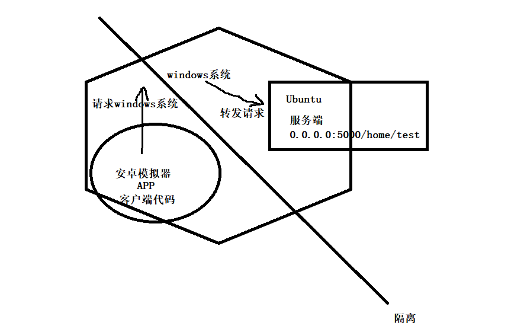

VMWare实际上是直接设置请求代理的。所以配置如下：

点击打开VMWare的菜单栏的“编辑”，点选"虚拟网络编辑器"，打开编辑器的窗口。


先选择上方的NAT模式网络设置，然后点选    NAT设置（s）....

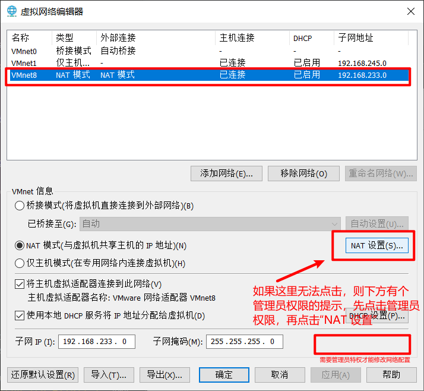

点击添加，表示添加一个**端口转发设置**。

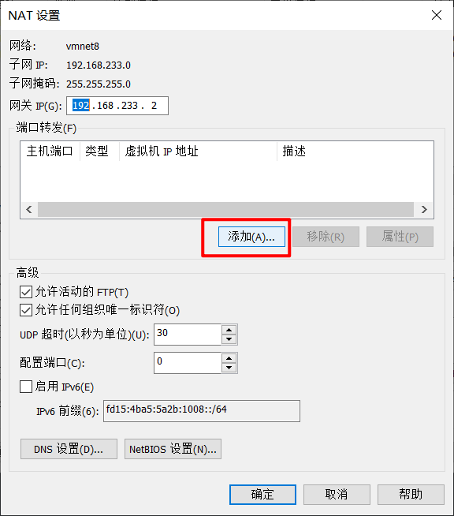


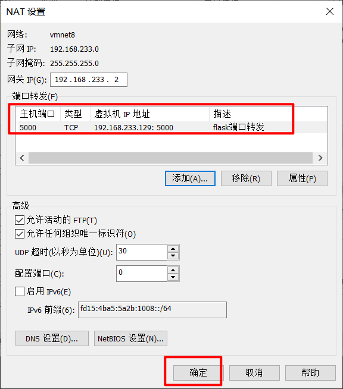

上面的设置完成以后，就可以在windows下的浏览器中，直接访问本地127.0.0.1:5000也可以访问到Ubuntu下面了。


接下来，后面就可以让安卓模拟器中的APP直接访问到windows下的5000端口，然后VMWare就会进行端口转发了。那么我们就需要让安卓模拟器知道windows的IP地址。因为安卓模拟器和windows处于同一个网络下的，所以我们可以之前安装APPLoader工具的绿色按钮，查看windows的IP地址。

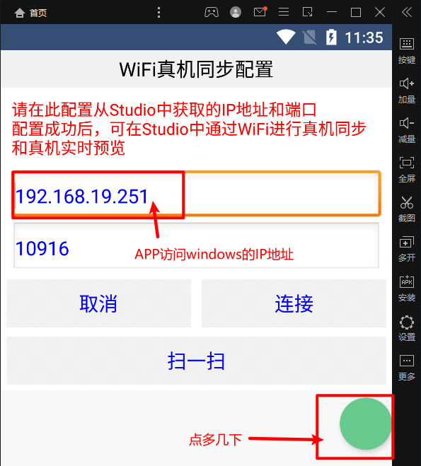

所以，在客户端的代码中，采用上面的IP地址+5000端口，结合API接口的访问地址，就可以在app中获取服务端的数据了。


### api.ajax

使用APP原生提供的提供的`api.ajax`发送ajax向flask请求数据。

基本语法：

```javascript
api.ajax({
      url: 'API接口地址',                 // 必须加上协议
      method: '请求方法',                 // post、get、put、delete、patch
      dataType: "json",                  // 服务端数据响应格式
      cache: true,                       // 缓存数据，若缓存，下次没网络时请求则会使用缓存，
                                         // 仅在get请求有效
      timeout: 30,                       // 超时时间，单位：秒
      headers:{},                        // 请求头，里面的key使用首字母大写的形式，
                                         // 如 Content-Type
      report:false,                      // 是否实时返回上传文件的进度，只有上传时使用
      data: {                            // 提交请求体的数据
          values: {                      // 以表单格式提交数据
              name: 'haha'
          },
          body: "",                      // 以字符串格式提交数据,body和values是冲突的，只能使用其中一个
          files: {                       // ajax上传文件
              file: 'fs://a.gif'         // 文件字段名
          }
      }
  },function(ret, err){                  // 回调函数，参数1是响应内容，参数2是错误信息
      if (ret) {
          alert( JSON.stringify( ret ) );
      } else {
          alert( JSON.stringify( err ) );
      }
  });
```

接下来的开发中,我们需要实现客户端,所以如果基于上面的$api开发的话,非常的影响效率,所以我们可以采用Vue.js来完成app的客户端开发.当然最终代码还是运行在APICloud里面.

index.html，代码：

```html
<!doctype html>
<html>

<head>
    <meta charset="utf-8">
    <meta name="viewport" content="maximum-scale=1.0,minimum-scale=1.0,user-scalable=0,initial-scale=1.0,width=device-width" />
    <meta name="format-detection" content="telephone=no,email=no,date=no,address=no">
    <title>Hello APP</title>
</head>

<body class="wrap">
    <header>yingming</header>
    <button>点击按钮</button>
</body>
<script>
    // 全部的js都必须写在一个APICloud提供apiready函数中，否则在调用手机系统的API功能时，会报错！！！
    apiready = ()=>{
        // 获取元素
        let button = $api.dom(document, 'button');
        // 绑定事件
        $api.addEvt(button, 'click', ()=>{
            api.ajax({
            url: 'http://192.168.233.129:5000/',     // 必须加上协议
            method: 'get',                 // post、get、put、delete、patch
            dataType: "json",                  // 服务端数据响应格式
            },function(ret, err){                  // 回调函数，参数1是响应内容，参数2是错误信息
                if (ret) {
                    api.alert({"msg": JSON.stringify( ret )});
                } else {
                    api.alert({"msg": JSON.stringify( err )});
                }
            });
        });
    } 
</script>
</html>
```

启动flask服务端，并修改index测试方法的返回结果，manage.py，代码：

```python
from application import Flask, init_app
from flask import jsonify

app: Flask = init_app("application.settings.dev")


@app.route('/')
def index():
    app.logger.debug("hello, debug")
    app.logger.info("hello, info")
    app.logger.warning("hello, warning")
    app.logger.error("hello, error")
    app.logger.critical("hello, critical")
    return jsonify({"name": "yingmingApp", "version": "0.0.3"})


if __name__ == '__main__':
    app.run()
```

#### AVM框架请求服务端ajax数据

首先，必须保证创建项目时，选择开启avm框架。

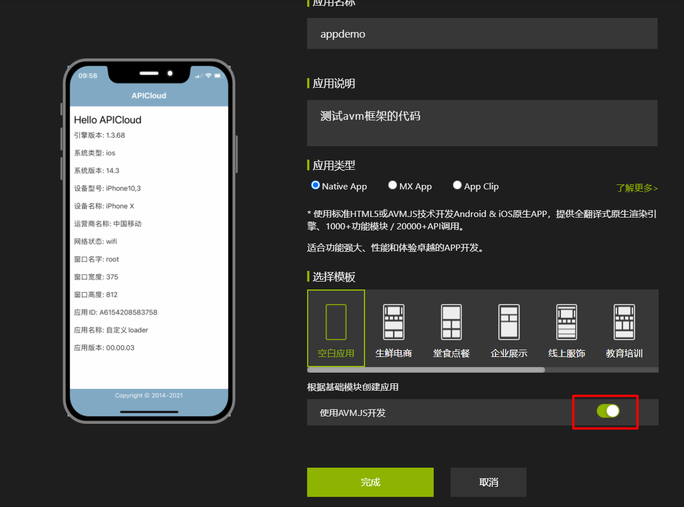

接着，就可以在新项目中，基于原来类似vue的语法来进行开发了。AVM项目中，默认首页在config.xml中是`pages/main/main.stml`文件，代码：

```vue
<template>
	<div>
		<text>{{msg}}</text>
		<button @click="getData">点击获取数据</button>
	</div>
</template>
<script>
export default {
	name: 'main',
	data() {
		return {
			msg: "Hello APICloud"
		};
	},
	methods: {
		getData(){
			api.ajax({
                url: 'http://192.168.233.129:5000/',     // 必须加上协议
                method: 'get',                 // post、get、put、delete、patch
                dataType: "json",                  // 服务端数据响应格式
			},function(ret, err){                  // 回调函数，参数1是响应内容，参数2是错误信息
				if (ret) {
					api.alert({"msg": JSON.stringify( ret )});
				} else {
					api.alert({"msg": JSON.stringify( err )});
				}
			});
		}
	}
};
</script>
<style>
.page {
	height: 100%;
	background: #fff;
}

.header {
	height: 44px;
	justify-content: center;
	align-items: center;
}

.title {
	font-size: 16px;
	font-weight: bold;
	color: #333;
}

.body {
	background: #f5f6f7;
	flex: 1;
}

.h1 {
	font-size: 22px;
	font-weight: bold;
	color: #333;
	text-align: center;
	margin: 50px;
}

.img {
	max-width: 100%;
}

.p {
	color: #aaa;
	text-align: center;
	font-size: 16px;
	margin: 15px;
}
</style>

```


### vue+axios

vue.js：https://vuejs.org/js/vue.js

axios.js：https://www.npmjs.com/package/axios

把下载回来的vue.js和axios.js保存到项目的scripts目录下，然后在页面中引入。

```html
<script src="../script/vue.js"></script>
<script src="../script/axios.js"></script>
```

html/index.html，代码：

```html
<!DOCTYPE html>
<html lang="en">
<head>
    <meta charset="UTF-8">
    <meta http-equiv="X-UA-Compatible" content="IE=edge">
    <meta name="viewport" content="width=device-width, initial-scale=1.0">
    <title>Document</title>
    <script src="../script/vue.3.2.41.js"></script>
    <script src="../script/axios.1.1.3.min.js"></script>
</head>
<body>
    <div id="app">
        <p>{{msg}}</p>
        <button @click="getData">点击获取数据</button>
    </div>
    <script>
        const vm = Vue.createApp({
            data(){
                return {
                    msg: "hello, App"
                }
            },
            methods: {
                getData(){
                    axios.get("http://192.168.233.129:5000/").then(response=>{
                        api.alert({"msg": JSON.stringify( response.data )});
                    })
                }
            }
        }).mount("#app")
    </script>
</body>
</html>
```

上面的代码是服务端提供了函数视图，当然也可以提供基于restful的类视图接口。

服务端代码，application/apps/home/views.py，代码：

```python
from flask import request
from flask.views import MethodView


class Home(MethodView):
    def get(self):
        print(request.method)
        return {"title": "类视图的get代码"}

    def post(self):
        print(request.method)
        return {"title": "类视图的post代码"}
    
def index():
    return "home.index"

def test():
    return "home.test"

```

路由代码：

```python
from typing import List
from application import path
from . import views

urlpatterns: List = [
    # path的作用就是把传递的参数转换成对应的字典结构：{"rule": "/home", "view_func": views.index, "methods": ["GET"]},
    path("/test", views.test, methods=["GET", "POST"]),
    path("/index", views.index),
    path("/", views.Home.as_view("home")),
]
```

客户端中的html/index.html，发送post请求，代码：

```html
<!DOCTYPE html>
<html lang="en">
<head>
    <meta charset="UTF-8">
    <meta http-equiv="X-UA-Compatible" content="IE=edge">
    <meta name="viewport" content="width=device-width, initial-scale=1.0">
    <title>Document</title>
    <script src="../script/vue.3.2.41.js"></script>
    <script src="../script/axios.1.1.3.min.js"></script>
</head>
<body>
    <div id="app">
        <p>{{msg}}</p>
        <button @click="getData">点击获取数据</button>
    </div>
    <script>
        const vm = Vue.createApp({
            data(){
                return {
                    msg: "hello, App"
                }
            },
            methods: {
                getData(){
                    axios.post("http://192.168.233.129:5000/home/").then(response=>{
                        api.alert({"msg": JSON.stringify( response.data )});
                    })
                }
            }
        }).mount("#app")
    </script>
</body>
</html>
```

# JSON-RPC

所谓的RPC，`Remote Procedure Call`的简写，中文译作**远程过程调用**或者**远程服务调用**，是一种api的设计风格，与rest风格对应。

直观的理解就是，通过网络请求远程服务器获取指定接口的数据，而不用知晓底层网络协议的细节。

`RPC`支持的数据格式很多，比如`XML`格式，`JSON`格式、ProtoBuf格式等等。最常用的肯定是json和ProtoBuf。

我们接下来项目使用到的数据格式json格式，因为当前的前后端之间的数据交互的采用http协议。

> 注意：
>
> gRPC，是一种基于rpc风格实现接口的架构，底层采用的TCP协议，数据格式采用的是ProtoBuf格式。而我们当前实现的json-rpc实际上采用的是http协议，采用了json数据格式，因此性能上比不上gRPC的。如果是属于服务端之间的不同平台或服务端之间的不同语言之间的交互往往有很多人采用了ProtoBuf，因为ProtoBuf在执行和执行的过程中，都是非常高效的，因为ProtoBuf是属于二进制安全的。

JSON-RPC是一个无状态的、轻量级的远程过程调用（RPC）方案，当然也可以认为是一种协议。

JSON-RPC文档：https://www.jsonrpc.org/specification

JSON-RPC译文文档：http://wiki.geekdream.com/Specification/json-rpc_2.0.html

JSON-RPC中的客户端一般是为了向远程服务器请求执行某个方法/函数。客户端向实现了JSON-RPC协议的服务端发送请求，多个输入参数能够通过**数组或者对象**传递到远程服务器上的被访问方法，这个远程方法也能返回多个输出数据，具体是什么，当然要看具体的方法实现。因为RPC可以通俗理解为4点： 

1. 客户端请求服务端完成某一个服务行为，要求<mark>客户端发送的所有请求都是POST请求</mark>!!!

2. 所有的传输数据都是单个对象，用json格式进行序列化。

3. 请求要求包含三个特定属性：

   ```
   jsonrpc: 用来声明JSON-RPC协议的版本，现在基本固定为“2.0”
   
   method，方法，是等待调用的远程方法名，字符串类型
   
   params，参数，对象类型或者是数组，向远程方法传递的多个参数值，如果没有参数，paramas的默认值可以使用[]或者{}来声明
   
   id，任意类型值，用于和最后的响应数据中的id判断是否匹配一致，也就是这里设定多少，后面响应里这个值也设定为相同的
   响应的接收者必须能够给出所有请求以正确的响应。这个值一般不能为Null，且为数字时不能有小数。
   
   示例：
   {
      "jsonrpc": "2.0",
      "method": "模块名.方法名",
      "params": {
         "键": "值",
      },
      "id": "UUID或整数格式...."
   }
   ```

4. 响应也有三个属性：

   ```bash
   jsonrpc, 用来声明JSON-RPC协议的版本，现在基本固定为“2.0”
   
   result，表示正确结果，是方法的返回值，调用方法出现错误时，不能包含该成员。
   
   error，表示错误结果，当出现错误时，返回一个特定的错误编码，如果没有错误产生，不能包含该成员。
   
   id，就是请求体携带的那个id值，必须与请求对象中的id的值相同。请求对象中的id时发生错误（如：转换错误或无效的请求），它必须为Null
   
   操作成功，响应示例：
   {
   	"jsonrpc": "2.0",
   	"reslt": {
   	   data: {
   	   
   	   }
   	}
   	"id": "UUID格式(来自请求中的ID，原样返回)...."
   }
   
   操作失败，响应示例：
   {
   	"jsonrpc": "2.0",
   	"error": {
   	   detail: {
   	   
   	   }
   	}
   	"id": "UUID格式(来自请求中的ID，原样返回)...."
   }
   
   ```

当然，有一些场景下是不用返回值的，比如只对客户端进行通知，由于不用对请求的id进行匹配，所以这个id就是不必要的，置空或者直接不要即可。同时，如果客户端请求体中没有携带ID的话，则服务端会默认本次的请求属于通知状态，不会给客户端返回任何结果，直接响应204.


在flask中要实现提供json-rpc风格的接口，可以使用**Flask-JSONRPC**这个第三方模块来实现。

git地址：https://github.com/cenobites/flask-jsonrpc


### 安装Flask-JSONRPC模块

```shell
pip install Flask-JSONRPC
```

直接在`application/__init__.py`项目初始化文件中进行初始化jsonrpc，代码。

```python
from pathlib import Path
from flask import Flask
from flask_sqlalchemy import SQLAlchemy
from flask_redis import FlaskRedis
from flask_pymongo import PyMongo
from flask_jsonrpc import JSONRPC

from application.utils.config import Config
from application.utils.logger import Logger
from application.utils.commands import Command
from application.utils.blueprint import AutoBluePrint, path


# 实例化配置加载类
config: Config = Config()
# 实例化SQLAlchemy
db: SQLAlchemy = SQLAlchemy()
# 实例化redis
redis_cache: FlaskRedis = FlaskRedis(config_prefix="REDIS")
redis_check: FlaskRedis = FlaskRedis(config_prefix="CHECK")

# mongoDB实例化
mongo: PyMongo = PyMongo()
# 实例化日志配置类
logger: Logger = Logger()

# 实例化终端命令管理类
command: Command = Command()

# 实例化自动化蓝图类
blueprint: AutoBluePrint = AutoBluePrint()

# 实例化jsonrpc
jsonrpc = JSONRPC()

def init_app(config_path: str) -> Flask:
    """用于创建app实例对象并完成初始化过程的工厂函数"""
    # 实例化flask应用对象
    app: Flask = Flask(__name__)
    # 全局路径常量，指向项目根目录
    app.BASE_DIR: Path = Path(__file__).resolve().parent.parent

    # 加载配置
    config.init_app(app, config_path)
    # SQLAlchemy加载配置
    db.init_app(app)
    # redis加载配置
    redis_cache.init_app(app)
    redis_check.init_app(app)
    # # pymongo加载配置
    mongo.init_app(app)

    # 日志加载配置
    logger.init_app(app)

    # 终端命令管理类加载配置
    command.init_app(app)

    # jsonrpc注册到项目中
    # 开启rpc接口的web调试界面：/api/browse
    jsonrpc.browse_url = app.config.get("API_BROWSE_URL", "/api/browse")
    # 是否允许浏览器访问web调试界面，与DEBUG的值一致即可
    jsonrpc.enable_web_browsable_api = app.config.get("DEBUG", False)
    jsonrpc.init_app(app)

    # 自动化蓝图类加载配置
    blueprint.init_app(app)

    # db创建数据表
    with app.app_context():
        db.create_all()

    return app

```

`application/settigns/__init__.py`，代码：

```python
"""JSONRPC"""
# api接口web调试界面的url地址
API_BROWSE_URL = "/api/browse"
```

提交版本

```bash
git add .
git commit -m "fix: add flask json rpc"
git push
```


快速实现一个测试的RPC接口。

`application/apps/home/api.py`，编写接口代码：

```python
from flask import request
from flask.views import MethodView


class Home(MethodView):
    def get(self):
        print(request.method)
        return {"title": "类视图的get代码"}

    def post(self):
        print(request.method)
        return {"title": "类视图的post代码"}

def index():
    return "home.index"

def test():
    return "home.test"


from application import jsonrpc
# PEP484规范: 给所有的变量、函数/方法的返回值、参数，必须指定他们的类型
from typing import Union, Any, List, Dict, Optional
from numbers import Real


@jsonrpc.method("Home.menu")  # 定义api接口的方法名，相当于定义视图的访问路由
def menu(data0: Any, data1: int,  data2: float, data3: str, data4: Union[int, bool], data5: bool,
         data6: List[Any], data7: List[int], data8: Dict[str, Real], data9: Optional[int] = None) -> List[Any]:
    print(f"data0={data0}, 格式：{type(data0)}")
    print(f"data1={data1}, 格式：{type(data1)}")
    print(f"data2={data2}, 格式：{type(data2)}")
    print(f"data3={data3}, 格式：{type(data3)}")
    print(f"data4={data4}, 格式：{type(data4)}")
    print(f"data5={data5}, 格式：{type(data5)}")
    print(f"data6={data6}, 格式：{type(data6)}")
    print(f"data7={data7}, 格式：{type(data7)}")
    print(f"data8={data8}, 格式：{type(data8)}")
    print(f"data9={data9}, 格式：{type(data9)}")
    message: List[Any] = [
        data0,  # 可以填写任意类型数据
        data1,   # 只能填写整型
        data2,   # 只能填写浮点型
        data3,   # 只能填写字符串
        data4,   #  Union表示联合类型， Union[int, bool]表示只能填写整型或布尔型之间的一种
        data5,  # 只能填写布尔型
        data6,  # List[Any]，只能填写列表数据，列表中的成员可以是任意类型的数据
        data7,  # List[int]，只能填写列表数据，列表中的成员只能是整型，除此之外，还有 List[str]、List[Dict[str, Any]]
        data8,  # Dict[str, Real]，只能填写字典数据，字典中的键必须是字符串，值必须是数值类型[包括整型和浮点型]
        data9,  # Optional[int, str]，Optional表示可选，也就是这个参数可以不填，默认None，也可以填写int类型
    ]
    return message

```

客户端需要发起post请求，访问地址为：`http://127.0.0.1:5000/api/browse/#/`

可以通过postman发送请求接口，访问数据格式应是：

```json
{
    "jsonrpc": "2.0",
    "method": "Home.menu",
    "params": {
        "data0": ["abc"],
        "data1": 133,
        "data2": 1.333,
        "data3": "100",
        "data4": 1000000,
        "data5": true,
        "data6": ["a", 100],
        "data7": [1,2,3,5],
        "data8": {
            "age": 100,
            "price": 3.50
        },
        "data9": 100.33
    },
    "id": "1"
}
```

请求效果：


### 系统自动注册蓝图下的api接口并实现方法名和函数分离

路由代码新增api接口的路由列表apipatterns，`home/urls.py`：

```python
from typing import List
from application import path
from . import views, api

urlpatterns: List = [
    # path的作用就是把传递的参数转换成对应的字典结构：{"rule": "/home", "view_func": views.index, "methods": ["GET"]},
    path("/test", views.test, methods=["GET", "POST"]),
    path("/index", views.index),
    path("/", views.Home.as_view("home")),
]

apipatterns: List = [
    # path ----> {"name": "menu", "view_func": api.menu}
    path("menu", api.menu),
]
```

总路由，代码：

```python
from typing import List
from application import path


urlpatterns: List = [
    path("/home", "home.urls"),
]
```


调整蓝图注册的代码，自动注册jsonrpc相关的api视图和请求方法名。`utils/blueprint.py`，代码：

```python
from types import ModuleType
from typing import List, Optional, Callable, Union, Dict
from flask import Flask, Blueprint
from importlib import import_module
from flask_jsonrpc import JSONRPC

class AutoBluePrint(object):
    def __init__(self, app: Optional[Flask] = None, jsonrpc: Optional[JSONRPC] = None):
        if app:
            self.init_app(app, jsonrpc)

    def init_app(self, app: Flask, jsonrpc: JSONRPC):
        """
        自动注册蓝图
        :param app:
        :return:
        """
        # 从配置文件中读取需要注册到项目中的蓝图路径信息
        blueprint_path_list: List = app.config.get("INSTALL_BLUEPRINTS", [])
        # 从配置文件中读取总路由模块
        url_root_path: str = app.config.get("URL_ROOT_PATH", "application.urls")
        # 总路由模块
        url_root_module: ModuleType = import_module(url_root_path)
        # 总路由列表
        if not hasattr(url_root_module, "urlpatterns"):
            message: str = "总路由文件 URL_ROOT_PATH，没有路由列表！请在总路由文件中设置 urlpatterns 路由列表"
            app.logger.error(message)
            raise Exception(message)

        root_urlpatterns: List = url_root_module.urlpatterns

        # 遍历蓝图路径列表，对每一个蓝图进行初始化
        for blueprint_path in blueprint_path_list:
            # 获取蓝图路径中最后一段的包名作为蓝图的名称
            blueprint_name: str = blueprint_path.split(".")[-1]
            # 给当前蓝图目录创建一个蓝图对象
            blueprint: Blueprint = Blueprint(blueprint_name, blueprint_path)

            # # 导入子路由关系，blueprint_url_path就是当前蓝图下的urls模块的导包路径
            # blueprint_url_path: str = blueprint_path + ".urls"
            # urls_module: ModuleType = import_module(blueprint_url_path)
            # urlpatterns: List = []
            # try:
            #     urlpatterns = urls_module.urlpatterns
            # except Exception:
            #     pass
            #
            # # 在循环中，把urlpatterns的每一个路由信息添加注册到蓝图对象里面
            # for url in urlpatterns:
            #     blueprint.add_url_rule(**url)

            # 蓝图路由的前缀
            url_prefix: str = ""

            # 蓝图下的子路由列表
            urlpatterns: List = []

            # 获取蓝图的父级目录，目的是为了拼接总路由中所有蓝图下的urls子路由文件的路径
            blueprint_father_path: str = ".".join(blueprint_path.split(".")[:-1])

            # 循环总路由列表
            for item in root_urlpatterns:
                # 判断当前蓝图是否有注册到总路由中提供对外访问，如果没有把蓝图注册到总路由中，则无法被外界访问。
                if blueprint_name in item["blueprint_url_subffix"]:
                    # 导入当前蓝图下的子路由模块
                    urls_module: ModuleType = import_module(f"{blueprint_father_path}.{item['blueprint_url_subffix']}")

                    # 获取子路由文件中的路由列表
                    urlpatterns: List = getattr(urls_module, "urlpatterns", [])
                    apipatterns: List = getattr(urls_module, "apipatterns", [])

                    # 提取蓝图路由的前缀
                    url_prefix = item["url_prefix"]
                    # 把urlpatterns的每一个路由信息添加注册到蓝图对象里面
                    for url in urlpatterns:
                        blueprint.add_url_rule(**url)

                    for api in apipatterns:
                        api["name"] = f"{url_prefix[1:].title()}.{api['rule']}"  # Home.menu
                        jsonrpc.register_view_function(**api)
                    break

            try:
                # 让蓝图自动发现模型模块
                import_module(f"{blueprint_path}.models")
            except ModuleNotFoundError:
                pass

            # 最后把蓝图对象注册到app实例对象
            # url_prefix 是地址前缀，将来我们将来实现一个总路由来声明它
            app.register_blueprint(blueprint, url_prefix=url_prefix)


def path(rule: str, name: Union[Callable, str], **kwargs) -> Dict:
    """绑定url地址和视图的映射关系"""
    if isinstance(name, Callable):
        return {"rule": rule, "view_func": name, **kwargs}
    elif isinstance(name, str):
        return {"url_prefix": rule, "blueprint_url_subffix": name, **kwargs}
    else:
        return {}
```

`application/__init__.py`，代码：

```python
from pathlib import Path
from flask import Flask
from flask_sqlalchemy import SQLAlchemy
from flask_redis import FlaskRedis
from flask_pymongo import PyMongo
from flask_jsonrpc import JSONRPC

from application.utils.config import Config
from application.utils.logger import Logger
from application.utils.commands import Command
from application.utils.blueprint import AutoBluePrint, path


# 实例化配置加载类
config: Config = Config()
# 实例化SQLAlchemy
db: SQLAlchemy = SQLAlchemy()
# 实例化redis
redis_cache: FlaskRedis = FlaskRedis(config_prefix="REDIS")
redis_check: FlaskRedis = FlaskRedis(config_prefix="CHECK")

# mongoDB实例化
mongo: PyMongo = PyMongo()
# 实例化日志配置类
logger: Logger = Logger()

# 实例化终端命令管理类
command: Command = Command()

# 实例化自动化蓝图类
blueprint: AutoBluePrint = AutoBluePrint()

# 实例化jsonrpc
jsonrpc = JSONRPC()

def init_app(config_path: str) -> Flask:
    """用于创建app实例对象并完成初始化过程的工厂函数"""
    # 实例化flask应用对象
    app: Flask = Flask(__name__)
    # 全局路径常量，指向项目根目录
    app.BASE_DIR: Path = Path(__file__).resolve().parent.parent

    # 加载配置
    config.init_app(app, config_path)
    # SQLAlchemy加载配置
    db.init_app(app)
    # redis加载配置
    redis_cache.init_app(app)
    redis_check.init_app(app)
    # # pymongo加载配置
    mongo.init_app(app)

    # 日志加载配置
    logger.init_app(app)

    # 终端命令管理类加载配置
    command.init_app(app)

    # jsonrpc注册到项目中
    # 开启rpc接口的web调试界面：/api/browse
    jsonrpc.browse_url = app.config.get("API_BROWSE_URL", "/api/browse")
    # 是否允许浏览器访问web调试界面，与DEBUG的值一致即可
    jsonrpc.enable_web_browsable_api = app.config.get("DEBUG", False)
    jsonrpc.init_app(app)

    # 自动化蓝图类加载配置
    blueprint.init_app(app, jsonrpc)  # 把jsonrpc对象传递到自动化蓝图类中。

    # db创建数据表
    with app.app_context():
        db.create_all()

    return app

```


通过postman访问地址：`127.0.0.1:5000/api`，请求体：

```python
{
  "jsonrpc": "2.0",
  "method": "Home.menu",
  "params": {
    "data0": 1,
    "data1": 100,
    "data2": 200,
    "data3": "me",
    "data4": 0,
    "data5": true,
    "data6": [
      "A",
      "B",
      200
    ],
    "data7": [
      1,
      2,
      3,
      4
    ],
    "data8": {
      "age": 18,
      "money": 1000
    }
  },
  "id": "272806ab-29a5-49ab-bd2f-36ff2ef29402"
}
```

注意：在上面的蓝图注册函数中，注册api别名的时候，拼接了当前蓝图名称所以访问的method值实际上是`蓝图名称.访问名称`。

当然在开发中，当前jsonrpc模块也支持把多个相关的api接口函数写成类方法格式。`home/api.py`，代码：

```python
class Home():
    def index(self,num: int)->Dict[str, Union[int, str]]:
        return {
            "errno": 200,
            "errmsg": "ok",
            "data": "hello world!%s" % num
        }

    def list(self)->Dict[str,str]:
        return {
            "data": "hello,list"
        }
```

路由示例代码，`home.urls`:

```python
from typing import List
from application import path
from . import views, api

urlpatterns: List = [
    # path的作用就是把传递的参数转换成对应的字典结构：{"rule": "/home", "view_func": views.index, "methods": ["GET"]},
    path("/test", views.test, methods=["GET", "POST"]),
    path("/index", views.index),
    path("/", views.Home.as_view("home")),
]


home = api.Home()

apipatterns: List = [
    # path ----> {"name": "menu", "view_func": api.menu}
    path("menu", api.menu),
    path("index", home.index),
    path("list", home.list),
]
```


# 客户端展示页面

### 首页显示

`html/index.html`，代码：

```vue
<!DOCTYPE html>
<html lang="en">
<head>
    <title>首页</title>
    <meta charset="UTF-8">
    <meta name="viewport" content="width=device-width,minimum-scale=1.0,maximum-scale=1.0,user-scalable=no">
    <meta name="format-detection" content="telephone=no,email=no,date=no,address=no">
    <link rel="stylesheet" href="../css/main.css">
	<script src="../script/vue.3.2.41.js"></script>
    <script src="../script/axios.1.1.3.min.js"></script>
    <script src="../script/main.js"></script>
</head>
<body>
  <div class="app" id="app">
    <!-- 背景音乐 -->
    
    <!--  背景图片 -->
    <div class="bg">
      
    </div>
    <!-- 菜单 -->
    <ul>
      <li></li> <!-- 果园 -->
      <li></li> <!-- 会员 -->
      <li></li> <!-- 娱乐 -->
      <li></li> <!-- 签到 -->
    </ul>
  </div>
  <script>
    const app = Vue.createApp({
        data(){
            return {
                music_play: true,  // 默认播放背景音乐的控制属性
            }
        },
        watch:{
            music_play(){
                if(this.music_play){
                    this.game.play_music("../mp3/bg1.mp3");
                }else{
                    this.game.stop_music();
                }
            }
        }
    })
    app.mount("#app");
    app.config.globalProperties.game = new Game("../mp3/bg1.mp3");
	</script>
</body>
</html>
```

`css/main.css`，代码：

```css
*{user-select: none;}
body,form,input,table,ul,li{margin: 0;padding: 0;}
body,th,td,.p1,.p2{font-family:arial}
p,form,ol,ul,li,dl,dt,dd,h3{margin:0;padding:0;list-style:none;}
table,img{border:0;}
img{max-height: 100%;max-width: 100%;width:100%}
td{font-size:9pt;line-height:18px;}
em{font-style:normal;}
em{font-style:normal;color:#c00;}
a em{text-decoration:underline;}
input,button{outline: 0;}

@keyframes scaleDraw {  /*定义关键帧、scaleDrew是需要绑定到选择器的关键帧名称*/
    0%{ transform: scale(1);  }
    25%{ transform: scale(1.5);  }
    50%{ transform: scale(1);  }
    75%{ transform: scale(1.5);  }
}
@keyframes rotation{
	from {-webkit-transform: rotate(0deg);}
	to {-webkit-transform: rotate(360deg);}
}
html{
	font-size: 12px;
}

.app{
	margin: 0 auto;
	max-width: 1125px;
  width: 100%;
	overflow: hidden;
	max-height: 100%;
  height: 100rem;
	position: relative;
}
.app .music{
	position: absolute;
	width: 5rem;
	height: 5rem;
	top: 3rem;
	right: 3rem;
	z-index: 100;
	border-radius: 50%;
}
.app .music2{
	animation: rotation 6s ease-in infinite;
}
.app .bg{
	margin: 0 auto;
	width: 100%;
	max-width: 100rem;
	position: relative;
	z-index: -1;
}

.app .bg img{
	width: 100rem;
	animation: scaleDraw 120s ease-in infinite;
}
.app .module1{
	position: absolute;
	top: 24.17rem;
	left: 0;
	width: 16.39rem;
	height: 29.72rem;
}
.app .module2{
	position: absolute;
	top: 13.5rem;
	right: 0;
	width: 16rem;
	height: 20.39rem;
}
.app .module3{
	position: absolute;
	width: 11.94rem;
	height: 18.06rem;
	top: 40.56rem;
	right: 2.67rem;
}
.app .module4{
	position: absolute;
	top: 6.94rem;
	left: 5.17rem;
	width: 7.83rem;
	height: 10.72rem;
}

.form{
	margin: 0 auto;
	position: absolute;
	top: 16rem;
	width: 26.94rem;
	left: 0;
	right: 0;
}
.form-title{
	margin: 0 auto;
	width: 16.86rem;
	height: 5.33rem;
	position: relative;
	z-index: 0;
}
.form-title .back{
	position: absolute;
	right: -3rem;
	top: 0.67rem;
	width: 3.83rem;
	height: 3.89rem;
}
.form-data{
	position: relative;
	padding-top: 3.78rem;
  z-index: 0;
}
.form-data-bg{
	position: absolute;
	top: -2.39rem;
	width: 26.94rem;
	left: 0;
	right: 0;
	margin: auto;
	z-index: -1;
}
.form-item{
	width: 23.1rem;
	margin: 0 auto 1.5rem;
}
.form-item label.text{
	width: 6.67rem;
	letter-spacing: 0.13rem;
	text-align: right;
	display: inline-block;
	font-size: 1.33rem;
	margin-bottom: 0.33rem;
	font-weight: bold;
}
.form-item input[type=text],
.form-item input[type=password]
{
	background-color: transparent;
	border-radius: 3px;
	width: 14.44rem;
	border: 0.08rem #666 solid;
	height: 2.33rem;
	font-size: 1rem;
	text-indent: 1rem;
	vertical-align: bottom;
}
.form-item input.code{
	width: 10.67rem;
}
.form-item .refresh{
	width: 2.56rem;
	height: 2.44rem;
	margin-left: 0.67rem;
	vertical-align: middle;
}
.form-item .refresh:active{
	margin-top: .5px;
	margin-bottom: -.5px;
}
.form-item input.agree{
	margin-left: 2.4rem;
	margin-bottom: 0.33rem;
	width: 1rem;
  height: 1rem;
  vertical-align: sub;
}
.form-item .agree_text{
	font-size: 1rem;
}
.form-item input.remember{
	margin-left: 5.83rem;
	vertical-align: sub;
}
.form-item .commit{
	width: 11.5rem;
	height: 3.94rem;
	margin: 0 auto;
	display: block;
}
.form-item .commit:active{
	margin-top: .5px;
	margin-bottom: -.5px;
}
.form-item .toreg{
	margin-left: 3.11rem;
	background: url("../image/btn1.png") no-repeat 0 0;
	background-size: 100% 100%;
}
.form-item .tofind{
	background: url("../image/btn2.png") no-repeat 0 0;
	background-size: 100% 100%;
}
.form-item .toreg,
.form-item .tofind
{
	display: inline-block;
	width: 7.94rem;
	height: 2.5rem;
	margin-right: 1.67rem;
	font-size: 1rem;
	color: #fff;
	line-height: 2.5rem;
	text-align: center;
	user-select: none;
}

```

`script/main.js`，代码：

```javascript
class Game{
	constructor(bg_music){
		// 构造函数
		this.init();
    	this.play_music(bg_music);
	}
	init(){
		// 初始化
		console.log("系统初始化");
    	this.rem();
	}
	print(data){
		// 打印数据
		console.log(JSON.stringify(data));
	}

	rem(){
		// 样式适配[保证在任何尺寸下的手机里面，页面效果保持]
		if(window.innerWidth<1200){
			this.UIWidth = document.documentElement.clientWidth;
			this.UIHeight = document.documentElement.clientHeight;
			document.documentElement.style.fontSize = (0.01*this.UIWidth*3)+"px";
			document.querySelector("#app").style.height=this.UIHeight+"px"
		}
		window.onresize = ()=>{
			if(window.innerWidth<1200){
				this.UIWidth = document.documentElement.clientWidth;
				this.UIHeight = document.documentElement.clientHeight;
				document.documentElement.style.fontSize = (0.01*this.UIWidth*3)+"px";
			}
		}
	}
	stop_music(){
		// 暂停音乐
		this.print("停止")
		document.body.removeChild(this.audio);
	}
	play_music(src){
		// 播放音乐
		this.audio = document.createElement("audio");
		this.source = document.createElement("source");
		this.source.type = "audio/mp3";
		this.audio.autoplay = "autoplay";
		this.source.src=src;
		this.audio.appendChild(this.source);
		document.body.appendChild(this.audio);
		var t = setInterval(()=>{
		if(this.audio.readyState > 0){
			if(this.audio.ended){
			clearInterval(t);
			document.body.removeChild(this.audio);
			}
		}
		},100);
	}
}

```


### 登陆页显示

`html/login.html`，代码：

```vue
<!DOCTYPE html>
<html>
<head>
	<title>登录</title>
	<meta name="viewport" content="width=device-width,minimum-scale=1.0,maximum-scale=1.0,user-scalable=no">
	<meta charset="utf-8">
    <link rel="stylesheet" href="../css/main.css">
	<script src="../script/vue.3.2.41.js"></script>
    <script src="../script/axios.1.1.3.min.js"></script>
    <script src="../script/main.js"></script>
</head>
<body>
	<div class="app" id="app">
    
    <div class="bg">
			
		</div>
		<div class="form">
			<div class="form-title">
				
				
			</div>
			<div class="form-data">
				<div class="form-data-bg">
					
				</div>
				<div class="form-item">
					<label class="text">手机</label>
					<input type="text" name="mobile" placeholder="请输入手机号">
				</div>
				<div class="form-item">
					<label class="text">密码</label>
					<input type="password" name="password" placeholder="请输入密码">
				</div>
				<div class="form-item">
					<input type="checkbox" class="agree remember" name="agree" checked>
					<label><span class="agree_text ">记住密码，下次免登录</span></label>
				</div>
				<div class="form-item">
					
				</div>
				<div class="form-item">
					<p class="toreg">立即注册</p>
					<p class="tofind">忘记密码</p>
				</div>
			</div>
		</div>
	</div>
	<script>
    const app = Vue.createApp({
        data(){
            return {
                music_play: true,  // 默认播放背景音乐的控制属性
            }
        },
        watch:{
            music_play(){
                if(this.music_play){
                    this.game.play_music("../mp3/bg1.mp3");
                }else{
                    this.game.stop_music();
                }
            }
        }
    })
    app.mount("#app");
    app.config.globalProperties.game = new Game("../mp3/bg1.mp3");
	</script>
</body>
</html>
```


### 注册页显示

`html/register.html`

```vue
<!DOCTYPE html>
<html>
<head>
	<title>注册</title>
	<meta name="viewport" content="width=device-width,minimum-scale=1.0,maximum-scale=1.0,user-scalable=no">
	<meta charset="utf-8">
    <link rel="stylesheet" href="../css/main.css">
	<script src="../script/vue.3.2.41.js"></script>
    <script src="../script/axios.1.1.3.min.js"></script>
    <script src="../script/main.js"></script>
</head>
<body>
	<div class="app" id="app">
        
        <div class="bg">
            
        </div>
		<div class="form">
			<div class="form-title">
				
				
			</div>
			<div class="form-data">
				<div class="form-data-bg">
					
				</div>
				<div class="form-item">
					<label class="text">手机</label>
					<input type="text" name="mobile" placeholder="请输入手机号">
				</div>
				<div class="form-item">
					<label class="text">验证码</label>
					<input type="text" class="code" name="code" placeholder="请输入验证码">
					
				</div>
				<div class="form-item">
					<label class="text">密码</label>
					<input type="password" name="password" placeholder="请输入密码">
				</div>
				<div class="form-item">
					<label class="text">确认密码</label>
					<input type="password" name="password2" placeholder="请再次输入密码">
				</div>
				<div class="form-item">
					<input type="checkbox" class="agree" name="agree" checked>
					<label><span class="agree_text">同意磨方《用户协议》和《隐私协议》</span></label>
				</div>
				<div class="form-item">
					
				</div>
			</div>
		</div>
	</div>
	<script>
    const app = Vue.createApp({
        data(){
            return {
                music_play: true,  // 默认播放背景音乐的控制属性
            }
        },
        watch:{
            music_play(){
                if(this.music_play){
                    this.game.play_music("../mp3/bg1.mp3");
                }else{
                    this.game.stop_music();
                }
            }
        }
    })
    app.mount("#app");
    app.config.globalProperties.game = new Game("../mp3/bg1.mp3");
	</script>
</body>
</html>
```

# 窗口和页面操作

在APICloud中提供了2种类型，3种方式给开发者打开或者新建窗口（window）或页面（frame）。

在APICloud中，一个APP，至少拥有一个window窗口，每一个window窗口下至少有一个frame页面。


### 1. window 窗口

window是APICloud提供的最顶级的页面单位.一个APP至少会存在一个以上的window窗口，在用户打开APP应用，应用在初始化的时候默认就会创建了一个name=root 的顶级window窗口显示当前App的config.xml配置项`<content src="首页路径"/>`设置的首页。


#### 新建window窗口

如果之前已经存在同名的窗口，则APP不会再次创建新窗口,而是置顶显示当前对应名称的窗口。因此APICloud中，新建窗口与切换窗口实际上是同一个操作。演示代码:

```javascript
api.openWin({
    name: 'page1',        // 自定义窗口名称
    bounces: false,       // 窗口是否上下拉动
    reload: false,         // 如果页面已经在之前被打开了,是否要重新加载当前窗口中的页面
    url: './page1.html',  // 窗口创建时展示的html页面的本地路径[相对于当前代码所在文件的路径]
    animation:{           // 打开新建窗口时的过渡动画效果
    	type:"none",                //动画类型（详见动画类型常量）
    	subType:"from_right",       //动画子类型（详见动画子类型常量）
    	duration:300                //动画过渡时间，默认300毫秒
    },
    pageParam: {          // 传递给下一个窗口使用的参数.将来可以在新窗口中通过 api.pageParam.name 获取
        name: 'test'      // name只是举例, 将来可以传递更多自定义数据的.
    }
});
```

#### 关闭指定名称的窗口

如果当前APP中只有剩下一个顶级窗口root,则无法通过当前方法关闭! 也有部分手机直接退出APP了

```javascript
//关闭当前window，使用默认动画
api.closeWin();

//关闭指定window，若待关闭的window不在最上面，则无动画
api.closeWin({
    name: 'page1'
});
```

接下来我们可以把打开和关闭窗口的代码封装到主程脚本main.js中.

```javascript
class Game{
	constructor(bg_music){
		// 构造函数
		this.init();
    	this.play_music(bg_music);
	}
	init(){
		// 初始化
		console.log("系统初始化");
    	this.rem();
	}
	print(data){
		// 打印数据
		console.log(JSON.stringify(data));
	}

	rem(){
		// 样式适配[保证在任何尺寸下的手机里面，页面效果保持]
		if(window.innerWidth<1200){
			this.UIWidth = document.documentElement.clientWidth;
			this.UIHeight = document.documentElement.clientHeight;
			document.documentElement.style.fontSize = (0.01*this.UIWidth*3)+"px";
			document.querySelector("#app").style.height=this.UIHeight+"px"
		}
		window.onresize = ()=>{
			if(window.innerWidth<1200){
				this.UIWidth = document.documentElement.clientWidth;
				this.UIHeight = document.documentElement.clientHeight;
				document.documentElement.style.fontSize = (0.01*this.UIWidth*3)+"px";
			}
		}
	}
	stop_music(){
		// 暂停音乐
		this.print("停止")
		document.body.removeChild(this.audio);
	}
	play_music(src){
		// 播放音乐
		this.audio = document.createElement("audio");
		this.source = document.createElement("source");
		this.source.type = "audio/mp3";
		this.audio.autoplay = "autoplay";
		this.source.src=src;
		this.audio.appendChild(this.source);
		document.body.appendChild(this.audio);
		var t = setInterval(()=>{
		if(this.audio.readyState > 0){
			if(this.audio.ended){
			clearInterval(t);
			document.body.removeChild(this.audio);
			}
		}
		},100);
	}
	goWin(url,pageParam){
		// 打开窗口
		const name = url.replace(".html","");
		if(name === "root"){
			api.openWin({"name":"root"});
			return; 
		}

		api.openWin({
		    name: name,             // 自定义窗口名称
		    bounces: false,        // 窗口是否上下拉动
		    reload: false,         // 如果页面已经在之前被打开了,是否要重新加载当前窗口中的页面
		    url: url,              // 窗口创建时展示的html页面的本地路径[相对于当前代码所在文件的路径]
		    animation:{            // 打开新建窗口时的过渡动画效果
		    	type: "push",                //动画类型（详见动画类型常量）
		    	subType: "from_right",       //动画子类型（详见动画子类型常量）
		    	duration:300                //动画过渡时间，默认300毫秒
		    },
		    pageParam: pageParam   // 传递给下一个窗口使用的参数.将来可以在新窗口中通过 api.pageParam.name 获取
		});
	}
	outWin(name){
		// 关闭窗口
		api.closeWin({"name": name});
	}
}
```


### 2. frame 帧页面

```
如果APP中所有的页面全部窗口进行展开,则APP需要耗费大量的内存来维护这个窗口列表,从而导致, 用户操作APP时，APP响应缓慢甚至卡顿的现象.所以APP中除了通过新建窗口的方式展开页面以外, 还提供了帧（frame，也叫帧页面）的方式来展开页面.
帧,代表的就是一个窗口下开打的某个页面记录.所谓的帧就有点类似于浏览器中窗口通过地址栏新建的一个页面一样.
使用的时候注意：
    1. APP每一个window窗口都可以打开1到多个帧.新建窗口的时候,系统会默认顺便创建第一帧出来.
    2. 每一帧代表的都是一个html页面,
    3. 默认情况下, APP的window窗口会自动默认满屏展示.而帧可以设置矩形的宽高.如果顶层的帧页面没有满屏显示,则用户可以看到当前这一帧下的其他帧的内容.
```

#### 新建帧页面

已经存在的帧页面不会被窗口，而是置顶显示。

```javascript
api.openFrame({
    name: 'page2',        // 帧页面的名称(同一个窗口中，帧页面的名称是唯一的)
    url: './page2.html',  // 帧页面打开的url地址
    data: '',             // 可选参数,如果填写了data,则不要使用url, data表示页面数据,可以是html代码
    bounces: false,        // 页面是否可以下拉拖动
    reload: false,         // 帧页面如果已经存在,是否重新刷新加载
    historyGestureEnabled:true,  // 是否支持历史手势操作
    animation:{
        type:"push",             //动画类型（详见动画类型常量）
    	subType:"from_right",    //动画子类型（详见动画子类型常量）
    	duration:300             //动画过渡时间，默认300毫秒
    },
    rect: {               // 当前帧的宽高范围
        // 方式1,设置矩形大小宽高
        x: 0,             // 左上角x轴坐标
        y: 0,             // 左上角y轴坐标
        w: 'auto',        // 当前帧页面的宽度, auto表示满屏
        h: 'auto'         // 当前帧页面的高度, auto表示满屏
	
        // 方式2,设置矩形大小宽高
        marginLeft:,    //相对父页面左外边距的距离，数字类型
        marginTop:,     //相对父页面上外边距的距离，数字类型
        marginBottom:,  //相对父页面下外边距的距离，数字类型
        marginRight:    //相对父页面右外边距的距离，数字类型
    },
    pageParam: {          // 要传递新建帧页面的参数,在新页面可通过 api.pageParam.name 获取
        name: 'test'      // name只是举例, 可以传递任意自定义参数
    }
});
```

#### 关闭帧页面

```javascript
// 关闭当前 frame页面
api.closeFrame();

// 关闭指定名称的frame页面
api.closeFrame({
    name: 'page2'
});
```

接下来我们可以把打开和关闭页面的代码封装到主程脚本main.js中.

```javascript
class Game{
	constructor(bg_music){
		// 构造函数
		this.init();
    	this.play_music(bg_music);
	}
	init(){
		// 初始化
		console.log("系统初始化");
    	this.rem();
	}
	print(data){
		// 打印数据
		console.log(JSON.stringify(data));
	}

	rem(){
		// 样式适配[保证在任何尺寸下的手机里面，页面效果保持]
		if(window.innerWidth<1200){
			this.UIWidth = document.documentElement.clientWidth;
			this.UIHeight = document.documentElement.clientHeight;
			document.documentElement.style.fontSize = (0.01*this.UIWidth*3)+"px";
			document.querySelector("#app").style.height=this.UIHeight+"px"
		}
		window.onresize = ()=>{
			if(window.innerWidth<1200){
				this.UIWidth = document.documentElement.clientWidth;
				this.UIHeight = document.documentElement.clientHeight;
				document.documentElement.style.fontSize = (0.01*this.UIWidth*3)+"px";
			}
		}
	}
	stop_music(){
		// 暂停音乐
		this.print("停止")
		document.body.removeChild(this.audio);
	}
	play_music(src){
		// 播放音乐
		this.audio = document.createElement("audio");
		this.source = document.createElement("source");
		this.source.type = "audio/mp3";
		this.audio.autoplay = "autoplay";
		this.source.src=src;
		this.audio.appendChild(this.source);
		document.body.appendChild(this.audio);
		var t = setInterval(()=>{
		if(this.audio.readyState > 0){
			if(this.audio.ended){
			clearInterval(t);
			document.body.removeChild(this.audio);
			}
		}
		},100);
	}
	goWin(url,pageParam){
		// 打开窗口
		const name = url.replace(".html","");
		if(name === "root"){
			api.openWin({"name":"root"});
			return;
		}

		api.openWin({
		    name: name,             // 自定义窗口名称
		    bounces: false,        // 窗口是否上下拉动
		    reload: false,         // 如果页面已经在之前被打开了,是否要重新加载当前窗口中的页面
		    url: url,              // 窗口创建时展示的html页面的本地路径[相对于当前代码所在文件的路径]
		    animation:{            // 打开新建窗口时的过渡动画效果
		    	type: "push",                //动画类型（详见动画类型常量）
		    	subType: "from_right",       //动画子类型（详见动画子类型常量）
		    	duration:300                //动画过渡时间，默认300毫秒
		    },
		    pageParam: pageParam   // 传递给下一个窗口使用的参数.将来可以在新窗口中通过 api.pageParam.name 获取
		});
	}
	outWin(name){
		// 关闭窗口
		api.closeWin({"name": name});
	}
	goFrame(url,pageParam){
		// 打开帧页面
		const name = url.replace(".html","");
		api.openFrame({
				name: name,
				url: url,
				rect: {
					x: 0,
					y: 0,
					w: 'auto',
					h: 'auto'
				},
				useWKWebView:true,
				historyGestureEnabled:true,
				bounces:false,
				animation:{
					type:"push",
					subType:"from_right",
					duration:300
				},
				pageParam: pageParam
		});
	}
	outFrame(name){
		// 关闭帧页面
		api.closeFrame({
		    name: name,
		});
	}
}

```

在index.html页面中,当用户点击左上角第一个抽奖按钮时，暂时先设置让系统跳转到登陆页面。

```html
<!DOCTYPE html>
<html lang="en">
<head>
    <title>首页</title>
    <meta charset="UTF-8">
    <meta name="viewport" content="width=device-width,minimum-scale=1.0,maximum-scale=1.0,user-scalable=no">
    <meta name="format-detection" content="telephone=no,email=no,date=no,address=no">
    <link rel="stylesheet" href="../css/main.css">
	<script src="../script/vue.3.2.41.js"></script>
    <script src="../script/axios.1.1.3.min.js"></script>
    <script src="../script/main.js"></script>
</head>
<body>
  <div class="app" id="app">
    <!-- 背景音乐 -->
    
    <!--  背景图片 -->
    <div class="bg">
      
    </div>
    <!-- 菜单 -->
    <ul>
      <li></li> <!-- 果园 -->
      <li></li> <!-- 会员 -->
      <li></li> <!-- 娱乐 -->
      <li></li> <!-- 签到 -->
    </ul>
  </div>
  <script>
    const app = Vue.createApp({
        data(){
            return {
                music_play: true,  // 默认播放背景音乐的控制属性
            }
        },
        watch:{
            music_play(){
                if(this.music_play){
                    this.game.play_music("../mp3/bg1.mp3");
                }else{
                    this.game.stop_music();
                }
            }
        },
        methods: {
            open_login(){
                this.game.goWin("login.html");
            },
            get_windows(){
                this.game.print(api.windows());
            }
        }
    })
    app.mount("#app");
    app.config.globalProperties.game = new Game("../mp3/bg1.mp3");
	</script>
</body>
</html>
```

在login.html页面中, 当用户点击`立即注册`,新建一个帧页面。

```html
<!DOCTYPE html>
<html>
<head>
	<title>登录</title>
	<meta name="viewport" content="width=device-width,minimum-scale=1.0,maximum-scale=1.0,user-scalable=no">
	<meta charset="utf-8">
    <link rel="stylesheet" href="../css/main.css">
	<script src="../script/vue.3.2.41.js"></script>
    <script src="../script/axios.1.1.3.min.js"></script>
    <script src="../script/main.js"></script>
</head>
<body>
	<div class="app" id="app">
    
    <div class="bg">
			
		</div>
		<div class="form">
			<div class="form-title">
				
				
			</div>
			<div class="form-data">
				<div class="form-data-bg">
					
				</div>
				<div class="form-item">
					<label class="text">手机</label>
					<input type="text" name="mobile" placeholder="请输入手机号">
				</div>
				<div class="form-item">
					<label class="text">密码</label>
					<input type="password" name="password" placeholder="请输入密码">
				</div>
				<div class="form-item">
					<input type="checkbox" class="agree remember" name="agree" checked>
					<label><span class="agree_text ">记住密码，下次免登录</span></label>
				</div>
				<div class="form-item">
					
				</div>
				<div class="form-item">
					<p class="toreg" @click="open_register">立即注册</p>
					<p class="tofind">忘记密码</p>
				</div>
			</div>
		</div>
	</div>
	<script>
    const app = Vue.createApp({
        data(){
            return {
                music_play: true,  // 默认播放背景音乐的控制属性
            }
        },
        watch:{
            music_play(){
                if(this.music_play){
                    this.game.play_music("../mp3/bg1.mp3");
                }else{
                    this.game.stop_music();
                }
            }
        },
		methods: {
			open_root(){
				this.game.goWin("root");
			},
			open_register(){
				this.game.goFrame("register.html");
			}
		}
    })
    app.mount("#app");
    app.config.globalProperties.game = new Game("../mp3/bg1.mp3");
	</script>
</body>
</html>
```


`html/register.html`,代码:

```html
<!DOCTYPE html>
<html>
<head>
	<title>注册</title>
	<meta name="viewport" content="width=device-width,minimum-scale=1.0,maximum-scale=1.0,user-scalable=no">
	<meta charset="utf-8">
    <link rel="stylesheet" href="../css/main.css">
	<script src="../script/vue.3.2.41.js"></script>
    <script src="../script/axios.1.1.3.min.js"></script>
    <script src="../script/main.js"></script>
</head>
<body>
	<div class="app" id="app">
        
        <div class="bg">
            
        </div>
		<div class="form">
			<div class="form-title">
				
				
			</div>
			<div class="form-data">
				<div class="form-data-bg">
					
				</div>
				<div class="form-item">
					<label class="text">手机</label>
					<input type="text" name="mobile" placeholder="请输入手机号">
				</div>
				<div class="form-item">
					<label class="text">验证码</label>
					<input type="text" class="code" name="code" placeholder="请输入验证码">
					
				</div>
				<div class="form-item">
					<label class="text">密码</label>
					<input type="password" name="password" placeholder="请输入密码">
				</div>
				<div class="form-item">
					<label class="text">确认密码</label>
					<input type="password" name="password2" placeholder="请再次输入密码">
				</div>
				<div class="form-item">
					<input type="checkbox" class="agree" name="agree" checked>
					<label><span class="agree_text">同意磨方《用户协议》和《隐私协议》</span></label>
				</div>
				<div class="form-item">
					
				</div>
			</div>
		</div>
	</div>
	<script>
    const app = Vue.createApp({
        data(){
            return {
                music_play: true,  // 默认播放背景音乐的控制属性
            }
        },
        watch:{
            music_play(){
                if(this.music_play){
                    this.game.play_music("../mp3/bg1.mp3");
                }else{
                    this.game.stop_music();
                }
            }
        },
		methods: {
			open_login(){
				this.game.goFrame("login.html");
			}
		}
    })
    app.mount("#app");
    app.config.globalProperties.game = new Game("../mp3/bg1.mp3");
	</script>
</body>
</html>
```

用户相关[登陆页面、注册页面、用户中心、修改密码、系统配置]  --> 窗口

首页---> 窗口

果园[背包、果园、用户信息]----> 窗口

商城[充值页面、商品道具列表、道具详情] --> 窗口