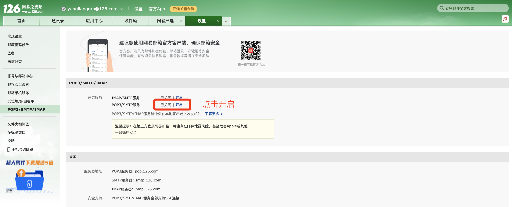

# day10 函数入门


目标：掌握函数的编写方式以及函数的基本使用。

今日概要：

- 初识函数
- 函数的参数
- 函数的返回值


提示：由于昨天的内容比较多，为了减轻大家的学习压力，今天设计的课程内容会比较少。


## 1. 初识函数

>  函数到底是个什么东西？

函数，可以当做是一大堆功能代码的集合。

```python
def 函数名():
    函数内编写代码
    ...
    ...
    
函数名()
```

例如：

```python
# 定义名字叫info的函数
def info():
    print("第一行")
    print("第二行")
    print("第n行...")
    
info()
```


> 什么时候会用到函数？

什么时候会用到函数呢？一般在项目开发中有会有两种应用场景：

- 有重复代码，用函数增加代码的重用性。

  ```python
  def send_email():
      # 10行代码
  
  print("欢迎使用计算机监控系统")
  if CPU占用率 > 90%:
      send_email()
  
  if 硬盘使用率 > 99%:
      send_email()
      
  if 内存使用率 > 98%:
      send_email()
  ...
  ```

- 代码太长，用函数增强代码的可读性。

  ```python
  def calculate_same_num_rule():
      """判断是否是豹子"""
      pass
  
  def calculate_same_color_rule():
      """判断是否是同花"""
      pass
  
  def calculate_straight_rule():
      """判断是否顺子"""
  	pass
  
  def calculate_double_card_rule(poke_list):
      """判断是否对子"""
  	pass
  
  def calculate_single_card_rule():
      """判断是否单牌"""
      pass
  
  
  
  # 1. 生成一副扑克牌
  card_color_list = ["红桃", "黑桃", "方片", "梅花"]
  card_nums = [2, 3, 4, 5, 6, 7, 8, 9, 10, 11, 12, 13, 14]  # A
  all_card_list = [[color, num] for color in card_color_list for num in card_nums]
  
  # 2.洗牌
  random.shuffle(all_card_list)
  
  # 3.给玩家发牌
  ...
  # 4.判断牌是：豹子？同花顺？顺子？对子？单点？
  
  calculate_same_num_rule()
  calculate_same_color_rule()
  calculate_straight_rule()
  ...
  
  ```


以前我们变成是按照业务逻辑从上到下逐步完成，称为：面向过程编程；现在学了函数之后，利用函数编程称为：函数式编程。


## 2. 函数的参数


之前说了很好多次发送邮件的案例，下面就来教大家用python发邮件，然后再由此引出函数的参数。

- 注册邮箱
- 基础配置
  - 授权码
  - SMTP服务器: smtp.126.com
- 代码发送邮件





以下是我为大家提供的发邮件的一个函数。

```python
import smtplib
from email.mime.text import MIMEText
from email.utils import formataddr

# ### 1.邮件内容配置 ###
msg = MIMEText("约吗", 'html', 'utf-8') 
msg['From'] = formataddr(["武沛齐", "yangliangran@126.com"])
msg['Subject'] = "180一晚"

# ### 2.发送邮件 ### 
server = smtplib.SMTP_SSL("smtp.126.com")
server.login("yangliangran@126.com", "LAYEVIAPWQAVVDEP")
server.sendmail("yangliangran@126.com", "424662508@qq.com", msg.as_string())
server.quit()
```


那么需求来了，请求大家提一个需求：根据上述代码实现给3个用户发邮件。

```python
v1 = "424662508@qq.com"
v2 = "424662509@qq.com"
v3 = "wupeiqi@live.com"


```

```python
import smtplib
from email.mime.text import MIMEText
from email.utils import formataddr

def send_email(xx):
    # ### 1.邮件内容配置 ###
    msg = MIMEText("约吗", 'html', 'utf-8') 
    msg['From'] = formataddr(["武沛齐", "yangliangran@126.com"])
    msg['Subject'] = "180一晚"

    # ### 2.发送邮件 ### 
    server = smtplib.SMTP_SSL("smtp.126.com")
    server.login("yangliangran@126.com", "LAYEVIAPWQAVVDEP")
    server.sendmail("yangliangran@126.com", xx, msg.as_string())
    server.quit()

send_email("424662508@qq.com")
send_email("424662509@qq.com")
send_email("wupeiqi@live.com")
```


- 思路1

  ```python
  def send_email1():
      # ### 1.邮件内容配置 ###
      # 邮件文本
      msg = MIMEText("约吗", 'html', 'utf-8') 
      # 邮件上显示的发件人
      msg['From'] = formataddr(["武沛齐", "wptawy@126.com"])
      # 邮件上显示的主题
      msg['Subject'] = "邮件主题"
  	
      # ### 2.发送邮件 ### 
      server = smtplib.SMTP_SSL("smtp.126.com")
      server.login("wptawy@126.com", "WIYSAILOVUKPQGHY")
      server.sendmail("wptawy@126.com", "424662508@qq.com", msg.as_string())
      server.quit()
      
  def send_email2():
      # ### 1.邮件内容配置 ###
      # 邮件文本
      msg = MIMEText("约吗", 'html', 'utf-8') 
      # 邮件上显示的发件人
      msg['From'] = formataddr(["武沛齐", "wptawy@126.com"])
      # 邮件上显示的主题
      msg['Subject'] = "邮件主题"
  	
      # ### 2.发送邮件 ### 
      server = smtplib.SMTP_SSL("smtp.126.com")
      server.login("wptawy@126.com", "WIYSAILOVUKPQGHY")
      server.sendmail("wptawy@126.com", "424662509@qq.com", msg.as_string())
      server.quit()
  
  def send_email3():
      # ### 1.邮件内容配置 ###
      # 邮件文本
      msg = MIMEText("约吗", 'html', 'utf-8') 
      # 邮件上显示的发件人
      msg['From'] = formataddr(["武沛齐", "wptawy@126.com"])
      # 邮件上显示的主题
      msg['Subject'] = "邮件主题"
  	
      # ### 2.发送邮件 ### 
      server = smtplib.SMTP_SSL("smtp.126.com")
      server.login("wptawy@126.com", "WIYSAILOVUKPQGHY")
      server.sendmail("wptawy@126.com", "wupeiqi@live.com", msg.as_string())
      server.quit()
      
  
  send_email1()
  send_email2()
  send_email3()
  ```

- 思路2，基于函数的参数（将代码中动态部分提取到参数位置，让函数可以充分被重用）

  ```python
  def send_email(email):
      # ### 1.邮件内容配置 ###
      # 邮件文本
      msg = MIMEText("约吗", 'html', 'utf-8') 
      # 邮件上显示的发件人
      msg['From'] = formataddr(["武沛齐", "wptawy@126.com"])
      # 邮件上显示的主题
      msg['Subject'] = "邮件主题"
  	
      # ### 2.发送邮件 ### 
      server = smtplib.SMTP_SSL("smtp.126.com")
      server.login("wptawy@126.com", "WIYSAILOVUKPQGHY")
      server.sendmail("wptawy@126.com", email, msg.as_string())
      server.quit()
      
  
  v1 = "424662508@qq.com"
  send_email(v1)
  
  v2 = "424662509@qq.com"
  send_email(v2)
  
  v3 = "wupeiqi@live.com"
  send_email(v3)
  ```

  

### 2.1 参数

在定义函数时，如果在括号中添加`变量`，我们称它为函数的形式参数：

```python
# ###### 定义有三个参数的函数（a1/a2/a3一般称为形式参数-形参） #####
def func(a1,a2,a3):
    print(a1+a2+a3)

# 执行函数并传入参数（执行函数传值时一般称为实际参数-实参）
func(11,22,33)

# 执行函数并传入参数
func(9,2,103)
```

- 位置传参

  ```python
  def add(n1,n2):
      print(n1+n2)
      
  add(1,22)
  ```

- 关键字传参

  ```python
  def add(n1,n2):
      print(n1+n2)
      
  add(n1=1,n2=22)
  ```


```python
"""
1. 形参
2. 实参
3. 位置传参
4. 关键字传参
"""


# ###### 定义有三个参数的函数（a1/a2/a3一般称为形式参数-形参） #####
def func(a1, a2, a3):
    print(a1 + a2 + a3)


# 执行函数并传入参数（执行函数传值时一般称为实际参数-实参）
func(11, 22, 33)

# 执行函数并传入参数
func(9, 2, 103)

# 执行函数
func(a1=99, a2=88, a3=1)
func(a1=99, a3=1, a2=88)
```


### 2.2 默认参数

```python
def func(a1, a2, a3=10):
    print(a1 + a2 + a3)


# 位置传参
func(8, 19)
func(1, 2, 99)

# 关键字传参（位置和关键混合时，关键字传参要在后面）
func(12, 9, a3=90)
func(12, a2=9, a3=90)
func(a1=12, a2=9, a3=90)
```

```python
file_object = open("xxx.txt")
```


### 2.3 动态参数

- *

  ```python
  def func(*args):
      print(args) # 元组类型 (22,)   (22,33,99,) ()
  
  # 只能按照位置传参
  func(22)
  func(22,33)
  func(22,33,99)
  func()
  ```

- **

  ```python
  def func(**kwargs):
      print(kwargs) # 字典类型 {"n1":"武沛齐"}    {"n1":"武沛齐","age":"18","email":"xxxx"}  {}
      
  # 只能按关键字传参
  func(n1="武沛齐")
  func(n1="武沛齐",age=18)
  func(n1="武沛齐",age=18,email="xx@live.com")
  ```

- *,**

  ```python
  def func(*args,**kwargs):
      print(args,kwargs) # (22,33,99) {}
  
  func(22,33,99)
  func(n1="武沛齐",age=18)
  func(22,33,99,n1="武沛齐",age=18)
  func()
  ```

  提示：是否还记得字符串格式化时的format功能。

  ```python
  v1 = "我叫{},今年{},性别{}".format("武沛齐",18,"男")
  
  v2 = "我叫{name},今年{age},性别{gender}".format(name="武沛齐",age=18,gender="男")
  ```

  

注意事项（不重要，听过一遍即可）

```python
# 1. ** 必须放在 * 的后面
def func1(*args, **kwargs):
    print(args, **kwargs)


# 2. 参数和动态参数混合时，动态参数只能放在最后。
def func2(a1, a2, a3, *args, **kwargs):
    print(a1, a2, a3, args, **kwargs)


# 3. 默认值参数和动态参数同时存在
def func3(a1, a2, a3, a4=10, *args, a5=20, **kwargs):
    print(a1, a2, a3, a4, a5, args, kwargs)


func3(11, 22, 33, 44, 55, 66, 77, a5=10, a10=123)
```


## 3. 函数返回值

在开发过程中，我们希望函数可以帮助我们实现某个功能，但让函数实现某功能之后有时也需要有一些结果需要反馈给我们，例如：

```python
import requests
from xml.etree import ElementTree as ET


def xml_to_list(city):
    data_list = []
    url = "http://ws.webxml.com.cn//WebServices/WeatherWebService.asmx/getWeatherbyCityName?theCityName={}".format(city)
    res = requests.get(url=url)
    root = ET.XML(res.text)
    for node in root:
        data_list.append(node.text)
    return data_list


result = xml_to_list("北京")
print(result)
```

```python
def func():
    return 666

res = func()
print(res) # 666
```

```python
def magic(num):
    result = num + 1000
    return result

data = magic(9)
print(data) # 1009
```


在了解了返回值的基本使用之后，接下来在学3个关键知识：

- 返回值可以是任意类型，如果函数中没写return，则默认返回None

  ```python
  def func():
      return [1,True,(11,22,33)]
  
  result = func()
  print(result)
  ```

  ```python
  def func():
      value = 1 + 1
      
  ret = func()
  print(ret) # None
  ```

  

  当在函数中`未写返回值` 或 `return` 或 `return None` ，执行函数获取的返回值都是None。

  ```python
  def func():
      value = 1 + 1
      return  # 或 return None
  
  ret = func()
  print(ret) # None
  ```

  

- return后面的值如果有逗号，则默认会将返回值转换成元组再返回。

  ```python
  def func():
      return 1,2,3
  
  value = func()
  print(value) # (1,2,3)
  ```

- 函数一旦遇到return就会立即退出函数（终止函数中的所有代码）

  ```python
  def func():
      print(1)
      return "结束吧"
  	print(2)
      
  ret = func()
  print(ret)
  ```

  ```python
  def func():
      print(1)
      for i in range(10):
          print(i)
          return 999
  	print(2)
      
  result = func()
  print(result)
  
  # 输出
  1
  0
  999
  ```

  ```python
  def func():
      print(1)
      for i in range(10):
          print(i)
          for j in range(100):
              print(j)
  	        return
  	print(2)
      
  result = func()
  print(result)
  
  # 输出
  1
  0
  0
  None
  ```


小结：

- 完成某个结果并希望的到结果。

  ```python
  def send_email():
      ...
      return True
  
  v1 = send_email()
  ```

  ```python
  def encrypt(old):
      ...
      return "密文..."
  
  data = encrypt("武沛齐")
  print(data)
  ```

- 基于return控制让函数终止执行

  ```python
  def func(name):
      with open("xxx.txt",mode='r',encoding="utf-8") as file_object:
          for line in file_object:
              if name in line:
                  return True
              
  data = func("武沛齐")
  if data:
      print("存在")
  else:
      print("不存在")
  ```

  ```python
  def foo():
      while True:
          num = input("请输入数字（Q）：")
          if num.upper() == "Q":
              return
          num = int(num)
          if num == 99:
              print("猜对了")
  		else:
              print("猜错了，请继续！")
  	print("....")
  
  foo()
  ```

  


## 总结

1. 如何定义一个函数？

2. 函数名的规范。（同变量名规范）

   - 规范

   - 建议

     ```python
     def change_num():
         pass
     ```

3. 函数的注释，说明函数的作用。

   ```python
   def encrypt(origin):
       """ 用于数据加密和xxx """
   	pass
   ```

4. 定义函数时，参数一般有以下情况（形式参数）

   - 情景1

     ```python
     def func(a1,a2):
         pass
     ```

   - 情景2：

     ```python
     def func(a1,a2=123):
         pass
     ```

   - 情景2：

     ```python
     def func(*args,**kwargs):
         pass
     ```

5. 函数的返回值，一般用于将函数执行的返回给调用者。

   - 默认返回None
   - 遇到return则函数执行完毕


## 作业

1. 请定义一个函数，用于计算一个字符串中字符`a`出现的次数并通过return返回。

   - 参数，字符串。
   - 返回值，字符串中 a 出现的次数。

   ```python
   def func(str: str):
       return str.count('a')
   
   str1 = 'aabbbaacacc'
   v1=func(str1)
   print(v1)
   
   ```

   

2. 写函数，判断用户传入的一个值（字符串或列表或元组任意）长度是否大于5，并返回真假。

   ```python
   def judge_length(li):
       if len(li) > 5:
           return True
       else:
           return False
   
   li2 = [1,2,3]
   v1 = judge_length(li2)
   print(v1)
   ```

3. 写函数，接收两个数字参数，返回比较大的那个数字（等于时返回两个中的任意一个都可以）。

   ```python
   def compare(x,y):
       return x if x >y else y
   
   v1 = compare(3,3)
   print(v1)
   ```

4. 写函数，函数接收四个参数分别是：姓名，性别，年龄，学历，然后将这四个值通过"*"拼接起来并追加到一个student_msg.txt文件中。

   ```python
   import os
   # 定位文件位置
   base_dir = os.path.dirname(os.path.abspath(__file__))
   db_file_path = os.path.join(base_dir,'files/student_msg.txt')
   # 函数定义
   def func(name,sex,age,education):
       content = '*'.join([name,sex,age,education])
       content = content + '\n'
       print(content)
       with open(db_file_path,mode='a',encoding='utf-8') as f:
           f.write(content)
   
   func('程康华','男',"18","博士后")
   ```

5. 补充代码，实现如下功能：

   - 【位置1】读取文件中的每一行数据，将包含特定关键的数据筛选出来，并以列表的形式返回。
   - 【位置1】文件不存在，则返回None
   - 【位置2】文件不存在，输出 "文件不存在"，否则循环输出匹配成功的每一行数据。

   ```python
   def select_content(file_path,key):
       # 补充代码【位置1】
   
   result = select_content("files/xxx.txt","股票")
   # 补充代码【位置2】
   
   ----------------------------------------------------------------分割线
   import os
   def select_content(file_path,key):
       # 补充代码【位置1】
       if not os.path.exists(file_path):
           return None
       data_list = []
       with open(file_path,mode='r',encoding='utf-8') as f:
           for line in f:
               if key in line:
                   data_list.append(key)
       return data_list
   result = select_content("files/xxx.txt","股票")
   # 补充代码【位置2】
   if result == None:
       print('文件不存在')
   else:
       print(result)
   ```

6. 补充代码，实现敏感词替换的功能。

   ```python
   def change_string(origin):
       # 补充代码，将字符串origin中中的敏感词替换为 **，最后将替换好的值返回。 
       data_list = ["苍老师","波多老师","大桥"]
       
   text = input("请输入内容：")
   result = change_string(text)
   print(result)
   
   -----------------------------------------------------分割线
   def change_string(origin):
       # 补充代码，将字符串origin中中的敏感词替换为 **，最后将替换好的值返回。
       data_list = ["苍老师", "波多老师", "大桥"]
       for word in data_list:
           origin= origin.replace(word, "**")
       return origin
   
   text = input("请输入内容：")
   result = change_string(text)
   print(result)
   
   ```

7. 基于函数实现用户认证，要求：

   - 写函数，读取的用户信息并构造为字典（用户信息存放在`files/user.xlsx`文件中）

     

     ```python
     # 构造的字典格式如下
     user_dict = {
         "用户名":"密码"
         ...
     }
     ```

   - 用户输入用户名和密码，进行校验。（且密码都是密文，所以，需要将用户输入的密码进行加密，然后再与Excel中的密文密码进行比较）

     ```python
     import hashlib
     
     def encrypt(origin):
         origin_bytes = origin.encode('utf-8')
         md5_object = hashlib.md5()
         md5_object.update(origin_bytes)
         return md5_object.hexdigest()
     
     
     p1 = encrypt('admin')
     print(p1) # "21232f297a57a5a743894a0e4a801fc3"
     
     p2 = encrypt('123123')
     print(p2) # "4297f44b13955235245b2497399d7a93"
     
     p3 = encrypt('123456')
     print(p3) # "e10adc3949ba59abbe56e057f20f883e"
     ```


扩展：密码都不是明文。

- 注册京东，京东存储：用户名和密码（密文）
- 登录京东：用户名& 密码。


```python
from openpyxl import load_workbook
import hashlib

def get_user_dict():
    wb = load_workbook('files/user.xlsx')
    sheet = wb.worksheets[0]
    user_dict = {}
    for row in sheet.rows:
        # print(row[1].value,row[2].value)
        user_dict[row[1].value] = row[2].value
    return user_dict

def encrypt(origin):
    origin_bytes = origin.encode('utf-8')
    md5_object = hashlib.md5()
    md5_object.update(origin_bytes)
    return md5_object.hexdigest()

def login(uname,pwd):
    user_list = get_user_dict()
    # print(user_list)
    if not uname in user_list:
        print('用户不存在')
        return False
    if user_list[uname] == pwd:
        print('登陆成功')
        return True
    else:
        print("密码错误")
        return False

uname = input('please username: ')
pwd = input('please password: ')
pwd = encrypt(pwd)
login(uname,pwd)

```


