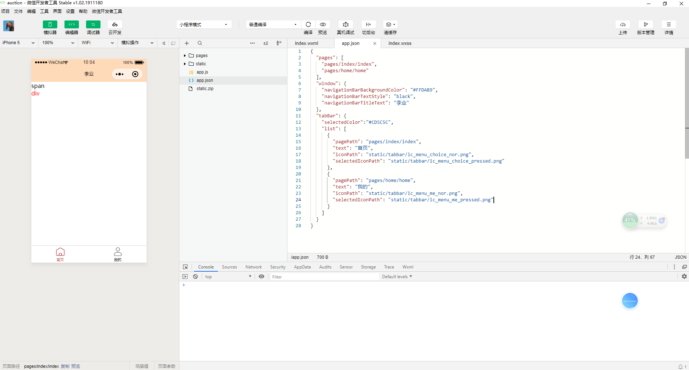

# day01 微信小程序

## 1. 问题

- 什么是微信小程序？

  ```
  - 移动互联网时代，手机。 
  - 手机软件，在手机上中安装很多软件。
  - 腾讯和阿里（只安装自己不用别人）
  	- 腾讯：微信 + N小程序
  	- 阿里：支付宝 + N小程序
  ```

- 为什么要做小程序？

  ```
  微信用户基数大。
  在微信上用我们小程序会比较便捷。
  ```

- 如何开发小程序？
  

  - 小程序：学习微信开发的语言（前端html、css、js、vue.js）
    - 微信开发者工具
  - API：restful接口（Python+django+drf框架）。
    - pycharm

## 2.环境的搭建

### 2.1 Python环境

- 虚拟环境
  - django
  - drf
- pycharm

### 2.2 小程序环境

#### 2.2.1 申请一个微信公众平台


#### 2.2.2 保存自己的appid

```
appid = wx1a3fac0e7easdfffs
```

#### 2.2.3 下载开发者工具


#### 2.2.4 创建项目


## 3.开发小程序

### 3.1 全局配置

```js
{
  "pages": [
    "pages/index/index",
    "pages/home/home"
  ],
  "window": {
    "navigationBarBackgroundColor": "#FFDAB9",
    "navigationBarTextStyle": "black",
    "navigationBarTitleText": "李业"
  },
  "tabBar": {
    "selectedColor":"#CD5C5C",
    "list": [
      {
        "pagePath": "pages/index/index",
        "text": "首页",
        "iconPath": "static/tabbar/ic_menu_choice_nor.png",
        "selectedIconPath": "static/tabbar/ic_menu_choice_pressed.png"
      },
      {
        "pagePath": "pages/home/home",
        "text": "我的",
        "iconPath": "static/tabbar/ic_menu_me_nor.png",
        "selectedIconPath": "static/tabbar/ic_menu_me_pressed.png"
      }
    ]
  }
}
```



### 3.2 组件

#### 3.2.1 text

编写文本信息，类似于span标签

#### 3.2.2 view

容器，类似于div标签

#### 3.2.3 image

图片


### 3.3 样式

#### 3.3.1 像素

- px
- rpx，750rpx


## 4.flex布局

一种非常方便的布局方式。 

在容器中记住4个样式即可。

```css
display: flex;   				flex布局
flex-direction: row;			规定主轴的方向：row/column
justify-content: space-around;	元素在主轴方向上的排列方式:flex-start/flex-end/space-around/space-between		
align-items: center;			元素在副轴方向上的排列方式:flex-start/flex-end/space-around/space-between		
```


