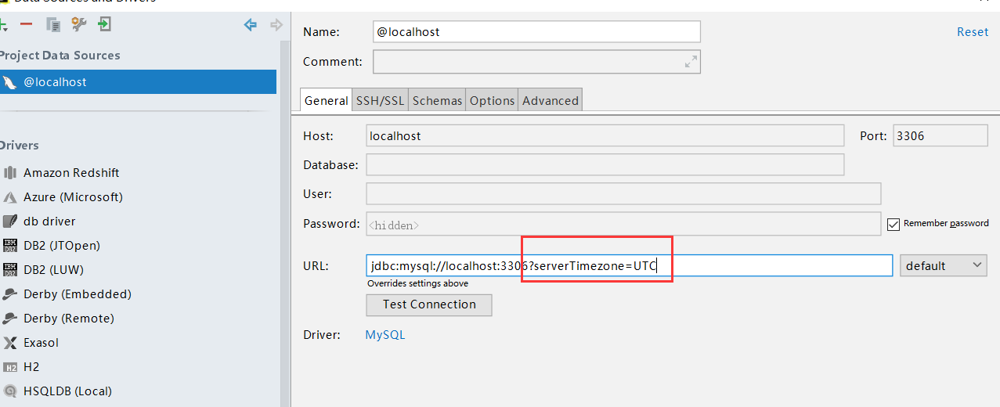

# 问题

遇到数据库问题，pycharm中无法连接或者无法识别mysql数据库。可能的原因：

-   pycharm版本太高，导致mysql驱动版本较高，8.x
-    禅道的mysql与本地的mysql冲突
    -   可以把禅道卸载，你可以装在docker上


-   mysql时区问题




# 用例执行

1.  页面中，勾选了一个或者多个用例，CheckBox
2.  点击执行按钮后，后端接收一个或者多个CheckBox的值（用例id）：
    1.  前端如何往后端发送？
        1.  ajax发送，循环CheckBox的外部盒子，获取每一个CheckBox状态为选中的input框，获取input的value值（用例id），然后push到数组中，再将该数组发送到后端。
        2.  form表单提交
    2.  后端如何接收form表单提交的值
        1.  request.POST.get_list

```python

def index(request):
    if request.method == "POST":
        request.POST.get("username")  # username对应的是单个值
        request.POST.get_list('checkbox_list')  # 以列表的形式接收多个值
```

3.  后端接收到了前端传过来的值：`[1, 2, 3, 4]`
    1.  根据获取到的用例id列表，去数据库中提取出对应记录（用例对象）
    2.  如果是多个用例对象，循环使用requests提取用例对象中的字段发请求。
    3.  结果断言
    4.  unittest生成测试报告
    5.  将测试报告保存到用例的相应字段中
    6.  修改用例的执行状态和通过状态
    7.  考虑如何获取批量执行的测试结果报告
4.  用例批量执行完毕，将批量执行结果保存到log表中
    1.  用例执行的时间
    2.  用例报告
5.  将执行结果给前端返回。


