# 引入


​	数据库称为数据管理系统，这个数据管理系统我们称之为DBMS，DB（database）就是数据库的意义，M（manage）就是管理的意思，S（system）就是系统的意思，其实就是英文名的首字符缩写。市场上冒出了很多优秀的数据库管理系统，例如：mysql、oracle、db2等等，人家开发好了，你使用就行了，既然是使用别人写好的数据库管理系统，那么我们在操作的时候，就要按照人家的规范来操作，这个规范叫做sql，我们通过这个系统来操作数据的语句叫做sql语句。那么过程就是这个样子的：首先下载安装人家的数据管理系统，然后启动系统，我们的项目如果想通过这个系统来操作数据，那么就需要你的项目中字节写一个socket客户端，要满足人家这个系统的服务端的消息格式要求，然后就按照人家规定好的sql语句写好操作数据的命令，使用你的写好的客户端通过网络发送给这个存放数据的机器上的数据管理系统的服务端，服务端街道这个命令之后，解析，然后产生对应的数据操作，你要是查询数据，就将查询数来的数据原路返回给你，如果你要是修改数据，那么我服务端就在系统上修改对应的数据。这就是整个操作流程了，其实这个系统就是一个基于socket编写的C/S架构的软件。


# 第一节 数据库分类

目前的数据库可以分为两个大类：关系型数据库和非关系型数据库

## 1.1 关系型数据库

​	**解释：**关系型数据库模型是把复杂的数据结构归结为简单的二元关系（即二维表格形式，不是excel，但是和excel的形式很像），结合下图来看一下，

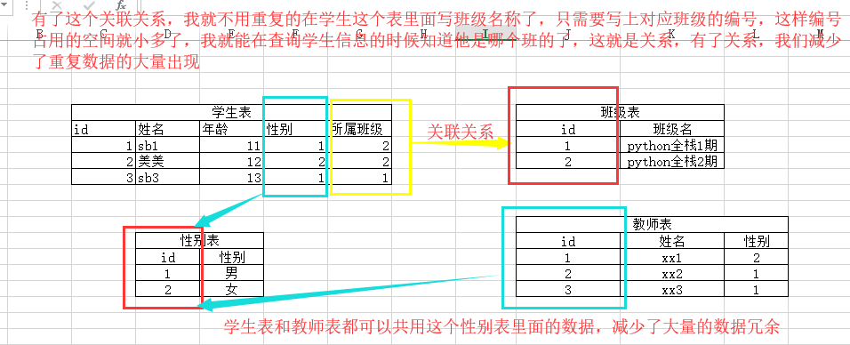


操作关系型数据库的命令，我们称之为SQL，看解释

```
	结构化查询语言(Structured Query Language)简称SQL(发音：/ˈes kjuː ˈel/ "S-Q-L")，是一种特殊目的的编程语言，是一种数据库查询和程序设计语言，用于存取数据以及查询、更新和管理关系数据库系统；同时也是数据库脚本文件的扩展名。
	结构化查询语言是高级的非过程化编程语言，允许用户在高层数据结构上工作。它不要求用户指定对数据的存放方法，也不需要用户了解具体的数据存放方式，所以具有完全不同底层结构的不同数据库系统, 可以使用相同的结构化查询语言作为数据输入与管理的接口。结构化查询语言语句可以嵌套，这使它具有极大的灵活性和强大的功能。
1986年10月，美国国家标准协会对SQL进行规范后，以此作为关系式数据库管理系统的标准语言（ANSI X3. 135-1986），1987年得到国际标准组织的支持下成为国际标准。不过各种通行的数据库系统在其实践过程中都对SQL规范作了某些编改和扩充。所以，实际上不同数据库系统之间的SQL不能完全相互通用
```

**常见的关系型数据库介绍**

```
				  2.1.1  oracle数据库

　　　　　　　　Oracle前身叫SDL、由Larry Ellison和两个变成任意在1977创办，他们开发了主机的拳头产品，在市场上大量销售。Oracle公司是最早开发关系型数据库的厂商之一，其产品支持最广泛的操作系统平台。目前Oracle关系数据库产品的市场占有率数一数二 。
　　　　　　　　Oracle公司是目前全球最大的数据库软件公司，也是近年业务增长极为迅速的软件提供与服务商 
　　　　　　　　主要应用范围：传统大企业、大公司、政府、金融、证券等。 
　　　　　　　　版本升级：oracle8i，oracle9i，oracle10g，oracle11g，oracle12c

　　　　　　2.1.2  MySQL

　　　　　　　　MySQL被广泛的应用在Internet上的大中小型网站中。由于体积小、速度快、总体拥有成本低，开放源代码

　　　　　　2.1.3  MariaDB数据库

　　　　　　　　MAriaDB数据库管理系统是MySQL数据库的一个分支，主要由开元社区维护，采用GPL授权许可。开发这个MariaDB的原因之一是：甲骨文公司收购了MySQL后，有MySQL闭源的潜在风险，因此MySQL开元社区采用分支的方式来避开这个风险。 

　　　　　　　　MariaDB基于事务的Maria存储引擎，替换了MySQL的MyISAM的存储引擎，它使用了Percona的XtraDB（InnoDB的变体）这个版本还包括了PrimeBase XT （PBXT）和Federated X存储引擎。

　　　　　　2.1.4 SQL Server数据库

      　　　　　　Microsoft SQL Server是微软公司开发的大型关系数据库系统。SQL Server的功能比较全面，效率高，可以作为中型企业或单位的数据库平台。SQL Server可以与Winodws操作系统紧密集成，不论是应用程序开发速度还是系统事务处理运行速度，都得到较大的提升，对于在Windows平台上开发的各种企业级信息管理系统来说，不论是C/S（客户机/服务器）架构还是B/S（浏览器/服务器）架构。SQL Server都是一个很好的选择。SQL Server的缺点是只能在Windows系统下运行

　　　　　　2.1.5  Access数据库

　　　　　　　　Access是入门级小型桌面数据库，性能安全性都很一般，可供个人管理或小型企业只用 
　　　　　　　　Access不是数据库语言，只是一个数据库程序，目前最新版本为Office 2007，其特点主要如下： 
　　　　　　　　（1）完善地管理各种数据库对象，具有强大的数据组织，用户管理、安全检查等功能 
　　　　　　　　（2）强大的数据处理功能，在一个工作组级别的网络环境中，使用Access开发的多用户管理系统具有传统的XSASE(DBASE、FoxBASE的统称)数据库系统所无法实现的客户服务器（Ckient/Server）结构和响应的数据库安全机制，Access具备了许多先进的大型数据管理管理系统所具备的特征。 
　　　　　　　　（3）可以方便地生成各种数据对象，利用存储的数据建立窗体和报表 
　　　　　　　　（4）作为Office套件的一部分，可以与Office集成，实现无缝连接 
　　　　　　　　（5）能够利用Web检索和发布数据，实现与Internet的连接，Access主要适用于中小企业应用系统，或作为客户机/服务器系统中的客户端数据库。

　　　　　　2.1.6  其他不常用关系型数据库

　　　　　　　　DB2，PostgreSQL，Informix，Sybase等。这些关系型数据库逐步的淡化了普通运维的实现，特别是互联网公司几乎见不到
```


## 1.2 非关系型数据库


**非关系型数据库也被成为NoSQL数据库，NOSQL的本意是“Not Olnly SQL”** 
	指的是非关系型数据库，而不是“No SQL”的意思，因此，NoSQL的产生并不是要彻底地否定关系型数据库，而是作为传统关系型数据库的一个有效补充。NOSQL数据库在特定的场景下可以发挥出难以想象的高效率和高性能。 

​	随着互联网Web2.0网站的星期，传统的关系型数据库在应付web2,0网站，特别是对于规模日益扩大的海量数据，超大规模和高并发的微博、微信、SNS类型的web2.0纯动态网站已经显得力不从心，暴露了很多难以克服的问题。 

​	例如：传统的关系型数据库IO瓶颈、性能瓶颈都难以有效突破，于是出现了大批针对特定场景，以高性能和使用便利为目的功能特异化的数据库产品。NOSQL（非关系型）类的数据就是在这样的情景下诞生并得到了非常迅速的发展 

​	高性能、高并发、对数据一致性要求不高 
​	开源的NoSQL体系，如Facebook的Cassandra，Apache的HBase，也得到了广泛认同，Redis，mongb也逐渐越来越受到各类大中小型公司的欢迎和追捧 

​	NOSQL非关系型数据库小结： 

```
　　　　1、NOSQL不是否定关系数据库，而是作为关系数据库的一个重要补充 
　　　　2、NOSQL为了高性能、高并发而生，忽略影响高性能，高并发的功能 
　　　　3、NOSQL典型产品memcached （纯内存），redis（持久化缓存），mongodb（文档的数据库） 
```


**常见的非关系型数据库**

```
2.2.1  memcached（key-value）

　　Memcaced是一个开源的、高性能的、具有分布式内存对象的缓存系统。通过它可以减轻数据库负载，加速动态的web应用，最初版本由LiveJoumal 的Brad Fitzpatrick在2003年开发完成。目前全球有非常多的用户都在使用它来架构主机的大负载网站或提升主机的高访问网站的响应速度。注意：Memcache 是这个项目的名称，而Memcached是服务端的主程序文件名。 
缓存一般用来保存一些进程被存取的对象或数据，通过缓存来存取对象或数据要比在磁盘上存取块很多，前者是内存，后者是磁盘、Memcached是一种纯内存缓存系统，把经常存取的对象或数据缓存在memcached的内存中，这些被缓存的数据被程序通过API的方式被读取，memcached里面的数据就像一张巨大的hash表，数据以key-value对的方式存在。Memcached通过缓存经常被存取的对象或数据，从而减轻频繁读取数据库的压力，提高网站的响应速度，构建出快速更快的可扩展的Web应用。 
　　官网：http://memcached.org/ 
　　由于memcached为纯内存缓存软件，一旦重启所有数据都会丢失，因此，新浪网基于Memcached开发了一个开源项目Memcachedb。通过为Memcached增加Berkeley DB的特久化存储机制和异步主复制机制，使Memcached具备了事务恢复能力、持久化数据能力和分布式复制能力，memcached非常适合需要超高性能读写速度、持久化保存的应用场景，但是最近几年逐渐被其他的持久化产品替代如Redis

　　Memcached小结： 
　　1、key-value行数据库 
　　2、纯内存数据库 
　　3、持久化memcachedb（sina）

2.2.2  Redis（key-value）

		和Memcached类似，redis也是一个key-value型存储系统。但redis支持的存储value类型相对更多，包括string（字符串）、list（链表）、set（集合）和zset（有序集合）等。这些数据类型都支持push/pop、add/remove及取交集、并集和差集及更丰富的操作，而且这些操作都是原子性的。为了保证效率，redis的数据都是缓存在内存中。区别是redis会周期性的把更新的数据写入磁盘或者把修改操作写入追加的记录文件，并且在基础上实现了master-slave（主从）同步。 

　　redis是一个高性能的key-value数据库。redis的出现、很大程度补偿了memcached这类key/value存储的不足，在部分场合可以对关系数据库起到很好的补充作用。它提供了Python、Ruby、Erlang、PHP客户端，使用方便。 
　　官方：http://www.redis.io/documentation 
　　redis特点： 
　　1）支持内存缓存，这个功能相当于memcached 
　　2）支持持久化存储，这个功能相当于memcachedb，ttserver 
　　3）数据库类型更丰富。比其他key-value库功能更强 
　　4）支持主从集群、分布式 
　　5）支持队列等特殊功能 
　　应用：缓存从存取memcached更改存取redis

2.2.3  MongoDB（Document-oriented）

　　MongoDB是一个介于关系型数据库和非关系型数据库之间的产品，是非关系型数据库当中功能最丰富，最像关系数据库的。他支持的数据库结构非常松散，类似json的bjson格式，因此可以存储比较复杂的数据类型。Mongodb最大的特点是他支持的查询语言非常强大，其语法有点类似于面向对象的查询语言，几乎可以实现类似关系数据库单表查询的绝大部分功能，而且还支持对数据建立索引。 

　　特点： 
　　　　高性能、易部署、易使用、存储数据非常方便 
　　主要功能特性： 

　　　　1.面向集合存储，易存储对象类型的数据 
　　　　2.“面向集合”（Collenction-Orented）意思是数据库被分组存储在数据集中，被称为一个集合（Collenction）每个 集合在数据库中都有一个唯一的标识名，并且可以包含无限数目的文档，集合的概念类似关系型数据库（RDBMS）里的表（table）不同的是它不需要定义任何模式（schema） 
　　　　3.模式自由 
　　　　　　模式自由（schema-free）意为着存储在mongodb数据库中的文件，我们不需要知道它的任何结构定义。 
　　　　4.支持动态查询 
　　　　5.支持完全索引，包含内部对象 
　　　　6.支持查询 
　　　　7.支持复制和故障恢复 
　　　　8.使用高效的二进制数据存储，包括大型对象 
　　　　9.自动处理碎片、以支持云计算层次的扩展性
2.2.4  Cassandra（Column-oriented）

　　Apache Cassndra是一套开源分布式Key-Value存储系统。它最初由Facebook开发，用于存储特别大的数据。Facebook目前在使用此系统。 
主要特点： 

　　1.分布式 
　　2.基于column的结构化 
　　3.高伸展性 
　　4.Cassandra的主要特点就是它不是一个数据库，而是由一堆数据库节点共同构成一个分布式网络服务，对Cassandra的一个写操作，会被复制到其他节点上去，对Cassandra的读操作。也会被路由到某个节点上面去读取。 
　　Cassandir是一个混合型的非关系的数据库，类似于Google的BigTable。其主要功能比Dynomie（分布式的key-value存储系统）更丰富，Cassandra最初由Facebook开发，后转变成了开源项目。

2.2.5  其他不常用非关系型数据库

　　HBase、MemcacheDB、BerkeleyDB、Tokyo Cabinet\Tokyo Tyrant（ttserver） 
　　ttserver 持久化输出，缺点存储2千万条 性能下降（由日本人发明）
```


# 第二节 MySQL下载安装

以windows来举例。

​	mysql下载地址：https://dev.mysql.com/downloads，如果你在mysql官网下载的是zip压缩包，看操作，**注意和上面第一种方法的下载网址不同**：

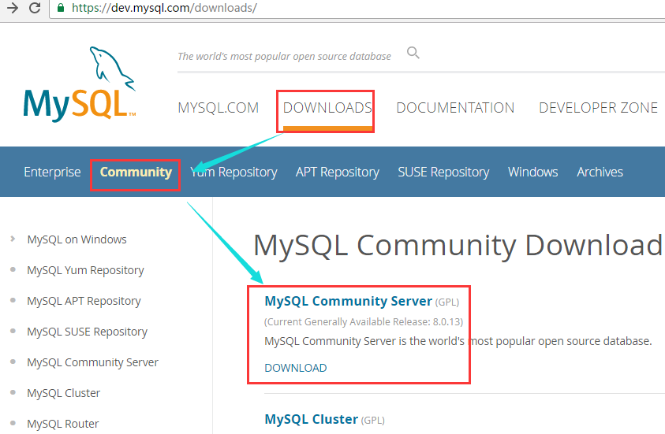


 

 　然后按照下面的选择来下载，发现是zip压缩包对吧，zip压缩包解压之后就能用，上面的msi还需要安装一下，安装的时候可以选择很多的依赖环境一起安装：

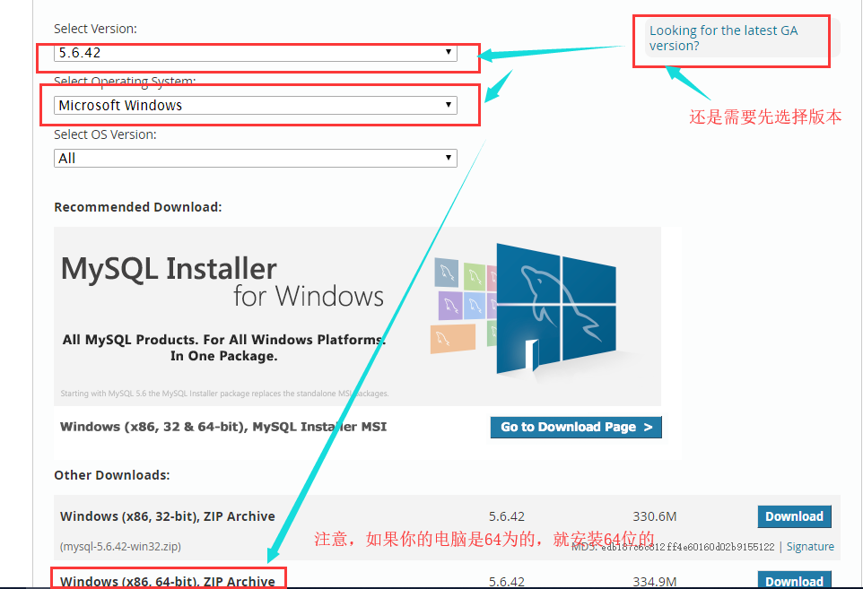

　

　　　　点击download进来：


 　

 

​	下载完成以后进行安装：

​	1.  解压MySQL压缩包，将以下载的MySQL压缩包解压到自定义目录下。我放在D:\Program Files\MySQL\ 

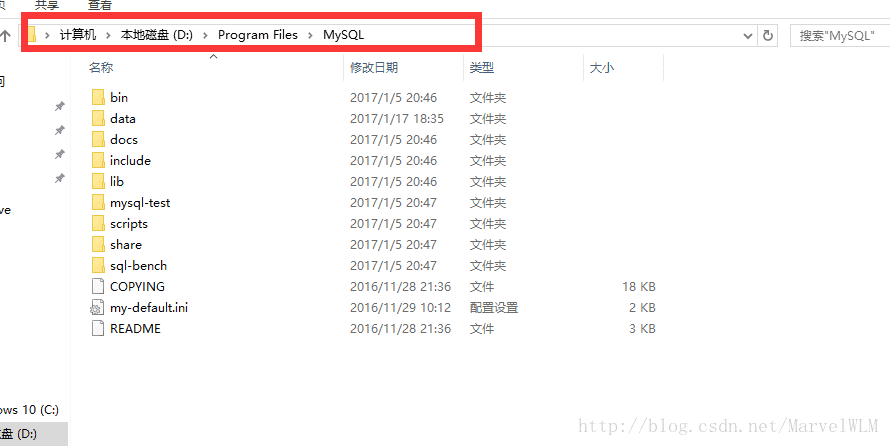 　　

　

	2. 解压完成之后其实就可以用了，但是为了方便使用，也就是在cmd启动mysql的时候，就不用加上全路径了，所以添加一下环境变量，将bin这个文件夹添加到环境变量，bin这个文件夹中有mysqld服务端，有mysql自带的一个客户端，所以添加了环境变量之后，在cmd中直接就可以使用了。

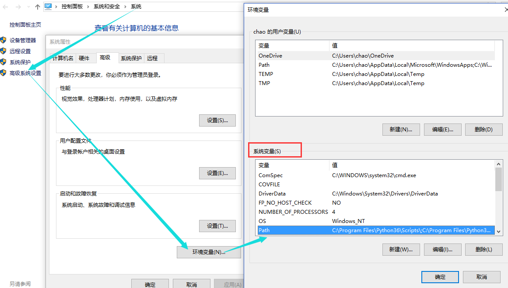


　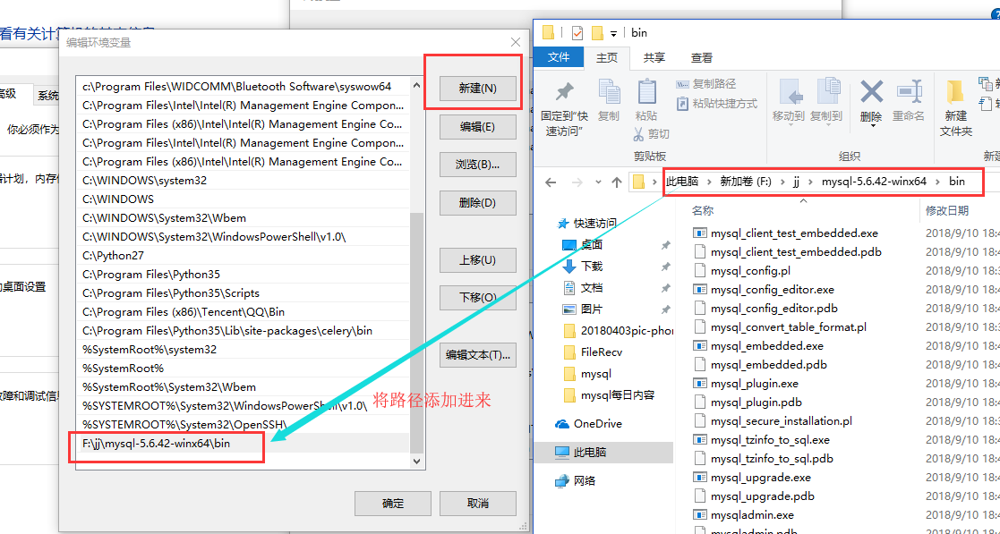

　　　　

​	这样就将我们的mysql服务端（mysqld）和mysql自带的一个客户端（供用户在本机测试用的，也是cmd窗口下使用的，客户端叫做mysql，后面操作的时候会使用到）

​	然后我们直接在cmd窗口就可以启动mysql服务端了，并且可以在任务管理起里面查看。

　　　

​	然后我们再启动一个cmd窗口来使用一下mysql客户端，然后连接一下我们开启的服务端，就可以成功了。

​	连接指令是：mysql -h 服务端IP地址 -P(大写) 3306(mysql服务端默认端口) -uroot（用户，这里我使用root用户来测了） -p密码  。注意：如果这样直接输入密码的话，密码和前面的-p中间不要有空格。

​	我自己在本机进行测试的，所以我写的mysql服务端的IP地址为我本机的回环地址127.0.0.1，其实如果是自己测试本机的mysql服务端，我们可以不用写ip地址和端口的，直接写mysql -uroot -p，但是连接别的电脑的mysql的时候一定要写IP地址和端口，并且不能用root用户去远程连接别的电脑的mysql服务端，并且要注意mysql服务器上的防火墙是否允许3306能够被外人连接，如果想让别人连，要更改防火墙设置，让他允许3306端口被连接，或者直接关闭防火墙（不建议直接关闭，测试的时候可以用），否则会报错。

　　　　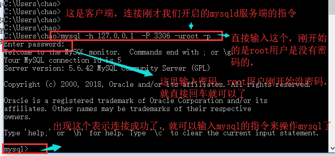

　　　　ip地址除了写127.0.0.1之外，还可以写localhost，或者自己本机的ip地址，但是写本机的ip地址的时候，服务端会将你的客户端视为外部设备，不允许你这样登陆。

　　　　自己本机测试连接的时候，完全可以不用写ip地址和端口

　　　　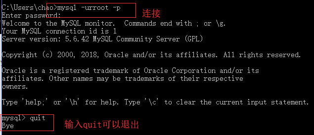

 

​	到目前为止，我们就已经可以连接并使用mysql数据库了，但是你发现，关闭mysql服务端比较麻烦，启动的时候我们直接输入的mysqld回车就启动了

​	关闭的方式有两种：

​		1.通过任务管理器来关闭服务端：

　　　　　　　　

​		2.通过cmd指令来关闭mysql服务端

　　　　　　　　

　　　　　　　　

 

​	所以我们可以通过系统服务的方式来控制mysql服务的开启或者关闭，那么就需要将mysql服务加入到系统服务中，来看一下怎么制作成系统服务：

​	打开cmd窗口，注意：必须以管理员身份打开cmd窗口，在左下角的地方找到这个圆圈，点击，然后输入cmd，匹配出来命令提示符，然后右键点击，以管理员身份打开

　　　　　　　　

 

　　　　　　　　

​	然后输入 mysqld --install  服务名（可以给这个服务一个名字，直接跟在这个指令的后面，不写也可以，会默认有一个，后面可以查看到）

　　　　　　　　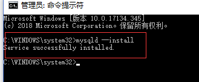

​	这样就添加系统服务了

​	然后win键+r  打开运行窗口，里面输入services.msc来打开系统服务列表

　　　　　　　　

​	就可以看到mysqld服务了，如果没有就点击上面的刷新按钮

　　　　　　　　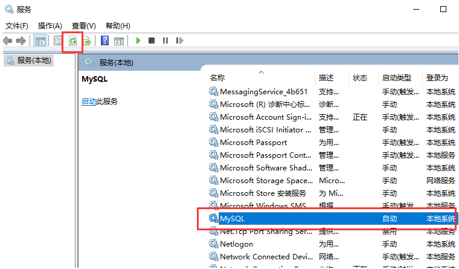

​	选中MySQL服务这一项，我们就可以直接右键查看功能，功能里面有启动和关闭，就可以通过系统服务的形式来启动和关闭MySQL服务了，这个服务是默认开启的，我们也可以自行设置是否自动开机启动等等的行为，左键双击一下这个服务你就看到下面的窗口了。

　　　　　　　　

　　　　　　　　

​	添加了系统服务以后，我们在启动和关闭这个mysql服务，就可以在cmd窗口下使用两个指令就搞定了：

​	启动指令：net start mysql

​	关闭指令：net stop mysql

​	并且不能再使用 mysqld指令直接启动了。

　　　　　　

​	还可以通过指令来移除刚才添加的系统服务：

​	cmd下移除服务命令为：mysqld remove


**简单总结**

```
#1、下载：MySQL Community Server 5.7.16
http://dev.mysql.com/downloads/mysql/

#2、解压
如果想要让MySQL安装在指定目录，那么就将解压后的文件夹移动到指定目录，如：C:\mysql-5.7.16-winx64

#3、添加环境变量
【右键计算机】--》【属性】--》【高级系统设置】--》【高级】--》【环境变量】--》【在第二个内容框中找到 变量名为Path 的一行，双击】 --> 【将MySQL的bin目录路径追加到变值值中，用 ； 分割】
 
#4、初始化
mysqld --initialize-insecure

#5、启动MySQL服务
mysqld # 启动MySQL服务

#6、启动MySQL客户端并连接MySQL服务
mysql -u root -p # 连接MySQL服务器

#7、将mysql添加系统服务
    注意：--install前，必须用mysql启动命令的绝对路径
    # 制作MySQL的Windows服务，在终端执行此命令：
    "c:\mysql-5.7.16-winx64\bin\mysqld" --install
 
    # 移除MySQL的Windows服务，在终端执行此命令：
    "c:\mysql-5.7.16-winx64\bin\mysqld" --remove

    注册成服务之后，以后再启动和关闭MySQL服务时，仅需执行如下命令：
    # 启动MySQL服务
    net start mysql
 
    # 关闭MySQL服务
    net stop mysql
```


# 第三节 MySQL库和表的操作


## 3.1 库操作

### 3.1.1 创建库

```
1.1 语法

	CREATE DATABASE 数据库名 charset utf8;

1.2 数据库命名规则

  可以由字母、数字、下划线、＠、＃、＄

  区分大小写

  唯一性

  不能使用关键字如 create select

  不能单独使用数字

  最长128位

```


### 3.1.2 其他操作

```
1 查看数据库
show databases;
show create database db1;
select database();

2 选择数据库
USE 数据库名

3 删除数据库
DROP DATABASE 数据库名;

4 修改数据库
alter database db1 charset utf8;
```


## 3.2 存储引擎

### 3.2.1 存储引擎介绍

存储引擎即表类型，mysql根据不同的表类型会有不同的处理机制。

首先确定一点，存储引擎的概念是MySQL里面才有的，不是所有的关系型数据库都有存储引擎这个概念，后面我们还会说，但是现在要确定这一点。　　

　　在讲清楚什么是存储引擎之前，我们先来个比喻，我们都知道录制一个视频文件，可以转换成不同的格式，例如mp4，avi，wmv等，而存在我们电脑的磁盘上也会存在于不同类型的文件系统中如windows里常见的ntfs、fat32，存在于linux里常见的ext3，ext4，xfs，但是，给我们或者用户看懂实际视频内容都是一样的。直观区别是，占用系统的空间大小与清晰程度可能不一样。
那么数据库表里的数据存储在数据库里及磁盘上和上述的视频格式及存储磁盘文件的系统格式特征类似，也有很多种存储方式。
　　但是对于用户和应用程序来说同样一张表的数据，无论用什么引擎来存储，用户能够看到的数据是一样的。不同储引擎存取，引擎功能，占用空间大小，读取性能等可能有区别。说白了，存储引擎就是在如何存储数据、提取数据、更新数据等技术方法的实现上，底层的实现方式不同，那么就会呈现出不同存储引擎有着一些自己独有的特点和功能，对应着不同的存取机制。
　　因为在关系数据库中数据的存储是以表的形式存储的，所以存储引擎也可以称为表类型(即：对表的存储、操作等的实现方法不同)，表是什么，表本质上就是磁盘上的文件。

　　其实MySQL支持多种存储引擎，每种引擎有着一些自己独特的功能，用户在使用的时候，可以根据自己的业务场景来使用不同的存储引擎，其中MySQL最常用的存储引擎为：MyISAM和InnoDB。
在详细介绍这些存储引擎之前，我们先来看看MySQL的整个工作流程，看一下存储引擎在哪里，MySQL都做了哪些事情。

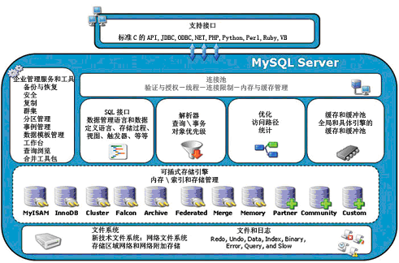


### 3.2.2 存储引擎分类


先看几条指令

```
show engines；#查看MySQL所有的引擎，
show variables like "storage_engine%";查看当前正在使用的引擎
```

**1. MyISAM引擎**　　

特点

```
MyISAM引擎特点：
        1.不支持事务
            事务是指逻辑上的一组操作，组成这组操作的各个单元，要么全成功要么全失败。
        2.表级锁定
            数据更新时锁定整个表：其锁定机制是表级锁定，也就是对表中的一个数据进行操作都会将这个表锁定，其他人不能操作这个表，这虽然可以让锁定的实现成本很小但是也同时大大降低了其并发性能。
        3.读写互相阻塞
            不仅会在写入的时候阻塞读取，MyISAM还会再读取的时候阻塞写入，但读本身并不会阻塞另外的读。
        4.只会缓存索引
            MyISAM可以通过key_buffer_size的值来提高缓存索引，以大大提高访问性能减少磁盘IO，但是这个缓存区只会缓存索引，而不会缓存数据。
        
        5.读取速度较快
            占用资源相对较少
        6.不支持外键约束，但只是全文索引
```


**2. InnoDB引擎**

特点

```
InnoDB引擎
        介绍：InnoDB引擎是MySQL数据库的另一个重要的存储引擎，正称为目前MySQL AB所发行新版的标准，被包含在所有二进制安装包里。和其他的存储引擎相比，InnoDB引擎的优点是支持兼容ACID的事务(类似于PostGreSQL)，以及参数完整性(即对外键的支持)。Oracle公司与2005年10月收购了Innobase。Innobase采用双认证授权。它使用GNU发行，也允许其他想将InnoDB结合到商业软件的团体获得授权。

InnoDB引擎特点：
        1.支持事务：支持4个事务隔离界别，支持多版本读。
        2.行级锁定(更新时一般是锁定当前行)：通过索引实现，全表扫描仍然会是表锁，注意间隙锁的影响。
        3.读写阻塞与事务隔离级别相关(有多个级别，这就不介绍啦~)。
        4.具体非常高效的缓存特性：能缓存索引，也能缓存数据。
        5.整个表和主键与Cluster方式存储，组成一颗平衡树。(了解)
        6.所有SecondaryIndex都会保存主键信息。(了解)
        7.支持分区，表空间，类似oracle数据库。
        8.支持外键约束，不支持全文索引(5.5之前)，以后的都支持了。
        9.和MyISAM引擎比较，InnoDB对硬件资源要求还是比较高的。
        
        小结：三个重要功能：Supports transactions，row-level locking，and foreign keys
```


**3. 事务介绍**

```

        简单地说，事务就是指逻辑上的一组SQL语句操作，组成这组操作的各个SQL语句，执行时要么全成功要么全失败。
        例如：你给我转账5块钱，流程如下
            a.从你银行卡取出5块钱，剩余计算money-5
            b.把上面5块钱打入我的账户上，我收到5块，剩余计算money+5.
        上述转账的过程，对应的sql语句为：
                update 你_account set money=money-5 where name='你'；
                update 我_account set money=money+5 where name='我'；
        上述的两条SQL操作，在事务中的操作就是要么都执行，要么都不执行，不然钱就对不上了。
        这就是事务的原子性(Atomicity)。
    事务的四大特性：
        1.原子性(Atomicity)
            事务是一个不可分割的单位，事务中的所有SQL等操作要么都发生，要么都不发生。
        2.一致性(Consistency)
            事务发生前和发生后，数据的完整性必须保持一致。
        3.隔离性(Isolation)
            当并发访问数据库时，一个正在执行的事务在执行完毕前，对于其他的会话是不可见的，多个并发事务之间的数据是相互隔离的。也就是其他人的操作在这个事务的执行过程中是看不到这个事务的执行结果的，也就是他们拿到的是这个事务执行之前的内容，等这个事务执行完才能拿到新的数据。
        4.持久性(Durability)
            一个事务一旦被提交，它对数据库中的数据改变就是永久性的。如果出了错误，事务也不允撤销，只能通过'补偿性事务'。
```


**创建表时指定引擎的命令**

```
create table t1(id int)engine=innodb; #指定innodb
create table t2(id int)engine=myisam; #指定myisam
```


## 3.3 表操作


### 3.3.1 创建表

建表语法

```
create table 表名(
字段名1 类型[(宽度) 约束条件],
字段名2 类型[(宽度) 约束条件],
字段名3 类型[(宽度) 约束条件]
);

#注意：
1. 在同一张表中，字段名是不能相同
2. 宽度和约束条件可选、非必须，宽度指的就是字段长度约束，例如：char(10)里面的10
3. 字段名和类型是必须的
```

### 3.3.2 表操作简单示例

```
mysql> create database db1 charset utf8;

mysql> use db1;

mysql> create table t1(  
    -> id int, 
    -> name varchar(50),
    -> sex enum('male','female'),
    -> age int(3)
    -> );

mysql> show tables; #查看db1库下所有表名

mysql> desc t1;
+-------+-----------------------+------+-----+---------+-------+
| Field | Type                  | Null | Key | Default | Extra |
+-------+-----------------------+------+-----+---------+-------+
| id    | int(11)               | YES  |     | NULL    |       |
| name  | varchar(50)           | YES  |     | NULL    |       |
| sex   | enum('male','female') | YES  |     | NULL    |       |
| age   | int(3)                | YES  |     | NULL    |       |
+-------+-----------------------+------+-----+---------+-------+

mysql> select id,name,sex,age from t1;
Empty set (0.00 sec)

mysql> select * from t1;
Empty set (0.00 sec)

mysql> select id,name from t1;
Empty set (0.00 sec)
```


插入数据简单操作

```mysql
mysql> insert into t1 values
    -> (1,'chao',18,'male'),
    -> (2,'sb',81,'female')
    -> ;
mysql> select * from t1;
+------+------+------+--------+
| id   | name | age  | sex    |
+------+------+------+--------+
|    1 | chao |   18 | male   |
|    2 | sb |   81 | female |
+------+------+------+--------+


mysql> insert into t1(id) values 
    -> (3),
    -> (4);
mysql> select * from t1;
+------+------+------+--------+
| id   | name | age  | sex    |
+------+------+------+--------+
|    1 | chao |   18 | male   |
|    2 | sb |   81 | female |
|    3 | NULL | NULL | NULL   |
|    4 | NULL | NULL | NULL   |
+------+------+------+--------+
```


### 3.3.3 查看表结构

看语法

```
mysql> describe t1; #查看表结构，可简写为：desc 表名
+-------+-----------------------+------+-----+---------+-------+
| Field | Type                  | Null | Key | Default | Extra |
+-------+-----------------------+------+-----+---------+-------+
| id    | int(11)               | YES  |     | NULL    |       |
| name  | varchar(50)           | YES  |     | NULL    |       |
| sex   | enum('male','female') | YES  |     | NULL    |       |
| age   | int(3)                | YES  |     | NULL    |       |
+-------+-----------------------+------+-----+---------+-------+


mysql> show create table t1\G; #查看表详细结构，可加\G
```


### 3.3.4 基础数据类型

#### 数值类型

整数类型：TINYINT，SMALLINT，MEDIUMINT，INT，BIGINT

作用：存储年龄，等级，id，各种号码等


注意：对于整型来说，数据类型后面的宽度并不是存储长度限制，而是显示限制，假如：int(8)，那么显示时不够8位则用0来填充，够8位则正常显示，通过zerofill来测试，存储长度还是int的4个字节长度。默认的显示宽度就是能够存储的最大的数据的长度，比如：int无符号类型，那么默认的显示宽度就是int(10)，有符号的就是int(11)，因为多了一个符号，所以我们没有必要指定整数类型的数据，没必要指定宽度，因为默认的就能够将你存的原始数据完全显示。


#### 浮点型

定点数类型  DEC，等同于DECIMAL　　

浮点类型：FLOAT DOUBLE

作用：存储薪资、身高、温度、体重、体质参数等

```
1.FLOAT[(M,D)] [UNSIGNED] [ZEROFILL]

    定义：
            单精度浮点数（非准确小数值），m是整数部分+小数部分的总个数，d是小数点后个数。m最大值为255，d最大值为30，例如：float(255,30)

    有符号：
               -3.402823466E+38 to -1.175494351E-38,
               1.175494351E-38 to 3.402823466E+38
    无符号：
               1.175494351E-38 to 3.402823466E+38


    精确度： 
               **** 随着小数的增多，精度变得不准确 ****


2.DOUBLE[(M,D)] [UNSIGNED] [ZEROFILL]

    定义：
               双精度浮点数（非准确小数值），m是整数部分+小数部分的总个数，d是小数点后个数。m最大值也为255，d最大值也为30

    有符号：
               -1.7976931348623157E+308 to -2.2250738585072014E-308
               2.2250738585072014E-308 to 1.7976931348623157E+308

    无符号：
               2.2250738585072014E-308 to 1.7976931348623157E+308
                
    精确度：
               ****随着小数的增多，精度比float要高，但也会变得不准确 ****


3.decimal[(m[,d])] [unsigned] [zerofill]

    定义：
              准确的小数值，m是整数部分+小数部分的总个数（负号不算），d是小数点后个数。 m最大值为65，d最大值为30。比float和double的整数个数少，但是小数位数都是30位


    精确度：
               **** 随着小数的增多，精度始终准确 ****
               对于精确数值计算时需要用此类型
               decimal能够存储精确值的原因在于其内部按照字符串存储。
精度从高到低：decimal、double、float
    decimal精度高，但是整数位数少
    float和double精度低，但是整数位数多
float已经满足绝大多数的场景了，但是什么导弹、航线等要求精度非常高，所以还是需要按照业务场景自行选择，如果又要精度高又要整数位数多，那么你可以直接用字符串来存。
```


**浮点型测试示例**

```
mysql> create table t1(x float(256,31));
ERROR 1425 (42000): Too big scale 31 specified for column 'x'. Maximum is 30.
mysql> create table t1(x float(256,30));
ERROR 1439 (42000): Display width out of range for column 'x' (max = 255)
mysql> create table t1(x float(255,30)); #建表成功
Query OK, 0 rows affected (0.02 sec)

mysql> create table t2(x double(255,30)); #建表成功
Query OK, 0 rows affected (0.02 sec)

mysql> create table t3(x decimal(66,31));
ERROR 1425 (42000): Too big scale 31 specified for column 'x'. Maximum is 30.
mysql> create table t3(x decimal(66,30));
ERROR 1426 (42000): Too-big precision 66 specified for 'x'. Maximum is 65.
mysql> create table t3(x decimal(65,30)); #建表成功
Query OK, 0 rows affected (0.02 sec)

mysql> show tables;
+---------------+
| Tables_in_db1 |
+---------------+
| t1            |
| t2            |
| t3            |
+---------------+
3 rows in set (0.00 sec)


mysql> insert into t1 values(1.1111111111111111111111111111111); #小数点后31个1
Query OK, 1 row affected (0.01 sec)

mysql> insert into t2 values(1.1111111111111111111111111111111);
Query OK, 1 row affected (0.00 sec)

mysql> insert into t3 values(1.1111111111111111111111111111111);
Query OK, 1 row affected, 1 warning (0.01 sec)

mysql> select * from t1; #随着小数的增多，精度开始不准确
+----------------------------------+
| x                                |
+----------------------------------+
| 1.111111164093017600000000000000 |
+----------------------------------+
1 row in set (0.00 sec)

mysql> select * from t2; #精度比float要准确点，但随着小数的增多，同样变得不准确
+----------------------------------+
| x                                |
+----------------------------------+
| 1.111111111111111200000000000000 |
+----------------------------------+
1 row in set (0.00 sec)

mysql> select * from t3; #精度始终准确,d为30，于是只留了30位小数
+----------------------------------+
| x                                |
+----------------------------------+
| 1.111111111111111111111111111111 |
+----------------------------------+
1 row in set (0.00 sec)
```


#### 日期类型

类型：DATE，TIME，DATETIME ，TIMESTAMP，YEAR 

作用：存储用户注册时间，文章发布时间，员工入职时间，出生时间，过期时间等

**简单介绍**

```
        YEAR
            YYYY（范围：1901/2155）2018

        DATE
            YYYY-MM-DD（范围：1000-01-01/9999-12-31）例：2018-01-01 

        TIME
            HH:MM:SS（范围：'-838:59:59'/'838:59:59'）例：12:09:32

        DATETIME

            YYYY-MM-DD HH:MM:SS（范围：1000-01-01 00:00:00/9999-12-31 23:59:59    Y）例： 2018-01-01 12:09:32

        TIMESTAMP

            YYYYMMDD HHMMSS（范围：1970-01-01 00:00:00/2037 年某时）
```

mysql的日期格式对字符串采用的是'放松'政策，可以以字符串的形式插入。

**日期类型测试示例**

```
year：
    mysql> create table t10(born_year year); #无论year指定何种宽度，最后都默认是year(4)
    mysql> insert into t10 values  
        -> (1900),
        -> (1901),
        -> (2155),
        -> (2156);
    mysql> select * from t10;
    +-----------+
    | born_year |
    +-----------+
    |      0000 |
    |      1901 |
    |      2155 |
    |      0000 |
    +-----------+


date,time,datetime:
    mysql> create table t11(d date,t time,dt datetime);
    mysql> desc t11;
    +-------+----------+------+-----+---------+-------+
    | Field | Type     | Null | Key | Default | Extra |
    +-------+----------+------+-----+---------+-------+
    | d     | date     | YES  |     | NULL    |       |
    | t     | time     | YES  |     | NULL    |       |
    | dt    | datetime | YES  |     | NULL    |       |
    +-------+----------+------+-----+---------+-------+

    mysql> insert into t11 values(now(),now(),now());
    mysql> select * from t11;
    +------------+----------+---------------------+
    | d          | t        | dt                  |
    +------------+----------+---------------------+
    | 2017-07-25 | 16:26:54 | 2017-07-25 16:26:54 |
    +------------+----------+---------------------+


timestamp：
    mysql> create table t12(time timestamp);
    mysql> insert into t12 values();
    mysql> insert into t12 values(null);
    mysql> select * from t12;
    +---------------------+
    | time                |
    +---------------------+
    | 2017-07-25 16:29:17 |
    | 2017-07-25 16:30:01 |
    +---------------------+


============注意啦，注意啦，注意啦===========
    1. 单独插入时间时，需要以字符串的形式，按照对应的格式插入
    2. 插入年份时，尽量使用4位值
    3. 插入两位年份时，<=69，以20开头，比如50,  结果2050      
                    >=70，以19开头，比如71，结果1971
    mysql> create table t12(y year);
    mysql> insert into t12 values  
        -> (50),
        -> (71);
    mysql> select * from t12;
    +------+
    | y    |
    +------+
    | 2050 |
    | 1971 |
    +------+


============综合练习===========
    mysql> create table student(
        -> id int,
        -> name varchar(20),
        -> born_year year,
        -> birth date,
        -> class_time time,
        -> reg_time datetime);

    mysql> insert into student values
        -> (1,'sb1',"1995","1995-11-11","11:11:11","2017-11-11 11:11:11"),
        -> (2,'sb2',"1997","1997-12-12","12:12:12","2017-12-12 12:12:12"),
        -> (3,'sb3',"1998","1998-01-01","13:13:13","2017-01-01 13:13:13");  

    mysql> select * from student;
    +------+------+-----------+------------+------------+---------------------+
    | id   | name | born_year | birth      | class_time | reg_time            |
    +------+------+-----------+------------+------------+---------------------+
    |    1 | sb1 |      1995 | 1995-11-11 | 11:11:11   | 2017-11-11 11:11:11 |
    |    2 | sb2 |      1997 | 1997-12-12 | 12:12:12   | 2017-12-12 12:12:12 |
    |    3 | sb3 |      1998 | 1998-01-01 | 13:13:13   | 2017-01-01 13:13:13 |
    +------+------+-----------+------------+------------+---------------------+
```


#### 字符串类型

类型：char，varchar

作用：名字，信息等等

官网：https://dev.mysql.com/doc/refman/5.7/en/char.html

注意：char和varchar括号内的参数指的都是字符的长度

```

#char类型：定长，简单粗暴，浪费空间，存取速度快
    字符长度范围：0-255（一个中文是一个字符，是utf8编码的3个字节）
    存储：
        存储char类型的值时，会往右填充空格来满足长度
        例如：指定长度为10，存>10个字符则报错(严格模式下)，存<10个字符则用空格填充直到凑够10个字符存储

    检索：
        在检索或者说查询时，查出的结果会自动删除尾部的空格，如果你想看到它补全空格之后的内容，除非我们打开pad_char_to_full_length SQL模式（SET sql_mode = 'strict_trans_tables,PAD_CHAR_TO_FULL_LENGTH';）

#varchar类型：变长，精准，节省空间，存取速度慢
    字符长度范围：0-65535（如果大于21845会提示用其他类型 。mysql行最大限制为65535字节，字符编码为utf-8：https://dev.mysql.com/doc/refman/5.7/en/column-count-limit.html）
    存储：
        varchar类型存储数据的真实内容，不会用空格填充，如果'ab  ',尾部的空格也会被存起来
        强调：varchar类型会在真实数据前加1-2Bytes的前缀，该前缀用来表示真实数据的bytes字节数（1-2Bytes最大表示65535个数字，正好符合mysql对row的最大字节限制，即已经足够使用）
        如果真实的数据<255bytes则需要1Bytes的前缀（1Bytes=8bit 2**8最大表示的数字为255）
        如果真实的数据>255bytes则需要2Bytes的前缀（2Bytes=16bit 2**16最大表示的数字为65535）
    
    检索：
        尾部有空格会保存下来，在检索或者说查询时，也会正常显示包含空格在内的内容
```


**char和varchar性能对比**

```
以char(5)和varchar(5)来比较，加入我要存三个人名：sb，ssb1，ssbb2
　　　　**char：**
　　　　　　优点：简单粗暴，不管你是多长的数据，我就按照规定的长度来存，5个5个的存，三个人名就会类似这种存储：sb ssb1 ssbb2，中间是空格补全，取数据的时候5个5个的取，简单粗暴速度快
　　　　　　缺点：貌似浪费空间，并且我们将来存储的数据的长度可能会参差不齐

　　　　**varchar：**
　　　　　　varchar类型不定长存储数据，更为精简和节省空间
　　　　　　例如存上面三个人名的时候类似于是这样的：sbssb1ssbb2，连着的，如果这样存，请问这三个人名你还怎么取出来，你知道取多长能取出第一个吗？(超哥，我能看出来啊，那我只想说：滚犊子！)
　　　　　　不知道从哪开始从哪结束，遇到这样的问题，你会想到怎么解决呢？还记的吗？想想？socket？tcp？struct？把数据长度作为消息头。


　　　　　　
　　　　　　所以，varchar在存数据的时候，会在每个数据前面加上一个头，这个头是1-2个bytes的数据，这个数据指的是后面跟着的这个数据的长度，1bytes能表示2**8=256，两个bytes表示2**16=65536，能表示0-65535的数字，所以varchar在存储的时候是这样的：1bytes+sb+1bytes+ssb1+1bytes+ssbb2，所以存的时候会比较麻烦，导致效率比char慢，取的时候也慢，先拿长度，再取数据。

　　　　　　优点：节省了一些硬盘空间，一个acsii码的字符用一个bytes长度就能表示，但是也并不一定比char省，看一下官网给出的一个表格对比数据，当你存的数据正好是你规定的字段长度的时候，varchar反而占用的空间比char要多。
```


**其他的字符串类型：BINARY、VARBINARY、BLOB、TEXT**

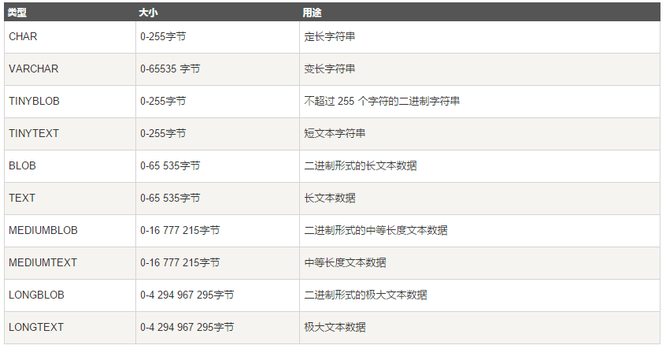

**其他类型简单介绍**

```
BINARY 和 VARBINARY 类似于 CHAR 和 VARCHAR，不同的是它们包含二进制字符串而不要非二进制字符串。也就是说，它们包含字节字符串而不是字符字符串。这说明它们没有字符集，并且排序和比较基于列值字节的数值值。
BLOB 是一个二进制大对象，可以容纳可变数量的数据。有 4 种 BLOB 类型：TINYBLOB、BLOB、MEDIUMBLOB 和 LONGBLOB。它们区别在于可容纳存储范围不同。
有 4 种 TEXT 类型：TINYTEXT、TEXT、MEDIUMTEXT 和 LONGTEXT。对应的这 4 种 BLOB 类型，可存储的最大长度不同，可根据实际情况选择。

BLOB：
     1._BLOB和_text存储方式不同，_TEXT以文本方式存储，英文存储区分大小写，而_Blob是以二进制方式存储，不分大小写。
     2._BLOB存储的数据只能整体读出。
     3._TEXT可以指定字符集，_BLO不用指定字符集。
```


#### 枚举类型和集合类型

字段的值只能在给定范围中选择，如单选框，多选框，如果你在应用程序或者前端不做选项限制，在MySQL的字段里面也能做限制
	enum 单选 只能在给定的范围内选一个值，如性别 sex 男male/女female
	set 多选 在给定的范围内可以选择一个或一个以上的值（爱好1,爱好2,爱好3...）

示例：

```
枚举类型（enum）
            An ENUM column can have a maximum of 65,535 distinct elements. (The practical limit is less than 3000.)
            示例：
                CREATE TABLE shirts (
                    name VARCHAR(40),
                    size ENUM('x-small', 'small', 'medium', 'large', 'x-large')
                );
                INSERT INTO shirts (name, size) VALUES ('dress shirt','large'), ('t-shirt','medium'),('polo shirt','small');

  

          集合类型（set）
            A SET column can have a maximum of 64 distinct members.
            示例：
                CREATE TABLE myset (col SET('a', 'b', 'c', 'd'));
                INSERT INTO myset (col) VALUES ('a,d'), ('d,a'), ('a,d,a'), ('a,d,d'), ('d,a,d');

```

**简单测试**

```
mysql> create table consumer( 
    -> name varchar(50),
    -> sex enum('male','female'),
    -> level enum('vip1','vip2','vip3','vip4','vip5'), #在指定范围内，多选一
    -> hobby set('play','music','read','study') #在指定范围内，多选多
    -> );

    mysql> insert into consumer values  
        -> ('xiaogui','male','vip5','read,study'),
        -> ('taibai','female','vip1','girl');

    mysql> select * from consumer;
    +------+--------+-------+------------+
    | name | sex    | level | hobby      |
    +------+--------+-------+------------+
    | xiaogui | male   | vip5  | read,study |
    | taibai | female | vip1  |            |
    +------+--------+-------+------------+
```


### 3.4 完整性约束

#### not null和default

是否可空，null表示空，非字符串
not null - 不可空
null - 可空

```

　　默认值，创建列时可以指定默认值，当插入数据时如果未主动设置，则自动添加默认值
　　create table tb1(
　　　　nid int not null defalut 2,
　　　　num int not null
　　)；
```

　　先说一点：在我们插入数据的时候，可以这么写insert into tb1(nid，num) values（1，‘chao’）；就是在插入输入的时候，指定字段插入数据，如果我在只给num插入值，可以这样写insert into tb1(num) values('chao');还可以插入数据的时候，指定插入数据字段的顺序：把nid和num换个位置，但是对应插入的值也要换位置。注意：即便是你只给一个字段传值了，**那么也是生成一整条记录**，这条记录的其他字段的值如果可以为空，那么他们就都是null空值，如果不能为空，就会报错。

**简单测试**

```
==================not null====================
mysql> create table t1(id int); #id字段默认可以插入空
mysql> desc t1;
+-------+---------+------+-----+---------+-------+
| Field | Type    | Null | Key | Default | Extra |
+-------+---------+------+-----+---------+-------+
| id    | int(11) | YES  |     | NULL    |       |
+-------+---------+------+-----+---------+-------+
mysql> insert into t1 values(); #可以插入空


mysql> create table t2(id int not null); #设置字段id不为空
mysql> desc t2;
+-------+---------+------+-----+---------+-------+
| Field | Type    | Null | Key | Default | Extra |
+-------+---------+------+-----+---------+-------+
| id    | int(11) | NO   |     | NULL    |       |
+-------+---------+------+-----+---------+-------+
mysql> insert into t2 values(); #不能插入空
ERROR 1364 (HY000): Field 'id' doesn't have a default value


==================default====================
#设置id字段有默认值后，则无论id字段是null还是not null，都可以插入空，插入空默认填入default指定的默认值
mysql> create table t3(id int default 1);
mysql> alter table t3 modify id int not null default 1;


==================综合练习====================
mysql> create table student(
    -> name varchar(20) not null,
    -> age int(3) unsigned not null default 18,
    -> sex enum('male','female') default 'male',
    -> hobby set('play','study','read','music') default 'play,music'
    -> );
mysql> desc student;
+-------+------------------------------------+------+-----+------------+-------+
| Field | Type                               | Null | Key | Default    | Extra |
+-------+------------------------------------+------+-----+------------+-------+
| name  | varchar(20)                        | NO   |     | NULL       |       |
| age   | int(3) unsigned                    | NO   |     | 18         |       |
| sex   | enum('male','female')              | YES  |     | male       |       |
| hobby | set('play','study','read','music') | YES  |     | play,music |       |
+-------+------------------------------------+------+-----+------------+-------+
mysql> insert into student(name) values('chao');
mysql> select * from student;
+------+-----+------+------------+
| name | age | sex  | hobby      |
+------+-----+------+------------+
| chao|  18 | male | play,music |
+------+-----+------+------------+
```


#### unique

独一无二，唯一属性：id，身份证号等

**简单测试**

```
============设置唯一约束 UNIQUE===============
方法一：
create table department1(
id int,
name varchar(20) unique,
comment varchar(100)
);


方法二：
create table department2(
id int,
name varchar(20),
comment varchar(100),
constraint uk_name unique(name)
);


mysql> insert into department1 values(1,'IT','技术');
Query OK, 1 row affected (0.00 sec)
mysql> insert into department1 values(1,'IT','技术');
ERROR 1062 (23000): Duplicate entry 'IT' for key 'name'
```


#### primary key

从约束角度看primary key字段的值不为空且唯一。

**简单测试**

```
============单列做主键===============
#方法一：not null+unique
create table department1(
id int not null unique, #主键
name varchar(20) not null unique,
comment varchar(100)
);

mysql> desc department1;
+---------+--------------+------+-----+---------+-------+
| Field   | Type         | Null | Key | Default | Extra |
+---------+--------------+------+-----+---------+-------+
| id      | int(11)      | NO   | PRI | NULL    |       |
| name    | varchar(20)  | NO   | UNI | NULL    |       |
| comment | varchar(100) | YES  |     | NULL    |       |
+---------+--------------+------+-----+---------+-------+
rows in set (0.01 sec)

#方法二：在某一个字段后用primary key
create table department2(
id int primary key, #主键
name varchar(20),
comment varchar(100)
);

mysql> desc department2;
+---------+--------------+------+-----+---------+-------+
| Field   | Type         | Null | Key | Default | Extra |
+---------+--------------+------+-----+---------+-------+
| id      | int(11)      | NO   | PRI | NULL    |       |
| name    | varchar(20)  | YES  |     | NULL    |       |
| comment | varchar(100) | YES  |     | NULL    |       |
+---------+--------------+------+-----+---------+-------+
rows in set (0.00 sec)

#方法三：在所有字段后单独定义primary key
create table department3(
id int,
name varchar(20),
comment varchar(100),
constraint pk_name primary key(id); #创建主键并为其命名pk_name

mysql> desc department3;
+---------+--------------+------+-----+---------+-------+
| Field   | Type         | Null | Key | Default | Extra |
+---------+--------------+------+-----+---------+-------+
| id      | int(11)      | NO   | PRI | NULL    |       |
| name    | varchar(20)  | YES  |     | NULL    |       |
| comment | varchar(100) | YES  |     | NULL    |       |
+---------+--------------+------+-----+---------+-------+
rows in set (0.01 sec
```


#### auto_increment

  之前我们插入数据的时候，id也需要自己来写，是不是很麻烦啊，我们是不是想，只要有一条记录就直接插入进去啊，不需要考虑说，你现在存储到第多少条数据了，对不对，所以出现了一个叫做auto_increment的属性

约束字段为自动增长，被约束的字段必须同时被key约束，也就是说只能给约束成key的字段加自增属性，默认起始位置为1，步长也为1.

**简单测试**

```
#不指定id，则自动增长
create table student(
id int primary key auto_increment,
name varchar(20),
sex enum('male','female') default 'male'
);

mysql> desc student;
+-------+-----------------------+------+-----+---------+----------------+
| Field | Type                  | Null | Key | Default | Extra          |
+-------+-----------------------+------+-----+---------+----------------+
| id    | int(11)               | NO   | PRI | NULL    | auto_increment |
| name  | varchar(20)           | YES  |     | NULL    |                |
| sex   | enum('male','female') | YES  |     | male    |                |
+-------+-----------------------+------+-----+---------+----------------+
mysql> insert into student(name) values
    -> ('egon'),
    -> ('alex')
    -> ;

mysql> select * from student;
+----+------+------+
| id | name | sex  |
+----+------+------+
|  1 | egon | male |
|  2 | alex | male |
+----+------+------+


#也可以指定id
mysql> insert into student values(4,'asb','female');
Query OK, 1 row affected (0.00 sec)

mysql> insert into student values(7,'wsb','female');
Query OK, 1 row affected (0.00 sec)

mysql> select * from student;
+----+------+--------+
| id | name | sex    |
+----+------+--------+
|  1 | egon | male   |
|  2 | alex | male   |
|  4 | asb  | female |
|  7 | wsb  | female |
+----+------+--------+


#对于自增的字段，在用delete删除后，再插入值，该字段仍按照删除前的位置继续增长
mysql> delete from student;
Query OK, 4 rows affected (0.00 sec)

mysql> select * from student;
Empty set (0.00 sec)

mysql> insert into student(name) values('ysb');
mysql> select * from student;
+----+------+------+
| id | name | sex  |
+----+------+------+
|  8 | ysb  | male |
+----+------+------+

#应该用truncate清空表，比起delete一条一条地删除记录，truncate是直接清空表，在删除大表时用它
mysql> truncate student;
Query OK, 0 rows affected (0.01 sec)

mysql> insert into student(name) values('egon');
Query OK, 1 row affected (0.01 sec)

mysql> select * from student;
+----+------+------+
| id | name | sex  |
+----+------+------+
|  1 | egon | male |
+----+------+------+
1 row in set (0.00 sec)
```


# 第四节 表其他操作

## 4.1 修改表

看语法

```
语法：
1. 修改表名
      ALTER TABLE 表名 
                          RENAME 新表名;

2. 增加字段
      ALTER TABLE 表名
                          ADD 字段名  数据类型 [完整性约束条件…], #注意这里可以通过逗号来分割，一下添加多个约束条件
                          ADD 字段名  数据类型 [完整性约束条件…];
      ALTER TABLE 表名
                          ADD 字段名  数据类型 [完整性约束条件…]  FIRST; #添加这个字段的时候，把它放到第一个字段位置去。
      ALTER TABLE 表名
                          ADD 字段名  数据类型 [完整性约束条件…]  AFTER 字段名;#after是放到后的这个字段的后面去了，我们通过一个first和一个after就可以将新添加的字段放到表的任意字段位置了。
                            
3. 删除字段
      ALTER TABLE 表名 
                          DROP 字段名;

4. 修改字段
      ALTER TABLE 表名 
                          MODIFY  字段名 数据类型 [完整性约束条件…];
      ALTER TABLE 表名 
                          CHANGE 旧字段名 新字段名 旧数据类型 [完整性约束条件…];  #change比modify还多了个改名字的功能，这一句是只改了一个字段名
      ALTER TABLE 表名 
                          CHANGE 旧字段名 新字段名 新数据类型 [完整性约束条件…];#这一句除了改了字段名，还改了数据类型、完整性约束等等的内容
```

​	给一个字段添加外键属性的语句：alter table 表2名 add foreign key(表2的一个字段) references 表1名(表1的一个字段);

​	注意一点：在mysql里面表名是不区分大小写的，如果你将一个名为t1的(小写的t1)改名为一个T1（大写的T1），是完全没用的，因为在数据库里面表名都是小写的。

简单测试

```
示例：
1. 修改存储引擎
mysql> alter table service 
    -> engine=innodb;

2. 添加字段
mysql> alter table student10
    -> add name varchar(20) not null,
    -> add age int(3) not null default 22;
    
mysql> alter table student10
    -> add stu_num varchar(10) not null after name;                //添加name字段之后

mysql> alter table student10                        
    -> add sex enum('male','female') default 'male' first;          //添加到最前面

3. 删除字段
mysql> alter table student10
    -> drop sex;

mysql> alter table service
    -> drop mac;

4. 修改字段类型modify
mysql> alter table student10
    -> modify age int(3);
mysql> alter table student10
    -> modify id int(11) not null primary key auto_increment;    //修改为主键

5. 增加约束（针对已有的主键增加auto_increment）
mysql> alter table student10 modify id int(11) not null primary key auto_increment;
ERROR 1068 (42000): Multiple primary key defined

mysql> alter table student10 modify id int(11) not null auto_increment;
Query OK, 0 rows affected (0.01 sec)
Records: 0  Duplicates: 0  Warnings: 0

6. 对已经存在的表增加复合主键
mysql> alter table service2
    -> add primary key(host_ip,port);        

7. 增加主键
mysql> alter table student1
    -> modify name varchar(10) not null primary key;

8. 增加主键和自动增长
mysql> alter table student1
    -> modify id int not null primary key auto_increment;

9. 删除主键
a. 删除自增约束
mysql> alter table student10 modify id int(11) not null; 

b. 删除主键
mysql> alter table student10                                 
    -> drop primary key;
```

## 4.2 查看所有表

```
show tables；
```

## 4.3 删除表

```
drop table 表名；
```


## 4.4 清空表

```
delete from 表名；
truncate 表名；  #会将auto_increment的起始数据重置为1。
```


# 本节作业

将下面的角色关系在数据库中创建好，并且插入一些数据进去，自行看看该如何设计，其实下面感觉已经给你写出来了都。

　　　　


