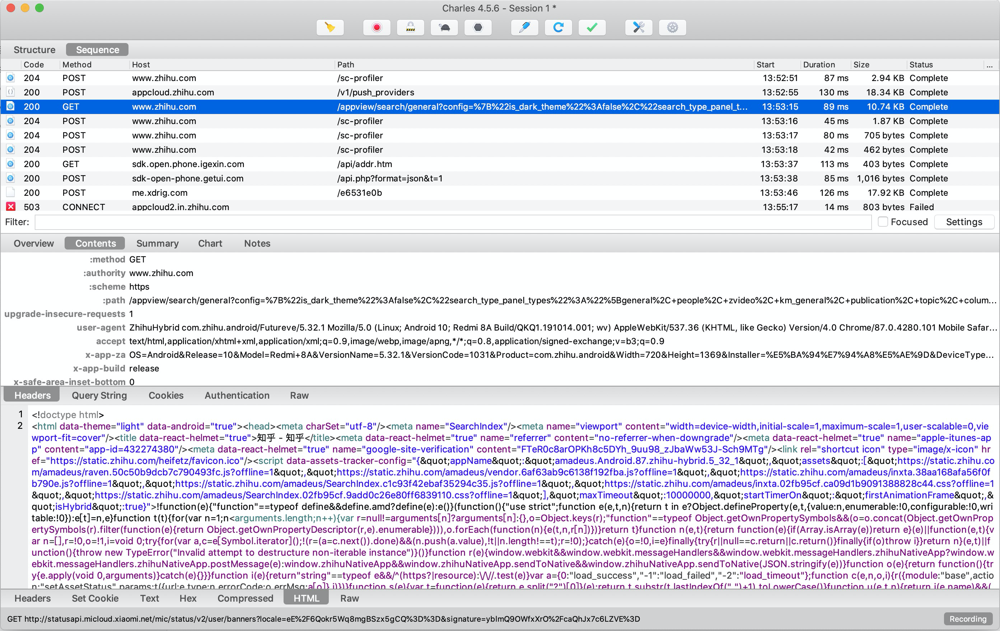
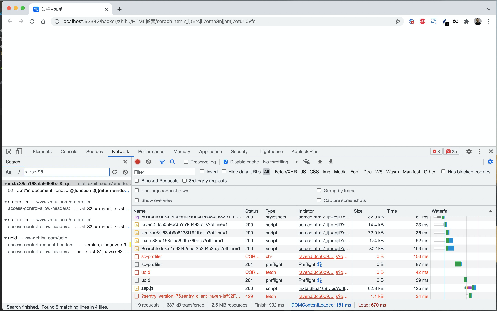
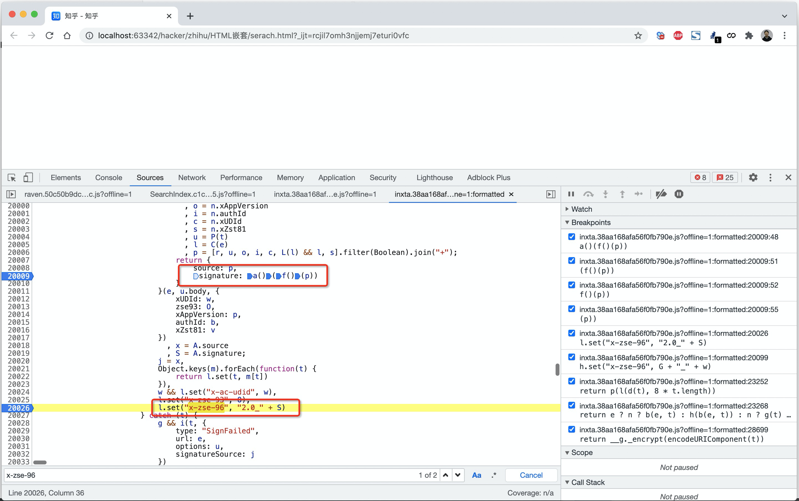

直接分析web版本关键的 `x-zse-96`还是不对。

猜想：是不是app中和web中的算法不一样呢。（webview）


## 1.app嵌套页面




把内容下载下来自己测试。







只是参数不同，而内部的算法，全都是一样。

- md5
- js加密


这个app加密的参数的格式：

```
zse93 + URL + app_version + hd + udid
```

而在web上的格式：

```python
zse93 + URL + d_c0
```


仅此而已，所以，修改下代码后就发现，可以正确运行。


## 最终版（正确）

```python
import os
import execjs
import hashlib
import hmac
import requests
import random
import time
from hashlib import sha1
from urllib.parse import quote_plus


def create_random_mac(sep=":"):
    """ 随机生成mac地址 """

    def mac_same_char(mac_string):
        v0 = mac_string[0]
        index = 1
        while index < len(mac_string):
            if v0 != mac_string[index]:
                return False
            index += 1
        return True

    data_list = []
    for i in range(1, 7):
        part = "".join(random.sample("0123456789ABCDEF", 2))
        data_list.append(part)
    mac = sep.join(data_list)

    if not mac_same_char(mac) and mac != "00:90:4C:11:22:33":
        return mac

    return create_random_mac(sep)


def encrypt_so(app_id, sign_version, ts, params_string):
    key = "dd49a835-56e7-4a0f-95b5-efd51ea5397f"
    str1 = sign_version
    str5 = app_id
    str6 = ts
    str4 = params_string
    # v23 = "1355" + "2" + "app_build=1031&app_version=5.32.1&bt_ck=1&bundle_id=com.zhihu.android&cp_ct=8&cp_fq=2016000&cp_tp=0&cp_us=100.0&d_n=Redmi%208A&fr_mem=202&fr_st=42809&latitude=0.0&longitude=0.0&mc_ad=E0%3A1F%3A88%3AAA%3AB3%3A39&mcc=cn&nt_st=1&ph_br=Xiaomi&ph_md=Redmi%208A&ph_os=Android%2010&ph_sn=unknown&pvd_nm=%E4%B8%AD%E5%9B%BD%E8%81%94%E9%80%9A&tt_mem=256&tt_st=51140&tz_of=28800" + "1636642368"
    v23 = "{}{}{}{}".format(str5, str1, str4, str6)
    hmac_code = hmac.new(key.encode('utf-8'), v23.encode('utf-8'), sha1)
    res = hmac_code.hexdigest()
    return res


def get_udid():
    app_id = "1355"
    sign_version = "2"

    ts = str(int(time.time()))
    mac_string = create_random_mac()
    mac_quote_string = quote_plus(mac_string)

    tpl = "app_build=1031&app_version=5.32.1&bt_ck=1&bundle_id=com.zhihu.android&cp_ct=8&cp_fq=2016000&cp_tp=0&cp_us=100.0&d_n=Redmi%208A&fr_mem=202&fr_st=42809&latitude=0.0&longitude=0.0&mc_ad={}&mcc=cn&nt_st=1&ph_br=Xiaomi&ph_md=Redmi%208A&ph_os=Android%2010&ph_sn=unknown&pvd_nm=%E4%B8%AD%E5%9B%BD%E8%81%94%E9%80%9A&tt_mem=256&tt_st=51140&tz_of=28800"
    form_string = tpl.format(mac_quote_string)

    sign = encrypt_so(app_id, sign_version, ts, form_string)

    res = requests.post(
        url="https://appcloud.zhihu.com/v1/device",
        data=form_string,
        headers={
            "x-req-signature": sign,
            "x-req-ts": ts,
            "x-app-id": app_id,
            "x-sign-version": "2",
            "user-agent": "ZhihuHybrid com.zhihu.android/Futureve/5.32.1 Mozilla/5.0 (Linux; Android 10; Redmi 8A Build/QKQ1.191014.001; wv) AppleWebKit/537.36 (KHTML, like Gecko) Version/4.0 Chrome/87.0.4280.101 Mobile Safari/537.36",
        }
    )
    udid = res.json()['udid']
    # {"udid":"AKAdWa4ABBRLBcRx8h10PCJ6NCQoMLaQYqg="}
    # print(res.text)

    # {'_xsrf': 'XhgPgcviB640eXESAJL8g3P2lI5R8tij', 'KLBRSID': 'cdfcc1d45d024a211bb7144f66bda2cf|1636645997|1636645997'}
    # print(res.cookies.get_dict())
    return udid


def get_hd(udid):
    res = requests.post(
        url="https://api.zhihu.com/guests/token",
        data={
            "source": "com.zhihu.android"
        },
        headers={
            "x-udid": udid,
            "user-agent": "ZhihuHybrid com.zhihu.android/Futureve/5.32.1 Mozilla/5.0 (Linux; Android 10; Redmi 8A Build/QKQ1.191014.001; wv) AppleWebKit/537.36 (KHTML, like Gecko) Version/4.0 Chrome/87.0.4280.101 Mobile Safari/537.36",
            'x-app-version': "5.32.1"
        },
    )

    # print(res.text)
    return res.json()['id']


def md5(data_string):
    obj = hashlib.md5()
    obj.update(data_string.encode('utf-8'))
    return obj.hexdigest()


def encrypt(md5_string):
    os.environ["NODE_PATH"] = "/usr/local/lib/node_modules/"
    with open('sdk.js', mode='r', encoding='utf-8') as f:
        js = f.read()

    ct = execjs.compile(js).call("get_sign", md5_string)
    return ct


def get_cookie_d_c0():
    res = requests.get(
        url="https://www.zhihu.com/",
        headers={
            "user-agent": "ZhihuHybrid com.zhihu.android/Futureve/5.32.1 Mozilla/5.0 (Linux; Android 10; Redmi 8A Build/QKQ1.191014.001; wv) AppleWebKit/537.36 (KHTML, like Gecko) Version/4.0 Chrome/87.0.4280.101 Mobile Safari/537.36",
        }
    )
    return res.cookies.get_dict()['d_c0']


def get_zse_96(url_string, udid, hd):
    zse_93 = "101_4_2.0"
    version = "5.32.1"

    s_string = '{}+{}+{}+{}+{}'.format(zse_93, url_string, version, hd, udid)

    md5_string = md5(s_string)
    part_sign = encrypt(md5_string)

    zse_96 = "2.0_{}".format(part_sign)

    return zse_96


def run():
    udid = get_udid()
    hd = get_hd(udid)

    key = "武沛齐"
    key_quote = quote_plus(key)
    url_string = "/api/v4/search_v3?q={}&t=general&lc_idx=0&correction=1&offset=0&advert_count=0&limit=20&is_real_time=0&show_all_topics=0&search_source=Suggestion&filter_fields=&raw_query=".format(key_quote)

    zse_96 = get_zse_96(url_string, udid, hd)

    res = requests.get(
        url="https://www.zhihu.com{}".format(url_string),
        headers={
            "x-udid": udid,
            "x-ac-udid": udid,
            "x-hd": hd,
            "x-zse-96": zse_96,
            "x-zse-93": "101_4_2.0",
            "user-agent": "ZhihuHybrid com.zhihu.android/Futureve/5.32.1 Mozilla/5.0 (Linux; Android 10; Redmi 8A Build/QKQ1.191014.001; wv) AppleWebKit/537.36 (KHTML, like Gecko) Version/4.0 Chrome/87.0.4280.101 Mobile Safari/537.36",
            'x-app-version': "5.32.1"

        },

    )

    print(res.json())


if __name__ == '__main__':
    run()
```

