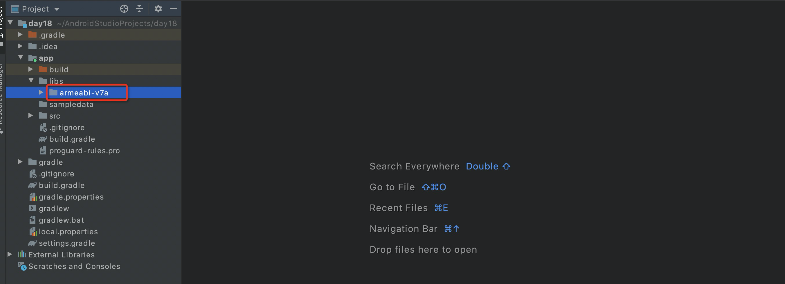
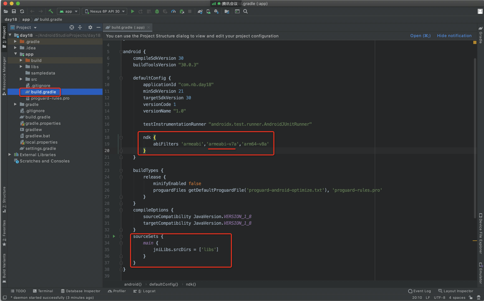
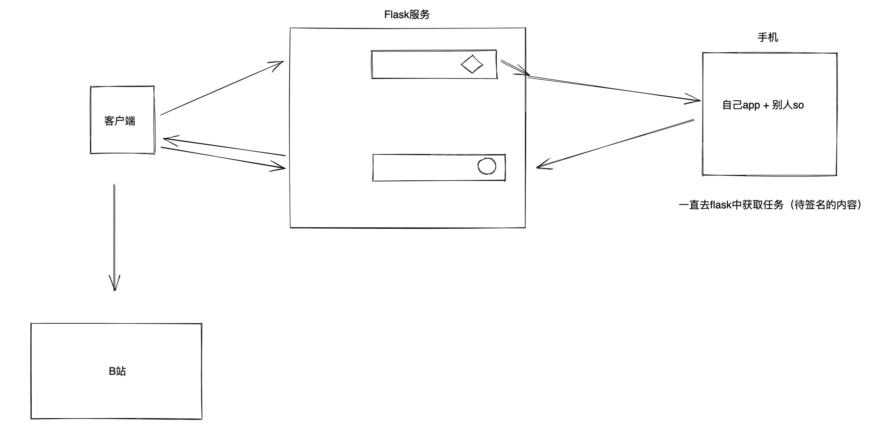
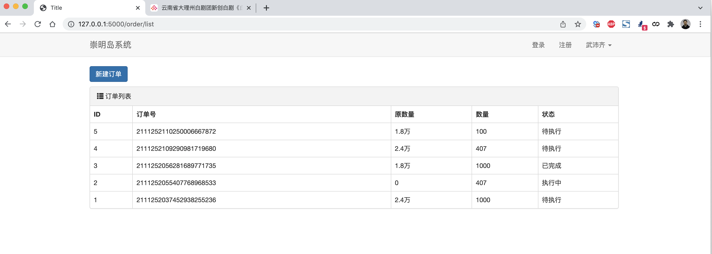

# day18 Flask服务和平台

今日概要：

- 服务（解决so文件加密）

  - 硬核破解，难度大。

  - frida-rpc，不再破解而是调用。

  - 开发一个app，加载so文件并调用so文件中的函数直接加密。【B站】

    ```
    内部依赖少，加密结果直接拿到。
    内部依赖多，补充很多代码（繁琐）。
    ```

- 平台

  - 下单
  - 程序自动去执行
  - 修改订单状态


## 1.app调用so

- JNI开发，自己写so文件，自己调用。
- 别人给我一个so文件，安卓开发中调用他so文件。


### 1.1 标准步骤

- 创建安卓应用

- 引入别人的so文件
  

- 配置，安卓程序去指定的目录中寻找so文件。
  

- 写类 + native方法，调用so文件（仿照你逆向的app）。

  ```java
  package com.bilibili.nativelibrary;
  import com.bilibili.nativelibrary.SignedQuery;
  
  import java.security.InvalidKeyException;
  import java.util.Map;
  import java.util.SortedMap;
  import java.util.TreeMap;
  
  import javax.crypto.spec.IvParameterSpec;
  
  public class LibBili {
      public static final int a = 0;
      public static final int b = 1;
      public static final int c = 0;
      public static final int d = 1;
      public static final int e = 2;
      public static final int f = 3;
  
      static {
          System.loadLibrary("bili");
      }
  	
      public static SignedQuery g(Map arg1) {
          TreeMap v1 = arg1 == null ? new TreeMap() : new TreeMap(arg1);
          return LibBili.s(((SortedMap) v1));
      }
      
      static native SignedQuery s(SortedMap arg0);
      
      ...
  }
  ```

- 使用类去调用方法进行加密

  ```java
  SignedQuery query = LibBili.g(参数)
  ```

- 编写哪些加密过程中依赖的所有的类。

  ```java
  ...
  ...
  ```

  注意：都依赖哪些类，你是无法直接找出来。

  


### 1.2 B站

day18【源码】


至此，写死了的URL参数，加密并获取sign，不能对外提供服务。


## 2.Flask服务




### 2.1 Flask部分

```python
import uuid
from queue import Queue, Empty
from flask import Flask, request, jsonify

app = Flask(__name__)

# 签名 任务队列
TASK_QUEUE = Queue()

# 结果队列
SIGN_DICT = {}


@app.route("/sign/task/", methods=["POST", "GET"])
def sign_task():
    if request.method == "POST":
        # ################ 第一步：客户端发送签名任务 ##############
        # 获取待签名字符串
        # 例如："abi=x86&appid=tv.danmaku.bili&appkey=1d8b6e7d45233436&brand=HUAWEI.."
        param_string = request.form.get('param_string')
        # sign_type=1，算法1加密 Libbili.g
        # sign_type=2，算法2加密 Libbili.h
        sign_type = request.form.get('sign_type')

        uid = str(uuid.uuid4())
        info = {"uid": uid, 'param_string': param_string, 'sign_type': sign_type}
        TASK_QUEUE.put(info)
        SIGN_DICT[uid] = Queue()
        return uid
    try:
        # ################ 第二步：app获取签名任务 ##############
        print("app取任务")
        task = TASK_QUEUE.get(block=True, timeout=8)
        res = jsonify(task)
    except Empty as e:
        res = "error"
    return res


@app.route("/sign/", methods=["POST", "GET"])
def sign():
    if request.method == "POST":
        # ################ 第三步：app签名后，签名的结果发送回来。 ##############
        print("app计算好并发送结果")
        info = request.json
        print('json--->', info)
        SIGN_DICT[info['uid']].put(info['total_string'])
        return "success"

    # ################ 第四步：客户端获取签名的结果 ##############
    print("等待获取 total string")
    uid = request.args.get('uid')
    total_string = SIGN_DICT[uid].get(block=True)
    del SIGN_DICT[uid]
    return total_string


if __name__ == '__main__':
    app.run(host="0.0.0.0", debug=False)
```


### 2.2 APP签名部分

见源码：hook


### 2.3 客户端部分

在B站中找了好几个请求，包含：LibBili.g 或 LibBili.h 。

见代码：v3.py


## 3.平台（x视频）


### 3.1 下单

- 大致框架

- 前端：HTML、CSS、JavaScript（模板BootStrap开发）

  - 使用BootStrap

    ```
    - 下载
    - 引入页面
    - 学习标签怎么编写，根据标签页面编写
    ```

  - BootStrap动态效果，依赖jQuery.js 

**见代码**：day18_chongming


### 3.2 写入数据库


#### 3.2.1 创建表结构


```sql
create database auto DEFAULT CHARSET utf8 COLLATE utf8_general_ci;
```

```sql
create table task(
    id int auto_increment primary key,
    oid char(22) not null,
    old_count varchar(64),
    count int not null,
    url varchar(128) not null,
	status tinyint not null,
    index ix_oid (oid)
) default charset=utf8;
```

```
mysql> desc task;
+-----------+--------------+------+-----+---------+----------------+
| Field     | Type         | Null | Key | Default | Extra          |
+-----------+--------------+------+-----+---------+----------------+
| id        | int(11)      | NO   | PRI | NULL    | auto_increment |
| oid       | char(22)     | NO   | MUL | NULL    |                |
| old_count | varchar(64)  | YES  |     | 0       |                |
| count     | int(11)      | NO   |     | NULL    |                |
| url       | varchar(128) | NO   |     | NULL    |                |
| status    | tinyint(4)   | NO   |     | NULL    |                |
+-----------+--------------+------+-----+---------+----------------+
6 rows in set (0.00 sec)
```


#### 3.2.2 操作MySQL

- pymysql

  ```
  pip install pymysql
  ```

  ```python
  import pymysql
  
  # 连接
  conn = pymysql.connect(host='127.0.0.1', port=3306, user='root', passwd='root123', charset="utf8", db='auto')
  cursor = conn.cursor(cursor=pymysql.cursors.DictCursor)
  
  # SQL语句
  cursor.execute("insert into task(...) values(%s,%s)", ["xx", "oo"])
  conn.commit()
  
  # 关闭连接
  cursor.close()
  conn.close()
  ```

- 数据库连接池

  ```
  pip install dbutils
  ```

  ```python
  import pymysql
  from dbutils.pooled_db import PooledDB
  
  # 数据库连接池
  DB_POOL = PooledDB(
      creator=pymysql,
      maxconnections=10,
      mincached=2,
      blocking=True,
      host='127.0.0.1',
      port=3306,
      user='root',
      password='root123',
      charset="utf8",
      database='auto'
  )
  
  
  def get_data():
      # 去数据库连接池中获取一个连接
      conn = DB_POOL.connection()
      cursor = conn.cursor(cursor=pymysql.cursors.DictCursor)
  
      # SQL语句(SQL语句中的sleep)
      cursor.execute("select sleep(1)")
      res = cursor.fetchall()
      print(res)
  
      # 将连接交还给数据库连接池
      cursor.close()
      conn.close()
  
  
  if __name__ == '__main__':
      get_data()
  ```

  


### 3.3 消息队列（redis）

当用户下单后，就会将此订单号放入消息队列中。

注意：提前启动redis。

```
pip install redis
```


- 在队列中添加任务

  ```python
  import redis
  
  # redis连接池
  REDIS_POOL = redis.ConnectionPool(host='127.0.0.1', port=6379, password="qwe123", encoding='utf-8', max_connections=100)
  
  # 在redis连接池中获取连接，再去做操作
  conn = redis.Redis(connection_pool=REDIS_POOL)
  
  # 根据连接再去做操作
  conn.lpush("YANG_VIDEO_TASK", "hello")
  
  ```

- 去队列中获取任务

  ```python
  import redis
  
  # redis连接池
  REDIS_POOL = redis.ConnectionPool(host='127.0.0.1', port=6379, password="qwe123", encoding='utf-8', max_connections=100)
  
  # 在redis连接池中获取连接，再去做操作
  conn = redis.Redis(connection_pool=REDIS_POOL)
  
  # 根据连接再去做操作
  data = conn.brpop("YANG_VIDEO_TASK")
  print(data)
  ```

  


### 3.4 显示订单列表



### 3.5 worker

Worker用于去消息队列中获取任务，一旦有任务到来，则开始进行执行刷播放的任务。

见代码：【day18_agent】


#### 知识点补充

```python
import redis

# redis连接池
REDIS_POOL = redis.ConnectionPool(host='127.0.0.1', port=6379, password="qwe123", encoding='utf-8', max_connections=100)

# 在redis连接池中获取连接，再去做操作
conn = redis.Redis(connection_pool=REDIS_POOL)

# 根据连接再去做操作
data = conn.brpop("YANG_VIDEO_TASK", timeout=10)
print(data)
```


见代码：【day18_agent】


## 总结

简易 & 通用版本的平台。

- 简易：登录、注册、支付、扣款、退款（ 推荐：Django ）。
- 通用：B站、抖音、x视频。


